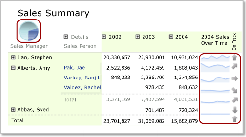

# Nested Data Regions (Report Builder and SSRS)
You can nest one data region, such as a chart, inside another data region, such as a matrix, typically to display data summaries in a concise manner or to provide a visual display as well as a table or matrix display.  
  
 For example, for a matrix (also called a *tablix*) that contains sales orders grouped by Store on rows and by Quarter on columns, you can add a table or chart to the corner cell to summarize the sales for all stores, or add a chart to a matrix column header to show the sales contribution of the data in the column as a percentage of all sales.  
  
   
  
 In this illustration, the pie chart in the corner cell and the sparkline charts in the rows are nested data regions.  
  
 By definition, nested data regions are based on the same report dataset. You cannot nest data regions that are based on different datasets. To display data from different datasets, consider using drillthrough reports or subreports. For more information, see [Drillthrough, Drilldown, Subreports, and Nested Data Regions (Report Builder and SSRS)](../../Topics/TopicNameNotContainA/Drillthrough--Drilldown--Subreports--and-Nested-Data-Regions--Report-Builder-and-SSRS-.md).  
  
> [!NOTE]  
>  [!INCLUDE[ssRBRDDup](../../Topics/TopicNameContainA/includes/ssRBRDDup_md.md)]  
  
## Understanding Scope for a Nested Data Region  
 The scope for data in a nested data region is automatically defined by its placement in the parent data region. For example, the scope for data for a chart nested in a tablix corner cell is the data from the dataset bound to the tablix data region after the filters are applied for the dataset, the tablix data region, and the chart data region. The scope for a tablix nested in a tablix cell is the same as the scope for the corner cell, but additionally scoped to the row and column group memberships of the cell in which it is nested, with the corresponding group filters applied. For more information about scope, see [Expression Scope for Totals, Aggregates, and Built-in Collections (Report Builder and SSRS)](../../Topics/TopicNameNotContainA/Expression-Scope-for-Totals--Aggregates--and-Built-in-Collections--Report-Builder-and-SSRS-.md).  
  
 The following list describes the scope for cells in the following tablix areas:  
  
-   **Tablix corner** The scope is the data in the data region linked to the tablix data region, after the filter and sort expressions for the dataset and the outer tablix are applied.  
  
-   **Tablix column group** The data in the innermost column group, after the filter and sort expressions for the dataset, the outer tablix, and the column groups are applied.  
  
-   **Tablix row group** The data in the innermost row group, after the filter and sort expressions for the dataset, the outer tablix, and the row groups are applied.  
  
-   **Tablix body** The data in the innermost group represented by the intersection of row groups and column groups, after the filter and sort expressions for the dataset, the outer tablix, and the row and column groups are applied.  
  
 For more information, see [Tablix Data Region Areas (Report Builder and SSRS)](../../Topics/TopicNameNotContainA/Tablix-Data-Region-Areas--Report-Builder-and-SSRS-.md).  
  
## Nesting a Chart, Sparkline, or Data Bar in a Tablix  
 When you add a chart (including a sparkline or data bar) to a tablix column group header or group footer row, or to a tablix body cell, the data passed to the chart is scoped to the subset of data for that cell. By default, when you add a chart to a tablix cell, the chart dimensions expand to fill the cell.  
  
> [!NOTE]  
>  To have more control over the size of a chart in a tablix cell, add the chart to a rectangle first, and then add the rectangle to the tablix cell.  
  
 By default, the chart legend colors are determined by the color of the data points in the chart series. To control colors so that nested chart data regions all use the same color for the same category of data, you must use custom colors and set sort expressions on the data. For more information, see [Specify Consistent Colors across Multiple Shape Charts (Report Builder and SSRS)](../../Topics/TopicNameNotContainA/Specify-Consistent-Colors-across-Multiple-Shape-Charts--Report-Builder-and-SSRS-.md) and [Sort Data in a Data Region (Report Builder and SSRS)](../../Topics/TopicNameContainA/Sort-Data-in-a-Data-Region--Report-Builder-and-SSRS-.md).  
  
## Nesting a Gauge or an Indicator in a Tablix  
 You can nest a gauge or an indicator inside of a table, matrix, or list in order to show a key performance indicator (KPI). When you place a gauge or indicator inside of a table, it will be rendered for each row in the tablix. For more information about adding indicators to a tablix, see [Indicators (Report Builder and SSRS)](../../Topics/TopicNameNotContainA/Indicators--Report-Builder-and-SSRS-.md).  
  
### Adding a gauge to a tablix  
 There are two ways to add a gauge to a tablix data region:  
  
-   Click inside the tablix cell and insert a gauge. The **Select Gauge Type** dialog box appears. Once you have selected a gauge type, the Gauge data region is placed inside of the selected tablix cell. You will likely need to resize the tablix in order to format the gauge.  
  
-   Click outside the table and insert a gauge. The **Select Gauge Type** dialog box appears. After you select a gauge type, the Gauge data region is placed in the top-left corner of the report. After you add data and format this gauge, drag and drop it inside of the tablix cell.  
  
 Like the chart, the dataset passed to the gauge is scoped to the subset of data for that cell. When a gauge is placed inside of a tablix cell, the gauge will always aggregate only one row of data.  
  
 When data in your tablix contains grouping, the Gauge data region that is nested inside the tablix does not automatically inherit this group. You must add a matching group expression to the gauge in order to show the same information that is shown on the tablix. For example, if data in your tablix is grouped by Product, you must add a Product group expression to the gauge to show the same data. For more information, see [Gauges (Report Builder and SSRS)](../../Topics/TopicNameNotContainA/Gauges--Report-Builder-and-SSRS-.md) and [Add or Delete a Group in a Data Region (Report Builder and SSRS)](../../Topics/TopicNameContainA/Add-or-Delete-a-Group-in-a-Data-Region--Report-Builder-and-SSRS-.md).  
  
 You must set the minimum and maximum values that will be displayed on the gauge scale. To specify the maximum value of the gauge, you can use an expression, such as `=Max!MyField.Value`. However, because this expression will be evaluated within the scope of the data in the cell only, the maximum of each gauge will not be the same for all rows in the tablix. This may make comparisons between gauges in the tablix more difficult to understand. Alternatively, you can specify a static value for the maximum. All rows inside of the tablix will show a gauge with this maximum value. For more information, see [Set a Minimum or Maximum on a Gauge (Report Builder and SSRS)](../../Topics/TopicNameContainA/Set-a-Minimum-or-Maximum-on-a-Gauge--Report-Builder-and-SSRS-.md).  
  
 If the data becomes too large on the gauge, consider using a scale multiplier to reduce the amount of digits displayed. To specify a multiplier, you can right-click on the scale and select **Scale Properties**. When the **Scale Properties** dialog box opens, specify a value for **Multiplier**.  
  
## Nesting a Table or Matrix and a Chart in a List  
 To nest multiple data regions in a List add a rectangle first, and then add the data regions to the rectangle.  
  
 You can define a group for a List data region, and then add a tablix and a chart to provide different views of the same data. To achieve this effect, you must define identical group and sort expressions for the embedded tablix and chart. By definition, the tablix and chart use data from the dataset of the parent list data region.  
  
> [!NOTE]  
>  By default, when you add a List data region to the design surface, the list includes a detail row. You can change this default by adding a group row and removing the detail row. For more information, see [Exploring the Flexibility of a Tablix Data Region (Report Builder and SSRS)](../../Topics/TopicNameContainA/Exploring-the-Flexibility-of-a-Tablix-Data-Region--Report-Builder-and-SSRS-.md).  
  
 For more information, see [Understanding Groups (Report Builder and SSRS)](../../Topics/TopicNameNotContainA/Understanding-Groups--Report-Builder-and-SSRS-.md) and [Add, Move, or Delete a Table, Matrix, or List (Report Builder and SSRS)](../../Topics/TopicNameContainA/Add--Move--or-Delete-a-Table--Matrix--or-List--Report-Builder-and-SSRS-.md).  
  
## See Also  
 [Filter, Group, and Sort Data (Report Builder and SSRS)](../../Topics/TopicNameNotContainA/Filter--Group--and-Sort-Data--Report-Builder-and-SSRS-.md)   
 [Tables, Matrices, and Lists (Report Builder and SSRS)](../../Topics/TopicNameNotContainA/Tables--Matrices--and-Lists--Report-Builder-and-SSRS-.md)   
 [Charts (Report Builder and SSRS)](../../Topics/TopicNameNotContainA/Charts--Report-Builder-and-SSRS-.md)   
 [Gauges (Report Builder and SSRS)](../../Topics/TopicNameNotContainA/Gauges--Report-Builder-and-SSRS-.md)   
 [Expressions (Report Builder and SSRS)](../../Topics/TopicNameNotContainA/Expressions--Report-Builder-and-SSRS-.md)   
 [Formatting Report Items (Report Builder and SSRS)](../../Topics/TopicNameNotContainA/Formatting-Report-Items--Report-Builder-and-SSRS-.md)   
 [Tutorial: Adding a KPI to a Report](assetId:///1bf77859-0b33-4f40-abaf-ebeeb6ebb1f8)   
 [Formatting Scales on a Gauge (Report Builder and SSRS)](../../Topics/TopicNameContainA/Formatting-Scales-on-a-Gauge--Report-Builder-and-SSRS-.md)