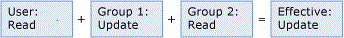
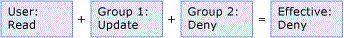
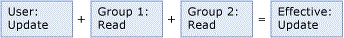

# Overlapping User and Group Permissions (Master Data Services)
A user's permissions are based on:  
  
-   Permissions from group memberships.  
  
-   Permissions assigned explicitly to the user.  
  
 If a user is a member of multiple groups, and those groups have access to [!INCLUDE[ssMDSmdm](../../Topics/TopicNameContainA/includes/ssMDSmdm_md.md)], the following rules apply:  
  
-   **Deny** overrides all other permissions. If the object permission is **Deny** in one group, the effective permission is deny.  
  
-   Access permission is a union all effective permissions on a group. If the object permission is **Create** from one group and **Update** from other group, the effective permission is **Create** and **Update**.  
  
 These rules apply to both the **Models** and **Hierarchy Members** tabs. Permissions are resolved for each tab and then combined. For more information, see [How Permissions Are Determined (Master Data Services)](../../Topics/TopicNameNotContainA/How-Permissions-Are-Determined--Master-Data-Services-.md).  
  
> [!NOTE]  
>  You can view the resolution of user and group overlapping permissions in the user interface. Both the **Models** and **Hierarchy Members** tab have a drop-down list from which you can choose **Effective** to view effective permissions.  
  
## Example 1  
   
  
 The user belongs to Group 1 and Group 2.  
  
 The user has **Read** permission to the Product entity.  
  
 Group 1 has **Update** permission to the Product entity.  
  
 Group 2 has **Read** permission to the Product entity.  
  
 Result: The user's effective permission is **Update** to the Product entity.  
  
## Example 2  
   
  
 The user belongs to Group 1 and Group 2.  
  
 The user has **Read** permission to the Product entity.  
  
 Group 1 has **Update** permission to Product entity.  
  
 Group 2 has **Deny** permission to the Product entity.  
  
 Result: The user's effective permission is **Deny** to the Product entity.  
  
## Example 3  
   
  
 The user belongs to Group 1 and Group 2.  
  
 The user has **Update** permission to a group of members in a hierarchy node.  
  
 Group 1 has **Read** permission to a group of members in a hierarchy node.  
  
 Group 2 has **Read** permission to a group of members in a hierarchy node.  
  
 Result: The user's effective permission is **Update** to the members.  
  
## See Also  
 [How Permissions Are Determined (Master Data Services)](../../Topics/TopicNameNotContainA/How-Permissions-Are-Determined--Master-Data-Services-.md)   
 [Overlapping Model and Member Permissions (Master Data Services)](../../Topics/TopicNameNotContainA/Overlapping-Model-and-Member-Permissions--Master-Data-Services-.md)