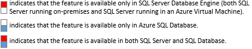

# Performance Center for SQL Server Database Engine and Azure SQL Database
This page provides links to help you locate the information that you need about performance in the [!INCLUDE[ssDEnoversion](../../Topics/TopicNameContainA/includes/ssDEnoversion_md.md)] and [!INCLUDE[ssSDSfull](../../Topics/TopicNameContainA/includes/ssSDSfull_md.md)].  
  
 **Legend**  
  
   
  
## This is a work in process. Does this Performance Center help you? How can we improve it?  
 What information are you looking for, and did you find it? What are we missing? What would you like to see here? We’re listening to your feedback to improve the content. Please submit your comments to [sqlfeedback@microsoft.com](mailto:sqlfeedback@microsoft.com?subject=Your%20feedback%20about%20the%20Temporal%20Tables%20page)  
  
## Configuration Options for Performance  
 [!INCLUDE[ssNoVersion](../../Topics/TopicNameContainA/includes/ssNoVersion_md.md)] provides the ability to affect database engine performance  through a number of configuration options at the [!INCLUDE[ssDEnoversion](../../Topics/TopicNameContainA/includes/ssDEnoversion_md.md)] level. With [!INCLUDE[ssSDSfull](../../Topics/TopicNameContainA/includes/ssSDSfull_md.md)], Microsoft performs most, but not all, of these optimizations for you.  
  
|||  
|-|-|  
|**Disk configuration options**|-    [Disk striping and RAID](https://technet.microsoft.com/library/ms190764\(v=sql.105\).aspx)|  
|**Data and log file configuration options**|-    [Place Data and Log Files on Separate Drives](../../Topics/TopicNameNotContainA/Place-Data-and-Log-Files-on-Separate-Drives.md) -    [View or Change the Default Locations for Data and Log Files (SQL Server Management Studio)](../../Topics/TopicNameNotContainA/View-or-Change-the-Default-Locations-for-Data-and-Log-Files--SQL-Server-Management-Studio-.md)|  
|**TempDB configuration options**|-    [Performance Improvements in TempDB](https://msdn.microsoft.com/library/ms190768.aspx#Anchor_1) -    [Database Engine Configuration - TempDB](../../Topics/TopicNameNotContainA/Database-Engine-Configuration---TempDB.md) -    [Using SSDs in Azure VMs to store SQL Server TempDB and Buffer Pool Extensions](http://blogs.technet.com/b/dataplatforminsider/archive/2014/09/25/using-ssds-in-azure-vms-to-store-sql-server-tempdb-and-buffer-pool-extensions.aspx) -    [Disk and performance best practices for temporary disk for SQL Server in Azure Virtual Machines](https://azure.microsoft.com/documentation/articles/virtual-machines-sql-server-performance-best-practices/)|  
| **Server Configuration Options**|<ul><li>**Processor configuration options**   <ul><li> [affinity mask Server Configuration Option](../../Topics/TopicNameNotContainA/affinity-mask-Server-Configuration-Option.md)</li><li> [affinity Input-Output mask Server Configuration Option](../../Topics/TopicNameNotContainA/affinity-Input-Output-mask-Server-Configuration-Option.md)</li><li> [affinity64 mask Server Configuration Option](../../Topics/TopicNameNotContainA/affinity64-mask-Server-Configuration-Option.md)</li><li> [affinity64 Input-Output mask Server Configuration Option](../../Topics/TopicNameNotContainA/affinity64-Input-Output-mask-Server-Configuration-Option.md)</li><li> [Configure the max worker threads Server Configuration Option](../../Topics/TopicNameNotContainA/Configure-the-max-worker-threads-Server-Configuration-Option.md)</li></ul></li><li>**Memory configuration options**   <ul><li> [Server Memory Server Configuration Options](../../Topics/TopicNameNotContainA/Server-Memory-Server-Configuration-Options.md)</li></ul></li><li>**Index configuration options**   <ul><li> [Configure the fill factor Server Configuration Option](../../Topics/TopicNameNotContainA/Configure-the-fill-factor-Server-Configuration-Option.md)</li><li></li></ul></li><li>**Query configuration options**   <ul><li> [Configure the min memory per query Server Configuration Option](../../Topics/TopicNameNotContainA/Configure-the-min-memory-per-query-Server-Configuration-Option.md)</li><li> [Configure the query governor cost limit Server Configuration Option](../../Topics/TopicNameNotContainA/Configure-the-query-governor-cost-limit-Server-Configuration-Option.md)</li><li> [Configure the max degree of parallelism Server Configuration Option](../../Topics/TopicNameNotContainA/Configure-the-max-degree-of-parallelism-Server-Configuration-Option.md)</li><li> [Configure the cost threshold for parallelism Server Configuration Option](../../Topics/TopicNameNotContainA/Configure-the-cost-threshold-for-parallelism-Server-Configuration-Option.md)</li><li> [optimize for ad hoc workloads Server Configuration Option](../../Topics/TopicNameNotContainA/optimize-for-ad-hoc-workloads-Server-Configuration-Option.md)</li></ul></li><li>**Backup configuration options**   <ul><li> [View or Configure the backup compression default Server Configuration Option](../../Topics/TopicNameNotContainA/View-or-Configure-the-backup-compression-default-Server-Configuration-Option.md)</li></ul></li></ul>|  
|**Database configuration optimization options**|-    [Data Compression](../../Topics/TopicNameNotContainA/Data-Compression.md) -    [View or Change the Compatibility Level of a Database](../../Topics/TopicNameContainA/View-or-Change-the-Compatibility-Level-of-a-Database.md) -    [ALTER DATABASE SCOPED CONFIGURATION (Transact-SQL)](assetId:///63373c2f-9a0b-431b-b9d2-6fa35641571a)|  
|**Table configuration optimization**|-    [Partitioned Tables and Indexes](../../Topics/TopicNameNotContainA/Partitioned-Tables-and-Indexes.md) -|  
|**Database Engine Performance in an Azure Virtual Machine**|-    [Quick check list](https://azure.microsoft.com/documentation/articles/virtual-machines-sql-server-performance-best-practices/) -    [Virtual machine size and storage account considerations](https://azure.microsoft.com/en-us/documentation/articles/virtual-machines-sql-server-performance-best-practices/) -    [Disks and performance considerations](https://azure.microsoft.com/documentation/articles/virtual-machines-sql-server-performance-best-practices/) -    [I/O Performance Considerations](https://azure.microsoft.com/en-us/documentation/articles/virtual-machines-sql-server-performance-best-practices/) -    [Feature specific performance considerations](https://azure.microsoft.com/documentation/articles/virtual-machines-sql-server-performance-best-practices/)|  
  
## Query Performance Options  
  
|||  
|-|-|  
|  **[Indexes](../../Topics/TopicNameNotContainA/Indexes.md)**|-   [Reorganize and Rebuild Indexes](../../Topics/TopicNameNotContainA/Reorganize-and-Rebuild-Indexes.md) -   [Specify Fill Factor for an Index](../../Topics/TopicNameNotContainA/Specify-Fill-Factor-for-an-Index.md) -   [Configure Parallel Index Operations](../../Topics/TopicNameNotContainA/Configure-Parallel-Index-Operations.md) -   [SORT_IN_TEMPDB Option For Indexes](../../Topics/TopicNameNotContainA/SORT_IN_TEMPDB-Option-For-Indexes.md) -   [Improve the Performance of Full-Text Indexes](../../Topics/TopicNameNotContainA/Improve-the-Performance-of-Full-Text-Indexes.md)|  
|  **[Partitioned Tables and Indexes](../../Topics/TopicNameNotContainA/Partitioned-Tables-and-Indexes.md)**|-   [Benefits of Partitioning](https://msdn.microsoft.com/library/ms190787.aspx#Anchor_0)|  
|  **[Stored Procedures](assetId:///75611e40-789f-412b-91e5-0cc0b8d289ef)**|-   [Benefits of Stored Procedures](https://msdn.microsoft.com/en-us/library/ms190782.aspx)|  
|  **[User-Defined Functions](../../Topics/TopicNameNotContainA/User-Defined-Functions.md)**|-   [User-defined Function Benefits](https://msdn.microsoft.com/en-us/library/ms191007.aspx)|  
| **Parallelism optimization**|-   [Configure the max worker threads Server Configuration Option](../../Topics/TopicNameNotContainA/Configure-the-max-worker-threads-Server-Configuration-Option.md) -   [ALTER DATABASE SCOPED CONFIGURATION (Transact-SQL)](assetId:///63373c2f-9a0b-431b-b9d2-6fa35641571a)|  
| **Query optimizer optimization**|-   [ALTER DATABASE SCOPED CONFIGURATION (Transact-SQL)](assetId:///63373c2f-9a0b-431b-b9d2-6fa35641571a)|  
|  **[Statistics](../../Topics/TopicNameNotContainA/Statistics.md)**|-   [When to Update Statistics](https://msdn.microsoft.com/library/ms190397.aspx#Anchor_3) -   [Update Statistics](../../Topics/TopicNameNotContainA/Update-Statistics.md)|  
|  **[In-Memory OLTP (In-Memory Optimization)](../../Topics/TopicNameNotContainA/In-Memory-OLTP--In-Memory-Optimization-.md)**|-   [Memory-Optimized Tables](../../Topics/TopicNameNotContainA/Memory-Optimized-Tables.md) -   [Natively Compiled Stored Procedures](../../Topics/TopicNameNotContainA/Natively-Compiled-Stored-Procedures.md) -   [Creating and Accessing Tables in TempDB from Natively Compiled Stored Procedures](../../Topics/TopicNameNotContainA/Creating-and-Accessing-Tables-in-TempDB-from-Natively-Compiled-Stored-Procedures.md) -   [Troubleshooting Common Performance Problems with Memory-Optimized Hash Indexes](../../Topics/TopicNameNotContainA/Troubleshooting-Common-Performance-Problems-with-Memory-Optimized-Hash-Indexes.md) -   [Demonstration: Performance Improvement of In-Memory OLTP](../Topic/Demonstration:%20Performance%20Improvement%20of%20In-Memory%20OLTP.md)|  
  
## See Also  
 [Monitor and Tune for Performance](../../Topics/TopicNameNotContainA/Monitor-and-Tune-for-Performance.md)   
 [Monitoring Performance By Using the Query Store](../../Topics/TopicNameNotContainA/Monitoring-Performance-By-Using-the-Query-Store.md)   
 [Azure SQL Database performance guidance for single databases](https://azure.microsoft.com/documentation/articles/sql-database-performance-guidance/)   
 [Optimizing Azure SQL Database Performance using Elastic Pools](https://azure.microsoft.com/documentation/articles/sql-database-elastic-pool-guidance/)   
 [Azure Query Performance Insight](https://azure.microsoft.com/documentation/articles/sql-database-query-performance/)