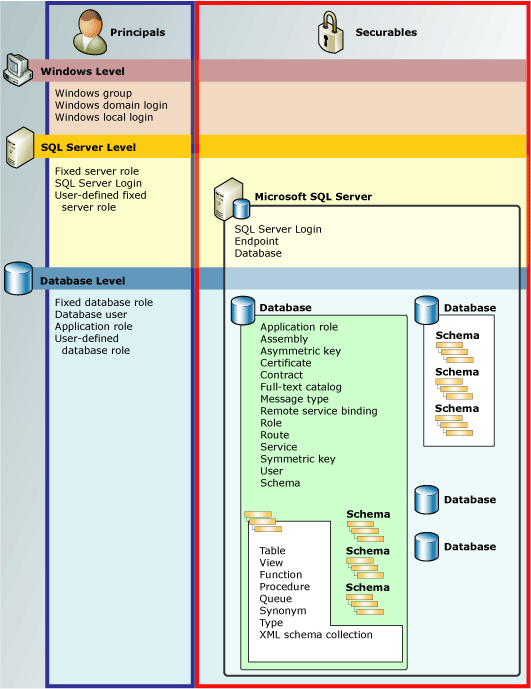

# Permissions Hierarchy (Database Engine)
The [!INCLUDE[ssDE](../../Topics/TopicNameContainA/includes/ssDE_md.md)] manages a hierarchical collection of entities that can be secured with permissions. These entities are known as *securables*. The most prominent securables are servers and databases, but discrete permissions can be set at a much finer level. [!INCLUDE[ssNoVersion](../../Topics/TopicNameContainA/includes/ssNoVersion_md.md)] regulates the actions of principals on securables by verifying that they have been granted appropriate permissions.  
  
 The following illustration shows the relationships among the [!INCLUDE[ssDE](../../Topics/TopicNameContainA/includes/ssDE_md.md)] permissions hierarchies.  
  
 The permissions system works the same in all versions of [!INCLUDE[ssNoVersion](../../Topics/TopicNameContainA/includes/ssNoVersion_md.md)], [!INCLUDE[ssSDS](../../Topics/TopicNameContainA/includes/ssSDS_md.md)], [!INCLUDE[ssDW](../../Topics/TopicNameNotContainA/includes/ssDW_md.md)], [!INCLUDE[ssAPS](../../Topics/TopicNameNotContainA/includes/ssAPS_md.md)], however some features are not available in all versions. For example, server-level permission cannot be configured in Azure products.  
  
   
  
## Chart of SQL Server Permissions  
 For a poster sized chart of all [!INCLUDE[ssDE](../../Topics/TopicNameContainA/includes/ssDE_md.md)] permissions in pdf format, see [http://go.microsoft.com/fwlink/?LinkId=229142](http://go.microsoft.com/fwlink/?LinkId=229142).  
  
## Working with Permissions  
 Permissions can be manipulated with the familiar [!INCLUDE[tsql](../../Topics/TopicNameContainA/includes/tsql_md.md)] queries GRANT, DENY, and REVOKE. Information about permissions is visible in the [sys.server_permissions](assetId:///7d78bf17-6c64-4166-bd0b-9e9e20992136) and [sys.database_permissions](assetId:///c1e261f8-6cb0-4759-b5f1-5ec233602655) catalog views. There is also support for querying permissions information by using built-in functions.  
  
 For information about designing a permissions system, see [Getting Started with Database Engine Permissions](../../Topics/TopicNameNotContainA/Getting-Started-with-Database-Engine-Permissions.md).  
  
## See Also  
 [Securing SQL Server](../../Topics/TopicNameNotContainA/Securing-SQL-Server.md)   
 [Permissions (Database Engine)](../../Topics/TopicNameNotContainA/Permissions--Database-Engine-.md)   
 [Securables](../../Topics/TopicNameNotContainA/Securables.md)   
 [Principals (Database Engine)](../../Topics/TopicNameNotContainA/Principals--Database-Engine-.md)   
 [GRANT (Transact-SQL)](assetId:///a760c16a-4d2d-43f2-be81-ae9315f38185)   
 [REVOKE (Transact-SQL)](assetId:///9d31d3e7-0883-45cd-bf0e-f0361bbb0956)   
 [DENY (Transact-SQL)](assetId:///c32d1e01-9ee9-4665-a516-fcfece58078e)   
 [has_perms_by_name (Transact-SQL)](assetId:///eaf8cc82-1047-4144-9e77-0e1095df6143)   
 [fn_builtin_permissions (Transact-SQL)](assetId:///704b1ad3-3534-4cf3-aff4-9fb70064b6cc)   
 [sys.server_permissions (Transact-SQL)](assetId:///7d78bf17-6c64-4166-bd0b-9e9e20992136)   
 [sys.database_permissions (Transact-SQL)](assetId:///c1e261f8-6cb0-4759-b5f1-5ec233602655)