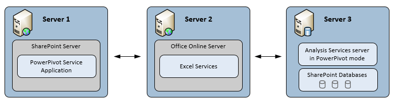

# Power Pivot for SharePoint (SSAS)
An [!INCLUDE[ssASnoversion](../../Topics/TopicNameContainA/includes/ssASnoversion_md.md)] server in [!INCLUDE[ssGemini](../../Topics/TopicNameContainA/includes/ssGemini_md.md)] mode provides server hosting of [!INCLUDE[ssGemini](../../Topics/TopicNameContainA/includes/ssGemini_md.md)] data in a SharePoint farm. [!INCLUDE[ssGemini](../../Topics/TopicNameContainA/includes/ssGemini_md.md)] data is an analytical data model that you build using one of the following:  
  
-   The [!INCLUDE[ssGemini](../../Topics/TopicNameContainA/includes/ssGemini_md.md)] for Excel 2010 add-in  
  
-   Excel 2013  
  
-   Excel 2016  
  
 **[!INCLUDE[applies](../../Topics/TopicNameContainA/includes/applies_md.md)]**  [!INCLUDE[ssGeminiShort](../../Topics/TopicNameNotContainA/includes/ssGeminiShort_md.md)] 2016 &#124; [!INCLUDE[ssGeminiShort](../../Topics/TopicNameNotContainA/includes/ssGeminiShort_md.md)] 2013  
  
 Server hosting of that data requires SharePoint, Excel Services, and an installation of [!INCLUDE[ssGemini](../../Topics/TopicNameContainA/includes/ssGemini_md.md)] for SharePoint. Data is loaded on [!INCLUDE[ssGemini](../../Topics/TopicNameContainA/includes/ssGemini_md.md)] for SharePoint instances where it can be refreshed at scheduled intervals using the [!INCLUDE[ssGemini](../../Topics/TopicNameContainA/includes/ssGemini_md.md)] data refresh capability that the server provides for Excel 2010 workbooks, that the [!INCLUDE[ssGemini](../../Topics/TopicNameContainA/includes/ssGemini_md.md)] provides for Excel 2013 and 2016 workbooks.  
  
## Power Pivot for SharePoint 2016  
 [!INCLUDE[ssCurrent](../../Topics/TopicNameContainA/includes/ssCurrent_md.md)] [!INCLUDE[ssGeminiShort](../../Topics/TopicNameNotContainA/includes/ssGeminiShort_md.md)] supports [!INCLUDE[msCoName](../../Topics/TopicNameContainA/includes/msCoName_md.md)] SharePoint 2016 and [!INCLUDE[offOnlineServer](../../Topics/TopicNameNotContainA/includes/offOnlineServer_md.md)] usage of Excel workbooks containing data models and [!INCLUDE[ssRSnoversion](../../Topics/TopicNameContainA/includes/ssRSnoversion_md.md)] Power View reports.  
  
 Excel, within [!INCLUDE[offOnlineServer](../../Topics/TopicNameNotContainA/includes/offOnlineServer_md.md)] includes data model functionality to enable interaction with a [!INCLUDE[ssGemini](../../Topics/TopicNameContainA/includes/ssGemini_md.md)] workbook in the browser. You do not need to deploy the [!INCLUDE[ssGemini](../../Topics/TopicNameContainA/includes/ssGemini_md.md)] for SharePoint 2016 add-in into the farm. You only need to install an [!INCLUDE[ssASnoversion](../../Topics/TopicNameContainA/includes/ssASnoversion_md.md)] server in [!INCLUDE[ssGemini](../../Topics/TopicNameContainA/includes/ssGemini_md.md)] mode and register the server with [!INCLUDE[offOnlineServer](../../Topics/TopicNameNotContainA/includes/offOnlineServer_md.md)].  
  
 Deploying the [!INCLUDE[ssGemini](../../Topics/TopicNameContainA/includes/ssGemini_md.md)] for SharePoint 2016 add-in enables additional functionality and features in your SharePoint farm. The additional features include [!INCLUDE[ssGemini](../../Topics/TopicNameContainA/includes/ssGemini_md.md)] Gallery and Schedule Data Refresh.  
  
   
  
## Power Pivot for SharePoint 2013  
 [!INCLUDE[ssCurrent](../../Topics/TopicNameContainA/includes/ssCurrent_md.md)] [!INCLUDE[ssGeminiShort](../../Topics/TopicNameNotContainA/includes/ssGeminiShort_md.md)] supports [!INCLUDE[msCoName](../../Topics/TopicNameContainA/includes/msCoName_md.md)] SharePoint 2013 Excel Services usage of Excel workbooks containing data models and [!INCLUDE[ssRSnoversion](../../Topics/TopicNameContainA/includes/ssRSnoversion_md.md)] Power View reports.  
  
 Excel Services in SharePoint 2013 includes data model functionality to enable interaction with a [!INCLUDE[ssGemini](../../Topics/TopicNameContainA/includes/ssGemini_md.md)] workbook in the browser. You do not need to deploy the [!INCLUDE[ssGemini](../../Topics/TopicNameContainA/includes/ssGemini_md.md)] for SharePoint 2013 add-in into the farm. You only need to install an [!INCLUDE[ssASnoversion](../../Topics/TopicNameContainA/includes/ssASnoversion_md.md)] server in SharePoint mode and register the server within the Excel Services **Data Model** settings.  
  
 Deploying the [!INCLUDE[ssGemini](../../Topics/TopicNameContainA/includes/ssGemini_md.md)] for SharePoint 2013 add-in enables additional functionality and features in your SharePoint farm. The additional features include [!INCLUDE[ssGemini](../../Topics/TopicNameContainA/includes/ssGemini_md.md)] Gallery, Schedule Data Refresh, and the [!INCLUDE[ssGemini](../../Topics/TopicNameContainA/includes/ssGemini_md.md)] Management Dashboard.  
  
   
  
##   In This Section  
 [Power Pivot Server Administration and Configuration in Central Administration](../../Topics/TopicNameNotContainA/Power-Pivot-Server-Administration-and-Configuration-in-Central-Administration.md)  
  
 [Power Pivot Configuration using Windows PowerShell](../../Topics/TopicNameNotContainA/Power-Pivot-Configuration-using-Windows-PowerShell.md)  
  
 [Power Pivot Configuration Tools](../../Topics/TopicNameNotContainA/Power-Pivot-Configuration-Tools.md)  
  
 [Power Pivot Authentication and Authorization](../../Topics/TopicNameNotContainA/Power-Pivot-Authentication-and-Authorization.md)  
  
 [Configure Power Pivot Health Rules](../../Topics/TopicNameNotContainA/Configure-Power-Pivot-Health-Rules.md)  
  
 [Power Pivot Management Dashboard and Usage Data](../../Topics/TopicNameNotContainA/Power-Pivot-Management-Dashboard-and-Usage-Data.md)  
  
 [Power Pivot Gallery](../../Topics/TopicNameNotContainA/Power-Pivot-Gallery.md)  
  
 [Power Pivot Data Access](../../Topics/TopicNameNotContainA/Power-Pivot-Data-Access.md)  
  
 [Power Pivot Data Refresh](../../Topics/TopicNameNotContainA/Power-Pivot-Data-Refresh.md)  
  
 [Power Pivot Data Feeds](../../Topics/TopicNameNotContainA/Power-Pivot-Data-Feeds.md)  
  
 [Power Pivot BI Semantic Model Connection (.bism)](../../Topics/TopicNameNotContainA/Power-Pivot-BI-Semantic-Model-Connection--.bism-.md)  
  
 **In other sections**  
  
## Additional topics  
 [Upgrade Power Pivot for SharePoint](../../Topics/TopicNameNotContainA/Upgrade-Power-Pivot-for-SharePoint.md)  
  
 [Install Analysis Services in Power Pivot Mode](../../Topics/TopicNameNotContainA/Install-Analysis-Services-in-Power-Pivot-Mode.md)  
  
 [PowerShell Reference for Power Pivot for SharePoint](../../Topics/TopicNameNotContainA/PowerShell-Reference-for-Power-Pivot-for-SharePoint.md)  
  
 [Example License Topologies and Costs  for SQL Server 2016 Business Intelligence](../../Topics/TopicNameNotContainA/Example-License-Topologies-and-Costs--for-SQL-Server-2016-Business-Intelligence.md)  
  
## See Also  
 [Power Pivot Planning and Deployment](http://go.microsoft.com/fwlink/?linkID=220972)   
 [Disaster Recovery for Power Pivot for SharePoint](http://go.microsoft.com/fwlink/p/?LinkId=389570)