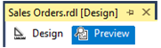
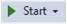

# Previewing Reports
When you design a     [!INCLUDE[ssRSnoversion](../../Topics/TopicNameContainA/includes/ssRSnoversion_md.md)] report, you may want to view it before publishing it to a production environment. You can do this in several ways: by switching to Preview mode in Report Designer, by using the preview window in Report Designer, and by publishing the report to a report server in a test environment.  
  
> [!NOTE]  
>  When you preview a report, the data for the report is cached to a file on the local computer. When you preview the same report again using the same query, parameters, and credentials, Report Designer retrieves the cached copy rather than rerunning the query. The data file is saved as *<reportname\>*.rdl.data in the same directory as the report definition file. The file is not deleted when you close Report Designer.  
  
## Preview Mode  
 You can preview a report in Report Designer by clicking . This runs the report locally, using the same report processing and rendering functionality that is provided with the report server. The report that is displayed is an interactive image; you can select parameters, click links, view the document map, and expand and collapse hidden areas of the report. You can also export the report to any of the installed rendering formats.  
  
## Standalone Preview  
 Another way to preview a report is to run the report project in a debug configuration, for example, to debug custom assemblies that you write. The report is opened in your default browser. There are three ways to run a project:  
  
-   By clicking **Start Debugging** on the **Debug** menu.  
  
-   By clicking the **Start** button on the [!INCLUDE[vsprvs](../../Topics/TopicNameContainA/includes/vsprvs_md.md)] standard toolbar .  
  
-   By pressing **F5**.  
  
 If you use a project configuration that builds the report but does not deploy it, the report that is specified in the **StartItem** property of the current configuration opens in a separate preview window. The preview window displays the report in the same way and has the same functionality as Preview mode.  
  
> [!NOTE]  
>  Before debugging a report, you must set a start item. For example, if you run debug mode and the browser opens the main report server page and not your report in preview mode. To set a start item, in Solution Explorer, right-click the report project, click **Properties**, and then in **StartItem**, select the name of the report to display.  
  
 If you wish to preview a particular report that is not the start item for the project, select a configuration that builds the report but does not deploy it (for example, the DebugLocal configuration), right-click the report, and then click **Run**. You must choose a configuration that does not deploy the report; otherwise, the report will be published to the report server instead of displayed locally in a preview window.  
  
## Publishing to a Test Server  
 You can also test reports by publishing them to a test server, browse to the report  and preview. Publishing a report to a test server is the same as publishing to a production server. For information about publishing a report, see [Publishing Reports to a Report Server](../../Topics/TopicNameContainA/Publishing-Reports-to-a-Report-Server.md).  
  
## See Also  
 [Print Reports (Report Builder and SSRS)](../../Topics/TopicNameNotContainA/Print-Reports--Report-Builder-and-SSRS-.md)   
 [Print a Report (Report Builder and SSRS)](../../Topics/TopicNameContainA/Print-a-Report--Report-Builder-and-SSRS-.md)   
 [Publish Reports](../../Topics/TopicNameNotContainA/Publish-Reports.md)   
 [Using Custom Assemblies with Reports](assetId:///53d141d0-2185-466a-84dc-7b90d284da3d)