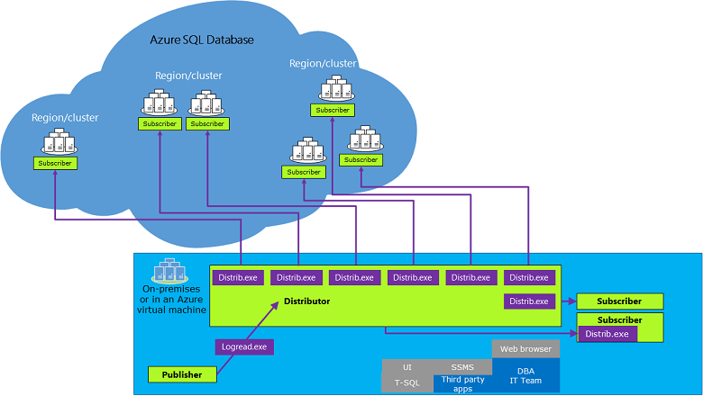

# Replication to SQL Database
[!INCLUDE[ssNoVersion](../../Topics/TopicNameContainA/includes/ssNoVersion_md.md)] replication can be configured to [!INCLUDE[ssSDSfull](../../Topics/TopicNameContainA/includes/ssSDSfull_md.md)].  
  
 **Supported Configurations:**  
  
-   The [!INCLUDE[ssNoVersion](../../Topics/TopicNameContainA/includes/ssNoVersion_md.md)] can be an instance of [!INCLUDE[ssNoVersion](../../Topics/TopicNameContainA/includes/ssNoVersion_md.md)] running on-premises or an instance of [!INCLUDE[ssNoVersion](../../Topics/TopicNameContainA/includes/ssNoVersion_md.md)] running in an Azure virtual machine in the cloud. For more information, see [SQL Server on Azure Virtual Machines overview](https://azure.microsoft.com/documentation/articles/virtual-machines-sql-server-infrastructure-services/).  
  
-   [!INCLUDE[ssSDS](../../Topics/TopicNameContainA/includes/ssSDS_md.md)] must be a push subscriber of a [!INCLUDE[ssNoVersion](../../Topics/TopicNameContainA/includes/ssNoVersion_md.md)] publisher.  
  
-   The distribution database and the replication agents cannot be placed on [!INCLUDE[ssSDS](../../Topics/TopicNameContainA/includes/ssSDS_md.md)].  
  
-   Snapshot and one-way transactional replication are supported. Peer-to-peer transactional replication and merge replication are not supported.  
  
## Versions  
 The publisher and distributor must be at least at one of the following versions:  
  
-   [!INCLUDE[ssSQL15](../../Topics/TopicNameContainA/includes/ssSQL15_md.md)]  
  
-   [!INCLUDE[ssSQL14](../../Topics/TopicNameContainA/includes/ssSQL14_md.md)] SP1 CU3  
  
-   [!INCLUDE[ssSQL14](../../Topics/TopicNameContainA/includes/ssSQL14_md.md)] RTM CU10  
  
-   [!INCLUDE[ssSQL11](../../Topics/TopicNameContainA/includes/ssSQL11_md.md)] SP2 CU8  
  
-   [!INCLUDE[ssSQL11](../../Topics/TopicNameContainA/includes/ssSQL11_md.md)] expected in SP3  
  
 Attempting to configure replication using an older version can result in error number MSSQL_REPL20084 (The process could not connect to Subscriber.) and MSSQL_REPL40532 (Cannot open server <name\> requested by the login. The login failed.).  
  
 The [!INCLUDE[ssSDS](../../Topics/TopicNameContainA/includes/ssSDS_md.md)] subscriber must be at least V12 and can be in any region.  
  
 To use all the features of [!INCLUDE[ssSDS](../../Topics/TopicNameContainA/includes/ssSDS_md.md)] you must be using the latest versions of [SQL Server Management Studio](https://msdn.microsoft.com/library/mt238290.aspx) and [SQL Server Data Tools](https://msdn.microsoft.com/library/mt204009.aspx).  
  
## Remarks  
 Replication can be configured by using [!INCLUDE[ssManStudioFull](../../Topics/TopicNameContainA/includes/ssManStudioFull_md.md)] or by executing [!INCLUDE[tsql](../../Topics/TopicNameContainA/includes/tsql_md.md)] statements on the publisher. You cannot configure replication by using the [!INCLUDE[ssSDS](../../Topics/TopicNameContainA/includes/ssSDS_md.md)] portal.  
  
 Replication can only use [!INCLUDE[ssNoVersion](../../Topics/TopicNameContainA/includes/ssNoVersion_md.md)] authentication logins to connect to [!INCLUDE[ssSDS](../../Topics/TopicNameContainA/includes/ssSDS_md.md)].  
  
 Replicated table must have a primary key.  
  
 You must have an existing Azure subscription and an existing [!INCLUDE[ssSDS](../../Topics/TopicNameContainA/includes/ssSDS_md.md)] V12.  
  
 A single publication on [!INCLUDE[ssNoVersion](../../Topics/TopicNameContainA/includes/ssNoVersion_md.md)] can support both [!INCLUDE[ssSDS](../../Topics/TopicNameContainA/includes/ssSDS_md.md)] and [!INCLUDE[ssNoVersion](../../Topics/TopicNameContainA/includes/ssNoVersion_md.md)] (on-premises and [!INCLUDE[ssNoVersion](../../Topics/TopicNameContainA/includes/ssNoVersion_md.md)] in an Azure virtual machine) subscribers.  
  
 Replication management, monitoring, and troubleshooting must be performed from the on-premises [!INCLUDE[ssNoVersion](../../Topics/TopicNameContainA/includes/ssNoVersion_md.md)].  
  
 Only push subscriptions to [!INCLUDE[ssSDS](../../Topics/TopicNameContainA/includes/ssSDS_md.md)] are supported.  
  
 Only `@subscriber_type = 0` is supported in **sp_addsubscription** for SQL Database.  
  
 [!INCLUDE[ssSDS](../../Topics/TopicNameContainA/includes/ssSDS_md.md)] does not support bi-directional, immediate, updatable, or peer to peer replication.  
  
## Replication Architecture  
   
  
## Scenarios  
  
#### Typical Replication Scenario  
  
1.  Create a transactional replication publication on an on-premises [!INCLUDE[ssNoVersion](../../Topics/TopicNameContainA/includes/ssNoVersion_md.md)] database.  
  
2.  On the on-premises [!INCLUDE[ssNoVersion](../../Topics/TopicNameContainA/includes/ssNoVersion_md.md)] use the **New Subscription Wizard** or [!INCLUDE[tsql](../../Topics/TopicNameContainA/includes/tsql_md.md)] statements to create a push to subscription to [!INCLUDE[ssSDS](../../Topics/TopicNameContainA/includes/ssSDS_md.md)].  
  
3.  The initial data set is typically a snapshot that is created by the Snapshot Agent and distributed and applied by the Distribution Agent. The initial data set can also be supplied through a backup or other means, such as [!INCLUDE[ssNoVersion](../../Topics/TopicNameContainA/includes/ssNoVersion_md.md)][!INCLUDE[ssISnoversion](../../Topics/TopicNameContainA/includes/ssISnoversion_md.md)].  
  
#### Data Migration Scenario  
  
1.  Use transactional replication to replicate data from an on-premises [!INCLUDE[ssNoVersion](../../Topics/TopicNameContainA/includes/ssNoVersion_md.md)] database to [!INCLUDE[ssSDS](../../Topics/TopicNameContainA/includes/ssSDS_md.md)].  
  
2.  Redirect the client or middle-tier applications to update the [!INCLUDE[ssSDS](../../Topics/TopicNameContainA/includes/ssSDS_md.md)] copy.  
  
3.  Stop updating the [!INCLUDE[ssNoVersion](../../Topics/TopicNameContainA/includes/ssNoVersion_md.md)] version of the table and remove the publication.  
  
## Limitations  
 The following options are not supported for [!INCLUDE[ssSDS](../../Topics/TopicNameContainA/includes/ssSDS_md.md)] subscriptions:  
  
-   Copy file groups association  
  
-   Copy table partitioning schemes  
  
-   Copy index partitioning schemes  
  
-   Copy user defined statistics  
  
-   Copy default bindings  
  
-   Copy rule bindings  
  
-   Copy fulltext indexes  
  
-   Copy XML XSD  
  
-   Copy XML indexes  
  
-   Copy permissions  
  
-   Copy spatial indexes  
  
-   Copy filtered indexes  
  
-   Copy data compression attribute  
  
-   Copy sparse column attribute  
  
-   Convert filestream to MAX data types  
  
-   Convert hierarchyid to MAX data types  
  
-   Convert spatial to MAX data types  
  
-   Copy extended properties  
  
-   Copy permissions  
  
 Limitations to be determined:  
  
-   Copy collation  
  
-   Execution in a serialized transaction of the SP  
  
## Examples  
 Create a publication and a push subscription. For more information, see:  
  
-   [Create a Publication](../../Topics/TopicNameContainA/Create-a-Publication.md)  
  
-   [Create a Push Subscription](../../Topics/TopicNameContainA/Create-a-Push-Subscription.md) by using the [!INCLUDE[ssSDSfull](../../Topics/TopicNameContainA/includes/ssSDSfull_md.md)] name as the subscriber (for example **N'azuresqldbdns.database.windows.net'**) and the [!INCLUDE[ssSDS](../../Topics/TopicNameContainA/includes/ssSDS_md.md)] name as the destination database (for example **AdventureWorks**).  
  
## See Also  
 [Create a Publication](../../Topics/TopicNameContainA/Create-a-Publication.md)   
 [Create a Push Subscription](../../Topics/TopicNameContainA/Create-a-Push-Subscription.md)   
 [Types of Replication](../../Topics/TopicNameNotContainA/Types-of-Replication.md)   
 [Monitoring (Replication)](../../Topics/TopicNameNotContainA/Monitoring--Replication-.md)   
 [Initialize a Subscription](../../Topics/TopicNameContainA/Initialize-a-Subscription.md)