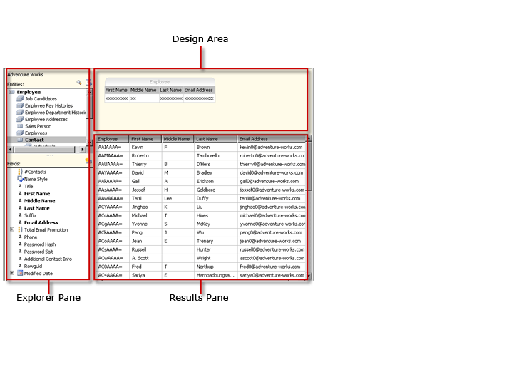
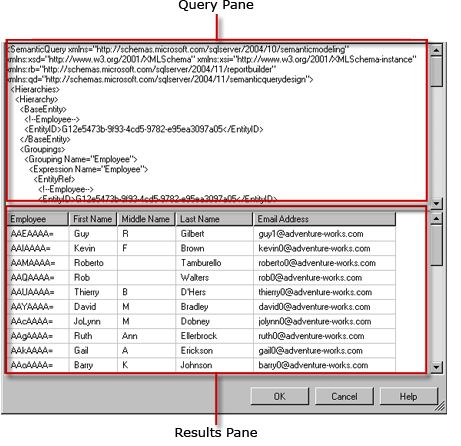

# Report Model Query Designer User Interface
Report Designer provides two query designers to help you specify which data from a Report Server Model data source you want to use in a report. Use the graphical query designer to explore and choose model entities and entity fields. Use the text-based query designer to work directly with a Semantic Model Definition Language (SMDL) specification in XML format.  
  
> [!IMPORTANT]  
>  Users access data sources when they create and run queries. You should grant minimal permissions on the data sources, such as read-only permissions.  
  
## Graphical Query Designer  
 Report Designer provides a graphical query designer that you can use to design and run SMDL queries that, during report processing, populate the field collection for a report dataset. The graphical query designer is divided into three areas, or panes.  
  
 The following figure labels each pane.  
  
   
  
 The following table describes the function of each pane.  
  
|Pane|Function|  
|----------|--------------|  
|Explorer pane|Displays graphic representations of the entities and entity fields in the model. Use this pane to explore entities, their related entities, and fields.|  
|Design Area|Displays a list of fields from the model. Use this pane to arrange the layout of the fields you've chosen.|  
|Results pane|Displays the results of the query. To run the query, right-click in any pane, and then click **Run**, or click the **Run** () button on the toolbar.|  
  
 Changing information in the Explorer or Design Area panes will affect the contents of the Result pane when you click **Run**.  
  
 To perform actions within a certain pane, such as deleting a column in the design area, right-click on the column and then click the command on the menu.  
  
### Graphical Query Designer Toolbar  
 You can also use toolbar buttons when designing your query. The following table lists the buttons on the toolbar and what they can be used for.  
  
|Button|Description|  
|------------|-----------------|  
|**Edit As Text**|Toggle between the text-based query designer and the graphical query designer. The query for a Report Server model data source is a Semantic Model Query Language (SMQL) specification in XML.|  
|**Import**|Import an existing query from a report definition (.rdl) file on the file system. For more information, see [Report Embedded Datasets and Shared Datasets (Report Builder and SSRS)](../../Topics/TopicNameNotContainA/Report-Embedded-Datasets-and-Shared-Datasets--Report-Builder-and-SSRS-.md).|  
||Undo the last action.|  
||Redo the last action.|  
||Run the query and display the resulting rows in the Result pane.|  
||Open the **Filter Data** dialog box, which allows you to specify which data you would like to filter on. You can specify filters independently of data currently in the Design Area.|  
  
## Text-based Query Designer  
 When you create a Report Server Model dataset query, the graphical query designer is the default. To switch to the text-based query designer, click the **Edit As Text** toggle button on the toolbar.  
  
 The text-based query designer consists of two panes: an SMQL query pane and a Result pane. This query designer view is primarily useful when you already have an SMQL query specification from some other source and would like to paste it in the query pane. Unlike the graphical query designer, the text-based query designer does not check query syntax or restructure the query. When you click **Run** on the toolbar, the query runs on the data source and the results are displayed in the Result pane.  
  
 The following figure labels each pane.  
  
   
  
 The following table describes the function of each pane.  
  
|Pane|Function|  
|----------|--------------|  
|Query pane|Displays the SMQL specification text.|  
|Result pane|Displays the results of the query. To run the query, right-click in any pane, and then click **Run**, or click the **Run** button on the toolbar.|  
  
### Text-based Query Designer Toolbar  
 You can also use toolbar buttons when designing your query. The following table lists the buttons on the toolbar and what they can be used for.  
  
|Button|Description|  
|------------|-----------------|  
|**Edit As Text**|Toggle between the text-based query designer and the graphical query designer.|  
|**Import**|Import a query from an existing report.|  
||Run the query text and display the resulting row set in the Result pane.|  
  
## See Also  
 [Query Design Tools (SSRS)](../../Topics/TopicNameNotContainA/Query-Design-Tools--SSRS-.md)   
 [Add Data from External Data Sources (SSRS)](../../Topics/TopicNameNotContainA/Add-Data-from-External-Data-Sources--SSRS-.md)   
 [Report Model Connection (SSRS)](../../Topics/TopicNameNotContainA/Report-Model-Connection--SSRS-.md)   
 [RSReportDesigner Configuration File](../../Topics/TopicNameNotContainA/RSReportDesigner-Configuration-File.md)