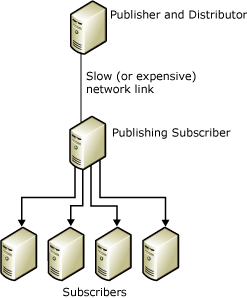
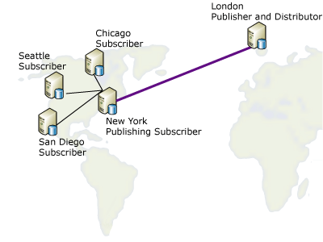

# Republish Data
In a republishing model, the Publisher sends data to a Subscriber, which then republishes the data to any number of other Subscribers. This is useful when a Publisher must send data to Subscribers over a slow or expensive communications link. If there are a number of Subscribers on the far side of that link, using a republisher shifts the bulk of the distribution load to that side of the link.  
  
 Republishing data involves the following steps:  
  
1.  Create a publication at the Publisher.  
  
2.  Create a subscription to the publication for the republishing Subscriber.  
  
3.  Initialize the subscription. The subscription must be initialized before the publication is created at the republishing Subscriber, or replication will fail.  
  
4.  Create a publication in the subscription database at the republishing Subscriber.  
  
5.  Create subscriptions to the publication at the republishing Subscriber for the other Subscribers.  
  
6.  Initialize the subscriptions.  
  
> [!NOTE]  
>  If you use merge replication in a republishing topology, all republishing Subscribers must use server subscriptions. For more information about subscription types, see [Subscribe to Publications](../../Topics/TopicNameNotContainA/Subscribe-to-Publications.md).  
  
 In the following illustration, both the Publisher and the republisher are acting as their own local Distributors. If each were set up to use a remote Distributor, each Distributor would need to be on the same side of the slow or expensive communications link as its Publisher. Publishers must be connected to remote Distributors by reliable, high-speed communications links.  
  
   
  
 Any server can act as both a Publisher and Subscriber. For example, consider the following diagram in which a publication of a table exists in London and must be distributed to four different cities in the United States: Chicago, New York, San Diego, and Seattle. The server in New York is chosen to subscribe to the published table originating in London, because the New York site meets these conditions:  
  
-   The network link back to London is relatively reliable.  
  
-   The London-to-New York communication costs are acceptable.  
  
-   There are good network communications lines from New York to all other Subscriber sites in the United States.  
  
       
  
 Replication supports the republishing scenarios shown in the following table.  
  
|Publisher|Publishing Subscriber|Subscriber|  
|---------------|---------------------------|----------------|  
|Transactional publication|Transactional subscription/transactional publication|Transactional subscription|  
|Transactional publication|Transactional subscription/merge publication*|Merge subscription|  
|Merge publication|Merge subscription/merge publication|Merge subscription|  
|Merge publication|Merge subscription/transactional publication|Transactional subscription|  
  
 \*You should set the **@published_in_tran_pub** property on the merge publication. By default, transactional replication expects tables at the Subscriber to be treated as read-only. If merge replication makes data changes to a table in a transactional subscription, non-convergence of data can occur. To avoid this risk, we recommend that any such table be specified as download-only in the merge publication. This prevents a merge Subscriber from uploading data changes to the table. For more information, see [Optimize Merge Replication Performance with Download-Only Articles](../../Topics/TopicNameNotContainA/Optimize-Merge-Replication-Performance-with-Download-Only-Articles.md).  
  
## See Also  
 [Configure Distribution](../../Topics/TopicNameNotContainA/Configure-Distribution.md)   
 [Publish Data and Database Objects](../../Topics/TopicNameNotContainA/Publish-Data-and-Database-Objects.md)   
 [Subscribe to Publications](../../Topics/TopicNameNotContainA/Subscribe-to-Publications.md)   
 [Initialize a Subscription](../../Topics/TopicNameContainA/Initialize-a-Subscription.md)   
 [Synchronize Data](../../Topics/TopicNameNotContainA/Synchronize-Data.md)