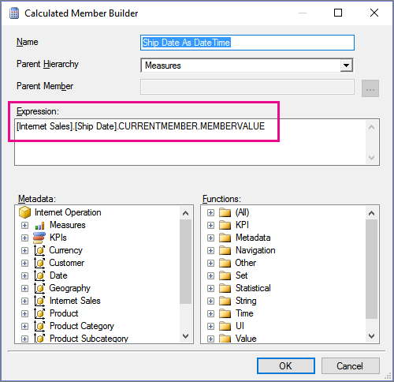
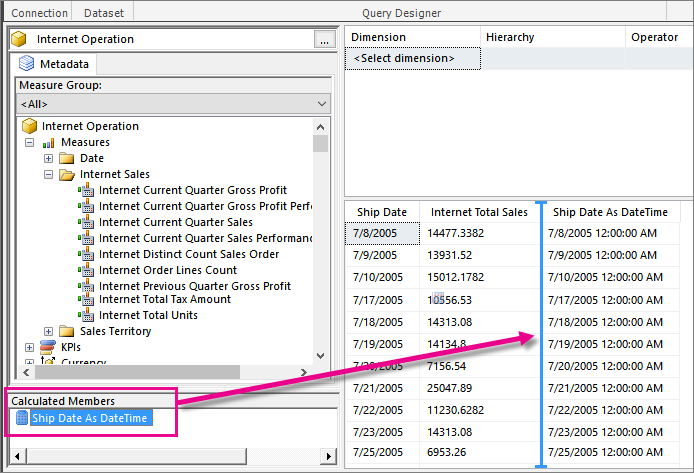

# Retain date formatting for Analysis Services in mobile reports | Reporting Services
Add a measure to a shared dataset in Report Builder so dates in [!INCLUDE[ssASnoversion_md](../../Topics/TopicNameContainA/includes/ssASnoversion_md.md)] data sources retain their data type in [!INCLUDE[SS_MobileReptPub_Long](../../Topics/TopicNameContainA/includes/SS_MobileReptPub_Short.md)].

The default return type for [!INCLUDE[ssASnoversion_md](../../Topics/TopicNameContainA/includes/ssASnoversion_md.md)] queries is a string.  When you build a dataset in [!INCLUDE[ssRSnoversion_md](../../Topics/TopicNameContainA/includes/ssRSnoversion_md.md)] Report Builder, the string type is respected and gets saved to the server. 

However, when the JSON table renderer processes the dataset, it reads the value of the column as a string and renders strings.  Then when [!INCLUDE[SS_MobileReptPub_Long](../../Topics/TopicNameContainA/includes/SS_MobileReptPub_Long.md)] fetches the table, it also only sees strings.

The workaround for this is to add a calculated member when you're creating a shared dataset in Report Builder. It works for both [!INCLUDE[ssASnoversion_md](../../Topics/TopicNameContainA/includes/ssASnoversion_md.md)] multidimensional and tabular models.

## Create a measure to retain a date field data type

1. Create a measure to hold the value of the date field in question, and in the expression field, choose the hierarchy/level of the date and append **.CurrentMember.MemberValue**. For example:
 
   [Internet Sales].[Ship Date].CurrentMember.MemberValue
   
   
   
2. Now you can append this calculated member to the set of columns by dragging it from the Calculated Members list in the bottom left and dropping it in the column grid on the right.  

    
   
### See also

-  [Data for Reporting Services mobile reports](../../Topics/TopicNameNotContainA/Data-for-Reporting-Services-mobile-reports.md)
-  [Prepare data for Reporting Services mobile reports](../../Topics/TopicNameNotContainA/Prepare-data-for-Reporting-Services-mobile-reports.md)