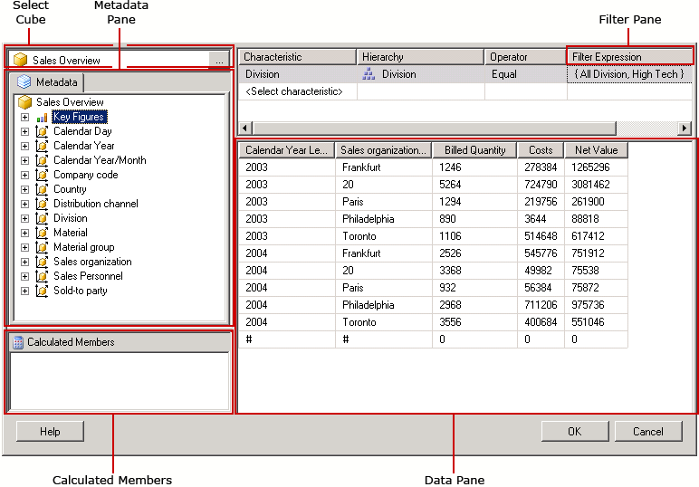
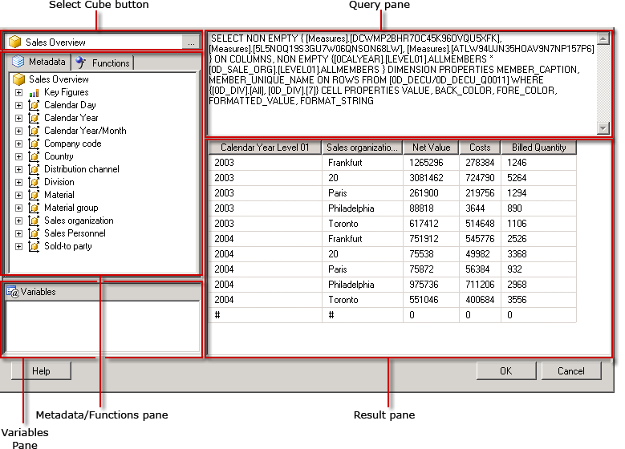

# SAP NetWeaver BI Query Designer User Interface (Report Builder)
[!INCLUDE[ssRSnoversion](../../Topics/TopicNameContainA/includes/ssRSnoversion_md.md)] provides a graphical query designer for building Multidimensional Expression (MDX) queries for a SAP NetWeaver® Business Intelligence data source. The MDX graphical query designer has two modes: Design mode and Query mode. Each mode provides a Metadata pane from which you can drag members from an InfoCube, MultiProvider, or Web-enabled query defined on the data source to build an MDX query that retrieves data when the report is processed.  
  
> [!IMPORTANT]  
>  Users access data sources when they create and run queries. You should grant minimal permissions on the data sources, such as read-only permissions.  
  
 This section describes the toolbar buttons and query designer panes for each mode of the graphical query designer.  
  
## Graphical Query Designer in Design Mode  
 When you edit a dataset query that uses a [!INCLUDE[SAP_DPE_BW_1](../../Topics/TopicNameNotContainA/includes/SAP_DPE_BW_1_md.md)] data source, the graphical query designer opens in the Design mode.  
  
   
  
 The following table lists the panes in this mode.  
  
|Pane|Function|  
|----------|--------------|  
|Select Cube button|Displays the currently selected InfoCube, MultiProvider, or Web-enabled query.|  
|Metadata pane|Displays a hierarchical list of InfoCubes, MultiProviders, and queries. Queries created at the data source may appear under the corresponding cube.|  
|Calculated Members pane|Displays the currently defined calculated members available for use in the query.|  
|Data pane|Displays the results of running the query.|  
  
 You can drag dimensions and key figures from the Metadata pane, and calculated members from the Calculated Member pane onto the Data pane. If the **AutoExecute** toggle button on the toolbar is on, the query designer runs the query every time you drop an object onto the Data pane. If **AutoExecute** is off, the query designer does not run the query as you make changes to the Data pane. You can manually run the query using the **Run** button on the toolbar.  
  
### Toolbar for the Graphical Query Designer in Design Mode Toolbar  
 The query designer toolbar provides buttons to help you design MDX queries using the graphical interface. The following table describes the buttons and their functions.  
  
|Button|Description|  
|------------|-----------------|  
|**Edit As Text**|Toggle between the text-based query designer and the graphical query designer. Not available for this data source type.|  
|**Import**|Import an existing query from a report definition (.rdl) file on the file system.|  
||Refresh metadata from the data source.|  
||Display the **Calculated Member Builder** dialog box.|  
||Switch between showing and not showing empty cells in the Data pane. (This is the equivalent to using the NON EMPTY clause in MDX).|  
||Automatically run the query and show the result every time a change is made, for example, deleting a column in the Data pane. Results are shown in the Data pane.|  
||Delete the selected column in the Data pane from the query.|  
||Display the **Variables** dialog box. This button is enabled only when the selected cube is a Query cube (because only query cubes support variables). When you assign a default value to a variable, a corresponding report parameter is created.|  
||Run the query and display the results in the Data pane.|  
||Cancel the query.|  
||Switch between Design mode and Query mode.|  
  
## Graphical Query Designer in Query Mode  
 To change the graphical query designer to Query mode, click the **Design Mode** toggle button on the toolbar.  
  
 The following figure indicates the parts of the query designer in Query mode.  
  
   
  
 The following table describes the function of each pane.  
  
|Pane|Function|  
|----------|--------------|  
|Select Cube button|Displays the currently selected InfoCube, MultiProvider, or other cube.|  
|Metadata/Functions pane|Displays a tabbed window that shows a list of available metadata or functions that can be used to build the query text.|  
|Variables pane|Displays the currently defined variables available for use in the query.|  
|Query pane|Displays the current query text.|  
|Result pane|Displays the results of the query.|  
  
 From the Metadata pane, you can drag key figures and dimensions from the **Metadata** tab onto the MDX Query pane; the technical name for the metadata is inserted at the cursor. You can drag functions from the **Functions** tab onto the MDX Query pane. When you execute the query, the Result pane displays the results for the current MDX query.  
  
 If your selected cube is a Web-enabled query, you will be prompted to set static default values for the existing variables. You can then drag variables onto the MDX Query pane.  
  
 The Metadata and Variable panes display friendly names. When you drop the objects onto the MDX Query pane, you see the technical names needed by the data source entered into the MDX query.  
  
### Toolbar for the Graphical Query Designer in Query Mode  
 The query designer toolbar provides buttons to help you design MDX queries using the graphical interface. The toolbar buttons are identical between Design mode and Query mode, but the following buttons are not enabled for Query mode:  
  
-   **Edit As Text**  
  
-   **Add Calculated Member** ()  
  
-   **Show Empty Cells** ()  
  
-   **AutoExecute** ()  
  
-   **Delete** ()  
  
## See Also  
 [Query Designers (Report Builder)](../../Topics/TopicNameNotContainA/Query-Designers--Report-Builder-.md)