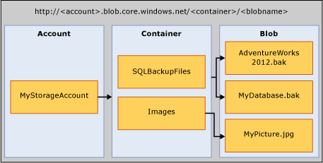

# SQL Server Backup to URL
This topic introduces the concepts, requirements and components necessary to use the Microsoft Azure Blob storage service as a backup destination. The backup and restore functionality are same or similar to when using DISK or TAPE, with a few differences. These differences and a few code examples are included in this topic.  
  
## Requirements, Components, and Concepts  
 **In this section:**  
  
-   [Security](#security)  
  
-   [Introduction to Key Components and Concepts](#intorkeyconcepts)  
  
-   [Microsoft Azure Blob storage service](#Blob)  
  
-   [SQL Server Components](#sqlserver)  
  
-   [Limitations](#limitations)  
  
-   [Support for Backup/Restore Statements](#Support)  
  
-   [Using Backup Task in SQL Server Management Studio](../../Topics/TopicNameNotContainA/SQL-Server-Backup-to-URL.md#BackupTaskSSMS)  
  
-   [SQL Server Backup to URL Using Maintenance Plan Wizard](../../Topics/TopicNameNotContainA/SQL-Server-Backup-to-URL.md#MaintenanceWiz)  
  
-   [Restoring from Windows Azure storage Using SQL Server Management Studio](../../Topics/TopicNameNotContainA/SQL-Server-Backup-to-URL.md#RestoreSSMS)  
  
###  <a name="security"></a> Security  
 The following are security considerations and requirements when backing up to or restoring from the Microsoft Azure Blob storage service.  
  
-   When creating a container for the Microsoft Azure Blob storage service, we recommend that you set the access to **private**. Setting the access to private restricts the access to users or accounts able to provide the necessary information to authenticate to the Windows Azure account.  
  
    > [!IMPORTANT]  
    >  [!INCLUDE[ssNoVersion](../../Topics/TopicNameContainA/includes/ssNoVersion_md.md)] requires that either a Windows Azure account name and access key authentication or a Shared Access Signature and access token be stored in a [!INCLUDE[ssNoVersion](../../Topics/TopicNameContainA/includes/ssNoVersion_md.md)] Credential. This information is used to authenticate to the Windows Azure account when performing backup or restore operations.  
  
-   The user account that is used to issue BACKUP or RESTORE commands should be in the **db_backup operator** database role with **Alter any credential** permissions.  
  
###  <a name="intorkeyconcepts"></a> Introduction to Key Components and Concepts  
 The following two sections introduce the Microsoft Azure Blob storage service, and the [!INCLUDE[ssNoVersion](../../Topics/TopicNameContainA/includes/ssNoVersion_md.md)] components used when backing up to or restoring from the Microsoft Azure Blob storage service. It is important to understand the components and the interaction between them to do a backup to or restore from the Microsoft Azure Blob storage service.  
  
 Creating a Windows Azure Storage account within your Azure subscription is the first step in this process. This storage account is an administrative account that has full administrative permissions on all containers and objects created with the storage account. [!INCLUDE[ssNoVersion](../../Topics/TopicNameContainA/includes/ssNoVersion_md.md)] can either use the Windows Azure storage account name and its access key value to authenticate and write and read blobs to the Microsoft Azure Blob storage service or use a Shared Access Signature token generated on specific containers granting it read and write rights. For more information on Azure Storage Accounts, see [About Azure Storage Accounts](http://azure.microsoft.com/en-us/documentation/articles/storage-create-storage-account/) and for more information about Shared Access Signatures, see [Shared Access Signatures, Part 1: Understanding the SAS Model](http://azure.microsoft.com/en-us/documentation/articles/storage-dotnet-shared-access-signature-part-1/). The [!INCLUDE[ssNoVersion](../../Topics/TopicNameContainA/includes/ssNoVersion_md.md)] Credential stores this authentication information and is used during the backup or restore operations.  
  
###  <a name="Blob"></a> Microsoft Azure Blob storage service  
 **Storage Account:** The storage account is the starting point for all storage services. To access the Microsoft Azure Blob storage service, first create a Windows Azure storage account. For more information, see [Create a Storage Account](http://azure.microsoft.com/en-us/documentation/articles/storage-create-storage-account/)  
  
 **Container:** A container provides a grouping of a set of blobs, and can store an unlimited number of blobs. To write a [!INCLUDE[ssNoVersion](../../Topics/TopicNameContainA/includes/ssNoVersion_md.md)] backup to the Microsoft Azure Blob storage service, you must have at least the root container created. You can generate a Shared Access Signature token on a container and grant access to objects on a specific container only.  
  
 **Blob:** A file of any type and size. There are two types of blobs that can be stored in the Microsoft Azure Blob storage service: block and page blobs. [!INCLUDE[ssNoVersion](../../Topics/TopicNameContainA/includes/ssNoVersion_md.md)] backup can use either blob type depending upon the Transact-SQL syntax used. Blobs are addressable using the following URL format: https://<storage account\>.blob.core.windows.net/<container\>/<blob\>. For more information about the Microsoft Azure Blob storage service, see [How to use the Blob Storage from .NET](http://www.windowsazure.com/develop/net/how-to-guides/blob-storage/). For more information about page and block blobs, see [Understanding Block and Page Blobs](http://msdn.microsoft.com/library/windowsazure/ee691964.aspx).  
  
   
  
 **Azure Snapshot:** A snapshot of an Azure blob taken at a point in time. For more information, see [Creating a Snapshot of a Blob](https://msdn.microsoft.com/en-us/library/azure/hh488361.aspx). [!INCLUDE[ssNoVersion](../../Topics/TopicNameContainA/includes/ssNoVersion_md.md)] backup now supports Azure snapshot backups of database files stored in the Microsoft Azure Blob storage service. For more information, see [File-Snapshot Backups for Database Files in Azure](../../Topics/TopicNameNotContainA/File-Snapshot-Backups-for-Database-Files-in-Azure.md).  
  
###  <a name="sqlserver"></a> [!INCLUDE[ssNoVersion](../../Topics/TopicNameContainA/includes/ssNoVersion_md.md)] Components  
 **URL:** A URL specifies a Uniform Resource Identifier (URI) to a unique backup file. The URL is used to provide the location and name of the [!INCLUDE[ssNoVersion](../../Topics/TopicNameContainA/includes/ssNoVersion_md.md)] backup file. The URL must point to an actual blob, not just a container. If the blob does not exist, it is created. If an existing blob is specified, BACKUP fails, unless the “WITH FORMAT” option is specified to overwrite the existing backup file in the blob.  
  
 Here is a sample URL value: http[s]://ACCOUNTNAME.blob.core.windows.net/<CONTAINER\>/<FILENAME.bak>. HTTPS is not required, but is recommended.  
  
 **Credential:** A [!INCLUDE[ssNoVersion](../../Topics/TopicNameContainA/includes/ssNoVersion_md.md)] credential is an object that is used to store authentication information required to connect to a resource outside of SQL Server. Here, [!INCLUDE[ssNoVersion](../../Topics/TopicNameContainA/includes/ssNoVersion_md.md)] backup and restore processes use credential to authenticate to the Microsoft Azure Blob storage service and its container and blob objects. The Credential stores either the name of the storage account and the storage account **access key** values or container URL and its Shared Access Signature token. Once the credential is created, the syntax of the BACKUP/RESTORE statements determines the type of blob and the credential required.  
  
 For an example about how to create a Shared Access Signature, see [Create a Shared Access Signature](../../Topics/TopicNameNotContainA/SQL-Server-Backup-to-URL.md#SAS) examples later in this topic and to create a [!INCLUDE[ssNoVersion](../../Topics/TopicNameContainA/includes/ssNoVersion_md.md)] Credential, see [Create a Credential](../../Topics/TopicNameNotContainA/SQL-Server-Backup-to-URL.md#credential) examples later in this topic.  
  
 For general information about credentials, see [Credentials](http://msdn.microsoft.com/en-us/library/ms161950.aspx)  
  
 For information on other examples where credentials are used, see [Create a SQL Server Agent Proxy](http://msdn.microsoft.com/library/ms175834.aspx).  
  
###  <a name="limitations"></a> Limitations  
  
-   Backup to premium storage is not supported.  
  
-   The maximum backup size supported using a page blob is limited by the maximum size of a single page blob, which 1 TB. The maximum backup size supported using block blobs is not limited by the maximum size of a block blob, which is 200 GB, because backup to block blobs supports striping to support substantially larger backup sizes.  
  
-   You can issue backup or restore statements by using TSQL, SMO, or PowerShell cmdlets. A backup to or restoring from the Microsoft Azure Blob storage service by using SQL Server Management Studio Backup or Restore wizard is not currently enabled.  
  
-   Creating a logical device name is not supported. So adding URL as a backup device using sp_dumpdevice or through SQL Server Management Studio is not supported.  
  
-   Appending to existing backup blobs is not supported. Backups to an existing blob can only be overwritten by using the **WITH FORMAT** option. However, when using file-snapshot backups (using the **WITH FILE_SNAPSHOT** argument), the **WITH FORMAT** argument is not permitted to avoid leaving orphaned file-snapshots that were created with the original file-snapshot backup.  
  
-   Backup to multiple blobs in a single backup operation is only supported using block blobs and using a Shared Access Signature (SAS) token rather than the storage account key for the SQL Credential.  
  
-   Specifying a block size with **BACKUP** is not supported.  
  
-   Specifying **MAXTRANSFERSIZE** is not supported.  
  
-   Specifying backupset options - **RETAINDAYS** and **EXPIREDATE** are not supported.  
  
-   [!INCLUDE[ssNoVersion](../../Topics/TopicNameContainA/includes/ssNoVersion_md.md)] has a maximum limit of 259 characters for a backup device name. The BACKUP TO URL consumes 36 characters for the required elements used to specify the URL – ‘https://.blob.core.windows.net//.bak’, leaving 223 characters for account, container, and blob names put together.  
  
###  <a name="Support"></a> Support for Backup/Restore Statements  
  
|||||  
|-|-|-|-|  
|Backup/Restore Statement|Supported|Exceptions|Comments|  
|BACKUP|√|BLOCKSIZE, and MAXTRANSFERSIZE are not supported.|Requires a [!INCLUDE[ssNoVersion](../../Topics/TopicNameContainA/includes/ssNoVersion_md.md)] credential to be defined, and requires the WITH CREDENTIAL argument to be specified if the [!INCLUDE[ssNoVersion](../../Topics/TopicNameContainA/includes/ssNoVersion_md.md)] credential is defined using the storage account key as the secret|  
|RESTORE|√||Requires a [!INCLUDE[ssNoVersion](../../Topics/TopicNameContainA/includes/ssNoVersion_md.md)] credential to be defined, and requires the WITH CREDENTIAL argument to be specified if the [!INCLUDE[ssNoVersion](../../Topics/TopicNameContainA/includes/ssNoVersion_md.md)] credential is defined using the storage account key as the secret|  
|RESTORE FILELISTONLY|√||Requires a [!INCLUDE[ssNoVersion](../../Topics/TopicNameContainA/includes/ssNoVersion_md.md)] credential to be defined, and requires the WITH CREDENTIAL argument to be specified if the [!INCLUDE[ssNoVersion](../../Topics/TopicNameContainA/includes/ssNoVersion_md.md)] credential is defined using the storage account key as the secret|  
|RESTORE HEADERONLY|√||Requires a [!INCLUDE[ssNoVersion](../../Topics/TopicNameContainA/includes/ssNoVersion_md.md)] credential to be defined, and requires the WITH CREDENTIAL argument to be specified if the [!INCLUDE[ssNoVersion](../../Topics/TopicNameContainA/includes/ssNoVersion_md.md)] credential is defined using the storage account key as the secret|  
|RESTORE LABELONLY|√||Requires a [!INCLUDE[ssNoVersion](../../Topics/TopicNameContainA/includes/ssNoVersion_md.md)] credential to be defined, and requires the WITH CREDENTIAL argument to be specified if the [!INCLUDE[ssNoVersion](../../Topics/TopicNameContainA/includes/ssNoVersion_md.md)] credential is defined using the storage account key as the secret|  
|RESTORE VERIFYONLY|√||Requires a [!INCLUDE[ssNoVersion](../../Topics/TopicNameContainA/includes/ssNoVersion_md.md)] credential to be defined, and requires the WITH CREDENTIAL argument to be specified if the [!INCLUDE[ssNoVersion](../../Topics/TopicNameContainA/includes/ssNoVersion_md.md)] credential is defined using the storage account key as the secret|  
|RESTORE REWINDONLY|−|||  
  
 For syntax and general information about backup statements, see [BACKUP (Transact-SQL)](assetId:///89a4658a-62f1-4289-8982-f072229720a1).  
  
 For syntax and general information about restore statements, see [RESTORE (Transact-SQL)](assetId:///877ecd57-3f2e-4237-890a-08f16e944ef1).  
  
### Support for Backup Arguments  
  
|||||  
|-|-|-|-|  
|Argument|Supported|Exception|Comments|  
|DATABASE|√|||  
|LOG|√|||  
||  
|TO (URL)|√|Unlike DISK and TAPE, URL does not support specifying or creating a logical name.|This argument is used to specify the URL path for the backup file.|  
|MIRROR TO|−|||  
|**WITH OPTIONS:**||||  
|CREDENTIAL|√||WITH CREDENTIAL is only supported when using BACKUP TO URL option to back up to the Microsoft Azure Blob storage service and only if the [!INCLUDE[ssNoVersion](../../Topics/TopicNameContainA/includes/ssNoVersion_md.md)] credential is defined using the storage account key as the secret|  
|FILE_SNAPSHOT|√|||  
|ENCRYPTION|√||When the **WITH ENCRYPTION** argument is specified, [!INCLUDE[ssNoVersion](../../Topics/TopicNameContainA/includes/ssNoVersion_md.md)] File-Snapshot Backup ensures that the entire database was TDE-encrypted before taking the backup and, if so, encrypts the file-snapshot backup file itself using the algorithm specified for TDE on the database. If all data in the database in the entire database is not encrypted, the backup will fail (e.g. the encryption process is not yet complete).|  
|DIFFERENTIAL|√|||  
|COPY_ONLY|√|||  
|COMPRESSION&#124;NO_COMPRESSION|√|Not supported for file-snapshot backup||  
|DESCRIPTION|√|||  
|NAME|√|||  
|EXPIREDATE &#124; RETAINDAYS|−|||  
|NOINIT &#124; INIT|−||This option is ignored if used.<br /><br /> Appending to blobs is not possible. To overwrite a backup use the **WITH FORMAT** argument. However, when using file-snapshot backups (using the **WITH FILE_SNAPSHOT** argument), the **WITH FORMAT** argument is not permitted to avoid leaving orphaned file-snapshots that were created with the original backup.|  
|NOSKIP &#124; SKIP|−|||  
|NOFORMAT &#124; FORMAT|√||This option is ignored if used.<br /><br /> A backup taken to an existing blob fails unless **WITH FORMAT** is specified. The existing blob is overwritten when **WITH FORMAT** is specified. However, when using file-snapshot backups (using the **WITH FILE_SNAPSHOT** argument), the FORMAT argument is not permitted to avoid leaving orphaned file-snapshots that were created with the original file-snapshot backup. However, when using file-snapshot backups (using the **WITH FILE_SNAPSHOT** argument), the **WITH FORMAT** argument is not permitted to avoid leaving orphaned file-snapshots that were created with the original backup.|  
|MEDIADESCRIPTION|√|||  
|MEDIANAME|√|||  
|BLOCKSIZE|−|||  
|BUFFERCOUNT|√|||  
|MAXTRANSFERSIZE|−|||  
|NO_CHECKSUM &#124; CHECKSUM|√|||  
|STOP_ON_ERROR &#124; CONTINUE_AFTER_ERROR|√|||  
|STATS|√|||  
|REWIND &#124; NOREWIND|−|||  
|UNLOAD &#124; NOUNLOAD|−|||  
|NORECOVERY &#124; STANDBY|√|||  
|NO_TRUNCATE|√|||  
  
 For more information about backup arguments, see [BACKUP (Transact-SQL)](assetId:///89a4658a-62f1-4289-8982-f072229720a1).  
  
### Support for Restore Arguments  
  
|||||  
|-|-|-|-|  
|Argument|Supported|Exceptions|Comments|  
|DATABASE|√|||  
|LOG|√|||  
|FROM (URL)|√||The FROM URL argument is used to specify the URL path for the backup file.|  
|**WITH Options:**||||  
|CREDENTIAL|√||WITH CREDENTIAL is only supported when using RESTORE FROM URL option to restore from Microsoft Azure Blob storage service.|  
|PARTIAL|√|||  
|RECOVERY &#124; NORECOVERY &#124; STANDBY|√|||  
|LOADHISTORY|√|||  
|MOVE|√|||  
|REPLACE|√|||  
|RESTART|√|||  
|RESTRICTED_USER|√|||  
|FILE|−|||  
|PASSWORD|√|||  
|MEDIANAME|√|||  
|MEDIAPASSWORD|√|||  
|BLOCKSIZE|√|||  
|BUFFERCOUNT|−|||  
|MAXTRANSFERSIZE|−|||  
|CHECKSUM &#124; NO_CHECKSUM|√|||  
|STOP_ON_ERROR &#124; CONTINUE_AFTER_ERROR|√|||  
|FILESTREAM|√|Not supported for snapshot backup||  
|STATS|√|||  
|REWIND &#124; NOREWIND|−|||  
|UNLOAD &#124; NOUNLOAD|−|||  
|KEEP_REPLICATION|√|||  
|KEEP_CDC|√|||  
|ENABLE_BROKER &#124; ERROR_BROKER_CONVERSATIONS &#124; NEW_BROKER|√|||  
|STOPAT &#124; STOPATMARK &#124; STOPBEFOREMARK|√|||  
  
 For more information about Restore arguments, see [RESTORE Arguments (Transact-SQL)](assetId:///4bfe5734-3003-4165-afd4-b1131ea26e2b).  
  
##  <a name="BackupTaskSSMS"></a> Using Backup Task in SQL Server Management Studio  
 The Backup task in SQL Server Management Studio includes URL as one of the destination options, and other supporting objects required to backup to Windows Azure storage like the SQL Credential. Using this task, you can backup to URL using an existing SQL credential or create a new SQL credential. However,  
  
> [!NOTE]  
>  To create a striped backup set, a [!INCLUDE[ssNoVersion](../../Topics/TopicNameContainA/includes/ssNoVersion_md.md)] file-snapshot backup, or a SQL credential using Shared Access token, you must use Transact-SQL, Powershell or C# rather than the Backup task in SQL Server Management Studio.  
  
 The following steps describe the changes made to the Back Up Database task to allow for backing up to Windows Azure storage:  
  
1.  Start SQL Server Management Studio and connect to the SQL Server instance. Select a database you want to backup, and right click on **Tasks**, and select **Back Up..**. This opens the Back Up Database dialog box.  
  
2.  On the general page the **URL** option is used to create a backup to Windows Azure storage. When you select this option, you see other options enabled on this page:  
  
    1.  **File Name:** Name of the backup file.  
  
    2.  **SQL Credential:** You can either specify an existing SQL Server Credential, or can create a new one by clicking on the **Create** next to the SQL credential box.  
  
        > [!IMPORTANT]  
        >  The dialog that opens when you click **Create** requires a management certificate or the publishing profile for the subscription. SQL Server currently supports publishing profile version 2.0. To download the supported version of the publishing profile, see [Download Publishing Profile 2.0](http://go.microsoft.com/fwlink/?LinkId=396421).  
        >   
        >  If you do not have access to the management certificate or publishing profile, you can create a SQL Credential by specifying the storage account name and access key information using Transact-SQL or SQL Server Management Studio. See the sample code in the [Create a Credential](#credential) section to create a credential using Transact-SQL. Alternatively, using SQL Server Management Studio, from the database engine instance, right click **Security**, select **New**, and select **Credential**. Specify the storage account name for **Identity** and the access key in the **Password** field.  
  
    3.  **Azure storage container:** The name of the Windows Azure storage container to store the backup files.  
  
    4.  **URL prefix:** This is built automatically using the information specified in the fields described in the previous steps. If you do edit this value manually, make sure it matches with the other information you provided previously. For example if you modify the storage URL, make sure the SQL Credential is set to authenticate to the same storage account.  
  
 When you select URL as the destination, certain options in the **Media Options** page are disabled.  The following topics have more information on the Back Up Database dialog:  
  
 [Back Up Database (General Page)](../../Topics/TopicNameNotContainA/Back-Up-Database--General-Page-.md)  
  
 [Back Up Database (Media Options Page)](../../Topics/TopicNameNotContainA/Back-Up-Database--Media-Options-Page-.md)  
  
 [Back Up Database (Backup Options Page)](../../Topics/TopicNameNotContainA/Back-Up-Database--Backup-Options-Page-.md)  
  
 [Create Credential - Authenticate to Azure Storage](../../Topics/TopicNameNotContainA/Create-Credential---Authenticate-to-Azure-Storage.md)  
  
##  <a name="MaintenanceWiz"></a> SQL Server Backup to URL Using Maintenance Plan Wizard  
 Similar to the backup task described previously, the Maintenance Plan Wizard in SQL Server Management Studio includes **URL** as one of the destination options, and other supporting objects required to backup to Windows Azure storage like the SQL Credential. It has the same For more information, see the **Define Backup Tasks** section in [Using Maintenance Plan Wizard](../../Topics/TopicNameNotContainA/Use-the-Maintenance-Plan-Wizard.md#SSMSProcedure).  
  
> [!NOTE]  
>  To create a striped backup set, a [!INCLUDE[ssNoVersion](../../Topics/TopicNameContainA/includes/ssNoVersion_md.md)] file-snapshot backup, or a SQL credential using Shared Access token, you must use Transact-SQL, Powershell or C# rather than the Backup task in Maintenance Plan Wizard.  
  
##  <a name="RestoreSSMS"></a> Restoring from Windows Azure storage Using SQL Server Management Studio  
 If you are restoring a database, **URL** is included as a device to restore from. The following steps describe using the Restore task to restore from the Microsoft Azure Blob storage service:  
  
1.  When you select **Devices** in the **General** page of the Restore task in SQL Server Management Studio, this takes you to the **Select backup devices** dialog box which includes **URL** as a backup media type.  
  
2.  When you select **URL** and click **Add**, this opens the **Connect to Azure storage** dialog. Specify the SQL Credential information to authenticate to Windows Azure storage using an existing SQL Credential.  
  
3.  SQL Server then connects to Windows Azure storage using the SQL Credential information you provided and opens the **Locate Backup File in Windows Azure** dialog. The backup files residing in the storage are displayed on this page. Select the file you want to use to restore and click **OK**. This takes you back to the **Select Backup Devices** dialog, and Clicking **OK** on this dialog takes you back to the main **Restore** dialog where you will be able complete the restore. For more information see, the following topics:  
  
     [Restore Database (General Page)](../../Topics/TopicNameNotContainA/Restore-Database--General-Page-.md)  
  
     [Restore Database (Files Page)](../../Topics/TopicNameNotContainA/Restore-Database--Files-Page-.md)  
  
     [Restore Database (Options Page)](../../Topics/TopicNameNotContainA/Restore-Database--Options-Page-.md)  
  
##  <a name="Examples"></a> Code Examples  
 This section contains the following examples.  
  
-   [Create a Credential](#credential)  
  
-   [Backing up a complete database](#complete)  
  
-   [Backing up the database and log](#databaselog)  
  
-   [Restoring to a point-in-time using STOPAT](#PITR)  
  
> [!NOTE]  
>  For a tutorial on using SQL Server 2016 with the Microsoft Azure Blob storage service, see [Tutorial: Using the Microsoft Azure Blob storage service with SQL Server 2016 databases](https://msdn.microsoft.com/en-US/library/dn466438.aspx)  
  
###  <a name="SAS"></a> Create a Shared Access Signature  
 The following examples create Shared Access Signatures that can be used to create a [!INCLUDE[ssNoVersion](../../Topics/TopicNameContainA/includes/ssNoVersion_md.md)] Credential on a newly created container. The first example creates an ad hoc Shared Access Signature and the second example creates a Shared Access Signature that is associated with a Stored Access Policy. For more information, see [Shared Access Signatures, Part 1: Understanding the SAS Model](http://azure.microsoft.com/en-us/documentation/articles/storage-dotnet-shared-access-signature-part-1/). These examples require Microsoft Azure Powershell. For information about installing and using Azure Powershell, see [How to install and configure Azure PowerShell](https://azure.microsoft.com/en-us/documentation/articles/powershell-install-configure/).  
  
1.  **Ad hoc Shared Access Signature**  
  
    ```  
    $context = New-AzureStorageContext -StorageAccountName <mystorageaccountname> -StorageAccountKey (Get-AzureStorageKey -StorageAccountName <mystorageaccountname>).Primary  
    New-AzureStorageContainer -Name <mystorageaccountcontainername> -Context $context  
    New-AzureStorageContainerSASToken -Name <mystorageaccountcontainername> -Permission rwdl -FullUri -Context $context  
    ```  
  
2.  **Shared Access Signature that is associated with a Stored Access Policy**  
  
    ```  
    $SubscriptionName='<mysubscriptionname>'  
    $StorageAccountName='<mystorageaccountname>'  
    $ContainerName='<mystorageaccountcontainername>'  
    Select-AzureSubscription -SubscriptionName $subscriptionName  
    $accountKeys = Get-AzureStorageKey -StorageAccountName $storageAccountName  
    $storageContext = New-AzureStorageContext -StorageAccountName $storageAccountName -StorageAccountKey $accountKeys.Primary  
    $container = New-AzureStorageContainer -Context $storageContext -Name $containerName  
    $cbc = $container.CloudBlobContainer  
    $permissions = $cbc.GetPermissions();  
    $policyName = 'policy1'  
    $policy = new-object 'Microsoft.WindowsAzure.Storage.Blob.SharedAccessBlobPolicy'  
    $policy.SharedAccessStartTime = $(Get-Date).ToUniversalTime().AddMinutes(-5)  
    $policy.SharedAccessExpiryTime = $(Get-Date).ToUniversalTime().AddYears(5)  
    $policy.Permissions = "Read,Write,List,Delete"  
    $permissions.SharedAccessPolicies.Add($policyName, $policy)  
    $cbc.SetPermissions($permissions);  
    $policy = new-object 'Microsoft.WindowsAzure.Storage.Blob.SharedAccessBlobPolicy'  
    $sas = $cbc.GetSharedAccessSignature($policy, $policyName)  
    Write-Host 'Shared Access Signature= '$($sas.Substring(1))''  
    Write-Host 'Credential T-SQL'  
    $TSQL = "CREATE CREDENTIAL [{0}] WITH IDENTITY='Shared Access Signature',     SECRET='{1}'" -f $cbc.Uri,$sas.Substring(1)  
    Write-Host $TSQL  
    ```  
  
###  <a name="credential"></a> Create a Credential  
 The following examples create [!INCLUDE[ssNoVersion](../../Topics/TopicNameContainA/includes/ssNoVersion_md.md)] credentials for authentication to the Microsoft Azure Blob storage service.  
  
1.  **Using storage account identity and access key**  
  
    ```  
    IF NOT EXISTS  
    (SELECT * FROM sys.credentials   
    WHERE credential_identity = '<mycredentialname>')  
    CREATE CREDENTIAL <mycredentialname> WITH IDENTITY = '<mystorageaccountname>?'  
    ,SECRET = '<mystorageaccountaccesskey>' ;  
    ```  
  
2.  **Using Shared Access Signature**  
  
    ```  
    IF NOT EXISTS  
    (SELECT * FROM sys.credentials   
    WHERE credential_identity = 'https:// <mystorageaccountname>.blob.core.windows.net/<mystorageaccountcontainername>')  
    CREATE CREDENTIAL <mycredentialname> WITH IDENTITY = 'SHARED ACCESS SIGNATURE'  
    ,SECRET = '<SAS_TOKEN>' ;  
    ```  
  
###  <a name="complete"></a> Perform a full database backup  
 The following examples perform a full database backup of the AdventureWorks2016 database to the Microsoft Azure Blob storage service.  
  
1.  **To URL using storage account identity and access key**  
  
    ```  
    BACKUP DATABASE AdventureWorks2012   
    TO URL = 'https://<mystorageaccountname>.blob.core.windows.net/<mycontainername>/AdventureWorks2016.bak'   
          WITH CREDENTIAL = '<mycredentialname>'   
         ,COMPRESSION  
         ,STATS = 5;  
    GO   
    ```  
  
2.  **To URL using Shared Access Signature**  
  
    ```  
    BACKUP DATABASE AdventureWorks2016   
    TO URL = 'https://<mystorageaccountname>.blob.core.windows.net/<mycontainername>/AdventureWorks2016.bak'   
    ;  
    GO   
    ```  
  
###  <a name="databaselog"></a> Backing up the database and log  
 The example below backs up the AdventureWorks2016 sample database, which uses the simple recovery model by default. To support log backups, the AdventureWorks2016 database is modified to use the full recovery model. The example then creates a full database backup set to Windows Azure blobs, striping the backup across two blobs. After a period of update activity, it then backs up the transaction log. This example creates the backup file names with a datetime stamp.  
  
1.  **To URL using Shared Access Signature**  
  
    ```  
    -- To permit log backups, before the full database backup, modify the database   
    -- to use the full recovery model.  
    USE master;  
    GO  
    ALTER DATABASE AdventureWorks2016  
       SET RECOVERY FULL;  
    GO  
  
    -- Back up the full AdventureWorks2016 database.  
           -- First create the file names for the backup files in the striped backup set with DateTime stamp  
  
    DECLARE @Full_Filename1 AS VARCHAR (300);  
    DECLARE @Full_Filename2 AS VARCHAR (300);  
    SET @Full_Filename1 = 'https://<mystorageaccountname>.blob.core.windows.net/<mycontainername>/AdventureWorks2016_Full_'+ ‘1_’+  
    REPLACE (REPLACE (REPLACE (CONVERT (VARCHAR (40), GETDATE (), 120), '-','_'),':', '_'),' ', '_') + '.bak';   
    SET @Full_Filename2 = 'https://<mystorageaccountname>.blob.core.windows.net/<mycontainername>/AdventureWorks2016_Full_'+ ‘2_’+  
    REPLACE (REPLACE (REPLACE (CONVERT (VARCHAR (40), GETDATE (), 120), '-','_'),':', '_'),' ', '_') + '.bak';   
  
    --Back up Adventureworks2016 database  
  
    BACKUP DATABASE AdventureWorks2016  
    TO URL =  @Full_Filename1,  URL = @Full_Filename2  
    GO  
    -- Back up the AdventureWorks2016 log.  
    DECLARE @Log_Filename AS VARCHAR (300);  
    SET @Log_Filename = 'https://<mystorageaccountname>.blob.core.windows.net/<mymycontainername>/AdventureWorks2016_Log_'+   
    REPLACE (REPLACE (REPLACE (CONVERT (VARCHAR (40), GETDATE (), 120), '-','_'),':', '_'),' ', '_') + '.trn';  
    BACKUP LOG AdventureWorks2016  
     TO URL = @Log_Filename  
  
    GO  
    ```  
  
###  <a name="PITR"></a> Restoring to a point-in-time using STOPAT  
 The following example restores the AdventureWorks2016 sample database database to its state at a point in time, and shows a restore operation.  
  
1.  **From URL using Shared Access Signature**  
  
    ```  
    RESTORE DATABASE AdventureWorks2016 FROM URL = 'https://<mystorageaccountname>.blob.core.windows.net/<mycontainername>/AdventureWorks2016_2015_05_18_16_00_00.bak'   
    WITH MOVE 'AdventureWorks2016_data' to 'C:\Program Files\Microsoft SQL Server\<myinstancename>\MSSQL\DATA\AdventureWorks2016.mdf'  
    ,MOVE 'AdventureWorks2016_log' to 'C:\Program Files\Microsoft SQL Server\<myinstancename>\MSSQL\DATA\AdventureWorks2016.ldf'  
    ,NORECOVERY  
    ,REPLACE  
    ,STATS = 5;  
    GO   
  
    RESTORE LOG AdventureWorks2016 FROM URL = 'https://<mystorageaccountname>.blob.core.windows.net/<mycontainername>/AdventureWorks2016_2015_05_18_18_00_00.trn'   
    WITH   
    RECOVERY   
    ,STOPAT = 'May 18, 2015 5:35 PM'   
    GO  
    ```  
  
## See Also  
 [SQL Server Backup to URL Best Practices and Troubleshooting](../../Topics/TopicNameNotContainA/SQL-Server-Backup-to-URL-Best-Practices-and-Troubleshooting.md)   
 [Back Up and Restore of System Databases (SQL Server)](../../Topics/TopicNameNotContainA/Back-Up-and-Restore-of-System-Databases--SQL-Server-.md)   
 [Tutorial: Using the Microsoft Azure Blob storage service with SQL Server 2016 databases](https://msdn.microsoft.com/en-US/library/dn466438.aspx)