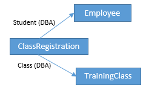
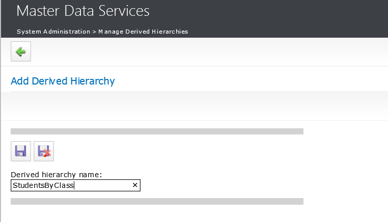
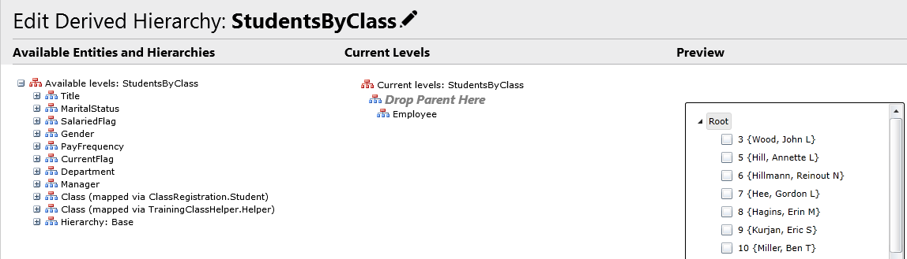
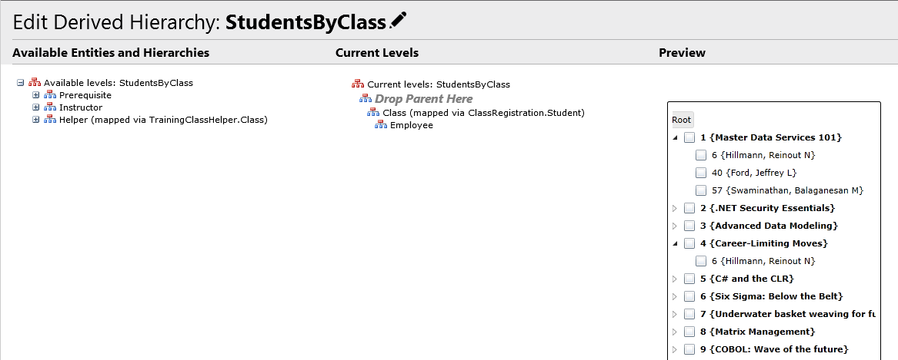
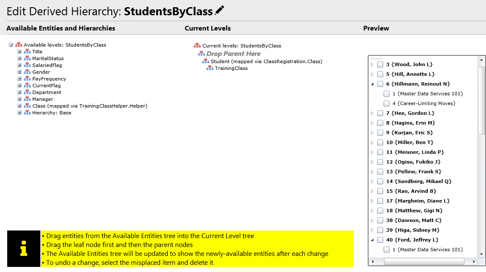
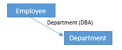
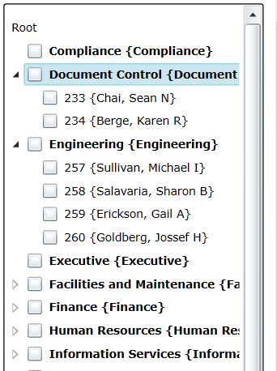

# Show Many-to-Many Relationships in Derived Hierarchies (Master Data Services)
Derived Hierarchies (DH) display one-to-many relationships, and can now also show many-to-many relationships.  
  
## Many-to-Many (M2M) Relationship  
 A many-to-many (M2M) relationship between two entities may be modeled through the use of a third entity that provides a mapping between them:  
  
   
  
 In the above example, there is an M2M relationship between the **Employee** and **TrainingClass** entities, provided by the mapping entity **ClassRegistration**. An employee may be registered as a student in multiple classes, and each class may contain multiple students.  
  
 Previously, Derived Hierarchies could not model M2M relationships. Beginning with [!INCLUDE[ssCurrent](../../Topics/TopicNameContainA/includes/ssCurrent_md.md)], you can now create a Derived Hierarchy that displays, for example, students by class, or invert the relationship and show classes grouped by student.  
  
 First, go to the Derived Hierarchy management page and create a new Derived Hierarchy:  
  
   
  
 Next, add levels to the new Derived Hierarchy, starting from the bottom up. In this example, we wish to show students (employees) grouped by class. The **Employee** entity is therefore the leaf level of the hierarchy, and is added first:  
  
   
  
 In the above screenshot, note that the **Employee** entity appears under **Current Levels** in the middle as the only level. The Derived Hierarchy **Preview** on the right simply shows a list of all members of the **Employee** entity. The **Available Levels** section on the left shows what levels may be added on top of the current top level (**Employee**). Most of these are domain-based attributes (DBAs) on the **Employee** entity, including the **Department** DBA.  
  
 Beginning with [!INCLUDE[ssCurrent](../../Topics/TopicNameContainA/includes/ssCurrent_md.md)], there is a new type of level that models M2M relationships, for example: **Class (mapped via ClassRegistration.Student)**. The level name is more verbose than the others to reflect the extra information needed to unambiguously describe the mapping relationship. Drag and drop this level to the **Employee** level in the **Current Levels** section:  
  
   
  
 Now the preview shows employees grouped by the training classes for which they are registered. Since this is a M2M relationship, each child member can have multiple parents. In the above example, employee **6 {Hillman, Reinout N}** is registered as a student in two classes, **1 {Master Data Services 101}** and **4 {Career-Limiting Moves}**.  
  
 This mapping relationship can also be displayed inverted, grouping classes by student:  
  
   
  
 Again, we see how a child can appear under more than one parent: training class **1 {Master Data Services 101}** appears under both **6 {Hillman, Reinout N}** and **40 {Ford, Jeffrey L}**.  
  
 The members of the mapping entity **ClassRegistration** do not appear anywhere within the Derived Hierarchy. They are used merely to define the relationships between parent and child members in the hierarchy.  
  
 You can edit the M2M relationship by modifying the mapping entity members, by doing one of the following. The M2M relationship is read-only in the **Derived Hierarchy Explorer** page.  
  
-   Modify the mapping entity members in the **Entity Explorer** page, using the Master Data Services add-in for Excel, or by using data staging.  
  
-   Drag and drop child nodes between parents in the **Derived Hierarchy Explore**r page.  
  
     This method modifies  existing members when possible and adds new members when necessary. Existing members are not deleted.  
  
     For example, with the ClassRegistration mapping entity, when moving a student to the unused node, the class attribute value of the corresponding mapping entity member is changed to null, and the member is not deleted. Conversely, when moving a student from the unused node to some class, if there exists an existing mapping member corresponding to the student where class is null, that member is modified by changing class from null to the new parent. If no such member is found, then one is added.  
  
     This process avoids member deletion to prevent unwanted deletion of other user data, for example if the mapping entity contains other attributes besides the two that define the parent-child relationship. Users must explicitly do deletions directly on the mapping entity.  
  
 The new M2M level can appear anywhere within a Derived Hierarchy that a domain-based attribute (DBA) level is allowed. A M2M level can be at the top, like in the above examples. It can be above and/or under a DBA level, including recursive levels. It can be under an Explicit Hierarchy (deprecated) Cap level. Multiple M2M relationships can be chained together in the same Derived Hierarchy.  
  
 M2M levels may be hidden, just like other Derived Hierarchy levels.  
  
## One-Many Relationship  
 A member of a DH may be the parent of many child members, but it generally cannot have more than one parent (for exceptions, see [Member Security](#bkmk_member_security)). For example, suppose there are two entities: Employee and Department, where each employee belongs to a single department. This relationship is modeled by adding to the Employee entity a domain-based attribute (DBA) that references the Department entity:  
  
   
  
 This is a one-to-many relationship because each employee belongs to just one department, but each department can have multiple employees. A Derived Hierarchy may be created that displays employees grouped by department:  
  
   
  
##   Member Security  
 A hierarchy that allows member duplication (allows a member to have more than one parent) cannot be used to assign member security permissions. For example:  
  
-   A Recursive Derived Hierarchy (RDH) that does not anchor null recursions (each member at the recursive level appears under both ROOT and its recursive parent).  
  
-   A Recursive Derived Hierarchy with a level above the recursive level (each member of the recursive level appears under both its non-recursive parent and its recursive parent).  
  
-   A Derived Hierarchy with a M2M level (a child may be mapped to many parents).  
  
## Collections  
 Collections and Explicit Hierarchies are deprecated. The conversion stored procedure (udpConvertCollectionAndConsolidatedMembersToLeaf) converts collection members to leaf members and creates many-to-many Derived Hierarchies to capture collection membership info.  
  
## See Also  
 [Derived Hierarchies (Master Data Services)](../../Topics/TopicNameNotContainA/Derived-Hierarchies--Master-Data-Services-.md)