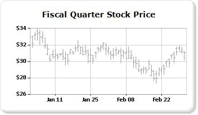

# Stock Charts (Report Builder and SSRS)
A stock chart is specifically designed for financial or scientific data that uses up to four values per data point. These values align with the high, low, open and close values that are used to plot financial stock data. This chart type displays opening and closing values by using markers, which are typically lines or triangles. In the following example, the opening values are shown by the markers on the left, and the closing values are shown by the markers on the right.  
  
   
  
 An example of a stock chart is available as a sample [!INCLUDE[ssCurrent](../../Topics/TopicNameContainA/includes/ssCurrent_md.md)] Report Builder report. For more information about downloading this sample report and others, see [!INCLUDE[ssCurrent](../../Topics/TopicNameContainA/includes/ssCurrent_md.md)][Report Builder and Report Designer sample reports](http://go.microsoft.com/fwlink/?LinkId=198283).  
  
> [!NOTE]  
>  [!INCLUDE[ssRBRDDup](../../Topics/TopicNameContainA/includes/ssRBRDDup_md.md)]  
  
## Variations  
  
-   **Candlestick**. The candlestick chart is a specialized form of the stock chart, wherein boxes are used to show the range between the open and close values. Like the stock chart, the candlestick chart can display up to four values per data point.  
  
## Data Considerations for Stock Charts  
  
-   When presenting many stock data points, such as annual stock price trend, it is difficult to distinguish each open, close, high and low value of each data point. In this scenario, consider using a line chart instead of a stock chart.  
  
-   When axis labels are generated, labeling usually begins at zero.  In general, stock prices do not fluctuate to the same degree as other data sets. For this reason, you may want to disable the axis labels from starting at zero, in order to get a better view of your data. To do this, set **IncludeZero** to **false** in the **Axis Properties** dialog box or the Properties window. For more information about how the chart generates axis labels, see [Formatting Axis Labels on a Chart (Report Builder and SSRS)](../../Topics/TopicNameContainA/Formatting-Axis-Labels-on-a-Chart--Report-Builder-and-SSRS-.md).  
  
-   [!INCLUDE[ssRSnoversion](../../Topics/TopicNameContainA/includes/ssRSnoversion_md.md)] provides many calculated formulas for use with stock charts, including Price Indicator, Relative Strength Index, MACD and more.  
  
## See Also  
 [Range Charts (Report Builder and SSRS)](../../Topics/TopicNameNotContainA/Range-Charts--Report-Builder-and-SSRS-.md)   
 [Charts (Report Builder and SSRS)](../../Topics/TopicNameNotContainA/Charts--Report-Builder-and-SSRS-.md)   
 [Formatting a Chart (Report Builder and SSRS)](../../Topics/TopicNameContainA/Formatting-a-Chart--Report-Builder-and-SSRS-.md)   
 [Axis Properties Dialog Box, Axis Options (Report Builder and SSRS)](../../Topics/TopicNameNotContainA/Axis-Properties-Dialog-Box--Axis-Options--Report-Builder-and-SSRS-.md)