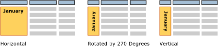

# Text Boxes (Report Builder and SSRS)
When you think of a text box, you probably think of a stand-alone box containing text on a surface like [!INCLUDE[msCoName](../../Topics/TopicNameContainA/includes/msCoName_md.md)] Office PowerPoint. In Report Builder, some text boxes are like that, and they can display literal text for titles, descriptions, and labels, or dynamic text based on expressions. But every cell in a table or matrix (a tablix data region) also contains a text box, which can be formatted in the same way as stand-alone text boxes in your report.  
  
> [!NOTE]  
>  If you drag a report dataset field value directly to the report design surface, or to a text box on the report design surface, you only see the first value in the result set when you run the report. To see all the values for a field, you must drag the field to a cell in a table or matrix. That way, when you run the report, you will see all the values in that field.  
  
 To show repeating text in a free-form layout, place a text box in a list data region. Use a list when you want to repeat a form for multiple values, for example, a customer invoice form repeated once for each customer. For more information, see [Create Invoices and Forms with Lists (Report Builder and SSRS)](../../Topics/TopicNameNotContainA/Create-Invoices-and-Forms-with-Lists--Report-Builder-and-SSRS-.md).  
  
 Use a rectangle container when you want to control the text box layout and white space below the last text box. For more information, see [Rectangles and Lines (Report Builder and SSRS)](../../Topics/TopicNameNotContainA/Rectangles-and-Lines--Report-Builder-and-SSRS-.md).  
  
 The expressions in a text box can contain literal text, point to a field in the database, or calculate data. All expressions are shown as placeholder text so that you can format numbers, colors, and other appearance properties. You can also combine placeholders with literal text in the same text box.  
  
 You can format text in any single text box with multiple fonts, colors, styles, and actions. For more information, see [Formatting Text and Placeholders (Report Builder and SSRS)](../../Topics/TopicNameNotContainA/Formatting-Text-and-Placeholders--Report-Builder-and-SSRS-.md).  
  
> [!NOTE]  
>  [!INCLUDE[ssRBRDDup](../../Topics/TopicNameContainA/includes/ssRBRDDup_md.md)]  
  
##   Growing and Shrinking a Text Box  
 By default, text boxes are a fixed size. You can allow a text box to shrink or expand vertically based on its contents. For more information, see [Allow a Text Box to Grow or Shrink (Report Builder and SSRS)](../../Topics/TopicNameContainA/Allow-a-Text-Box-to-Grow-or-Shrink--Report-Builder-and-SSRS-.md).  
  
## Orienting a Text Box  
 Orienting text boxes can help you create more readable reports, support locale-specific text orientation, fit more columns on a printed report that has fixed page size, and create reports with more graphical appeal. A text box can be oriented in different directions: horizontal, vertical, or rotated by 270 degrees. The vertical option is most commonly used for East Asian languages that are written top to bottom. In most renderers the vertical option handles the glyph rotation property so that the text is written top to bottom, but the characters are not on their sides. For other languages, in the vertical and 270-degree options the text is written sideways.  
  
 You can apply orientation to text boxes that contain literal text, fields from a report dataset, or calculated data. The text box can be stand-alone in the report body, in a table or matrix, or in a report header and footer.  
  
 The following picture shows three versions of a table report that groups data by month. The text box that contains the month value uses a different text box orientation.  
  
   
  
 Orientation is set on the text box and applies to all the text in the box. You cannot specify a different orientation for parts of the text box.  
  
 To quickly get started with changing text orientation, see the section on rotating text in the [Tutorial: Formatting Text (Report Builder)](assetId:///67d8513e-8a70-464b-b87f-e91d010cfd82). For more information, see [Set Text Box Orientation (Report Builder and SSRS)](../../Topics/TopicNameNotContainA/Set-Text-Box-Orientation--Report-Builder-and-SSRS-.md).  
  
##   How-To Topics  
 [Add, Move, or Delete a Text Box (Report Builder and SSRS)](../../Topics/TopicNameContainA/Add--Move--or-Delete-a-Text-Box--Report-Builder-and-SSRS-.md)  
  
 [Format Text in a Text Box (Report Builder and SSRS)](../../Topics/TopicNameContainA/Format-Text-in-a-Text-Box--Report-Builder-and-SSRS-.md)  
  
 [Set Text Box Orientation (Report Builder and SSRS)](../../Topics/TopicNameNotContainA/Set-Text-Box-Orientation--Report-Builder-and-SSRS-.md)  
  
 [Allow a Text Box to Grow or Shrink (Report Builder and SSRS)](../../Topics/TopicNameContainA/Allow-a-Text-Box-to-Grow-or-Shrink--Report-Builder-and-SSRS-.md)  
  
## See Also  
 [Formatting Text and Placeholders (Report Builder and SSRS)](../../Topics/TopicNameNotContainA/Formatting-Text-and-Placeholders--Report-Builder-and-SSRS-.md)   
 [Formatting Numbers and Dates (Report Builder and SSRS)](../../Topics/TopicNameNotContainA/Formatting-Numbers-and-Dates--Report-Builder-and-SSRS-.md)