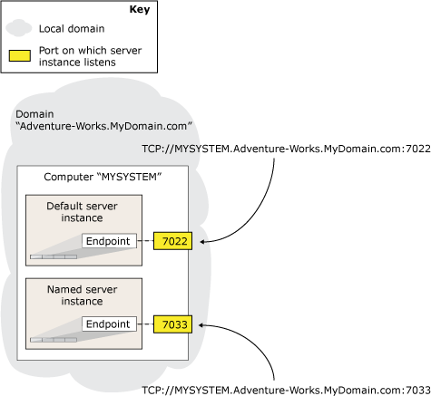

# The Database Mirroring Endpoint (SQL Server)
To participate in [!INCLUDE[ssHADR](../../Topics/TopicNameContainA/includes/ssHADR_md.md)] or database mirroring a server instance requires its own, dedicated *database mirroring endpoint*. This endpoint is a special-purpose endpoint that is used exclusively to receive connections from other server instances. On a given server instance, every [!INCLUDE[ssHADR](../../Topics/TopicNameContainA/includes/ssHADR_md.md)] or database mirroring connection to any other server instance uses a single database mirroring endpoint.  
  
 Database mirroring endpoints use Transmission Control Protocol (TCP) to send and receive messages between the server instances participating database mirroring sessions or hosting availability replicas. The database mirroring endpoint listens on a unique TCP port number.  
  
> [!NOTE]  
>  Client connections to a principal server or primary replica do not use the database mirroring endpoint.  
  
> [!NOTE]  
>  The database mirroring feature will be removed in a future version of Microsoft SQL Server. Avoid using this feature in new development work, and plan to modify applications that currently use database mirroring to use [!INCLUDE[ssHADR](../../Topics/TopicNameContainA/includes/ssHADR_md.md)] instead.  
  
 **In this Topic:**  
  
-   [Server Network Address](#ServerNetworkAddress)  
  
-   [Determining the Authentication Type for a Database Mirroring Endpoint](#EndpointAuthenticationTypes)  
  
-   [Related Tasks](#RelatedTasks)  
  
##   Server Network Address  
 The network address of a server instance (its *server network address* or *Endpoint URL*) contains the port number of its endpoint, as well as the system and domain name of its host computer. The port number uniquely identifies a specific server instance.  
  
 The following figure illustrates how two server instances on the same server are uniquely identified. The server network addresses of both server instances contain the same system name, `MYSYSTEM`, and domain name, `Adventure-Works.MyDomain.com`. To enable the system to route connections to a server instance, a server network address includes the port number associated with the mirroring endpoint of a particular server instance.  
  
   
  
 By default, an instance of [!INCLUDE[ssNoVersion](../../Topics/TopicNameContainA/includes/ssNoVersion_md.md)] does not contain a database mirroring endpoint. These must be created manually as part of setting up a database mirroring session. The system administrator must create a separate endpoint in each server instance that is to participate in database mirroring. Note that if more than one server instance on a given computer requires a database mirroring endpoint, specify a different port number for each endpoint.  
  
> [!IMPORTANT]  
>  If the computer running [!INCLUDE[ssNoVersion](../../Topics/TopicNameContainA/includes/ssNoVersion_md.md)] has a firewall, the firewall configuration must allow both incoming and outgoing connections for the port specified in the endpoint.  
  
 For database mirroring and [!INCLUDE[ssHADR](../../Topics/TopicNameContainA/includes/ssHADR_md.md)], authentication and encryption are configured on the endpoint. For more information, see [Transport Security for Database Mirroring and Always On Availability Groups (SQL Server)](../../Topics/TopicNameNotContainA/Transport-Security-for-Database-Mirroring-and-Always-On-Availability-Groups--SQL-Server-.md).  
  
> [!IMPORTANT]  
>  Do not reconfigure an in-use database mirroring endpoint. The server instances use each other's endpoints to learn the state of the other systems. If the endpoint is reconfigured, it might restart, which can appear to be an error to the other server instances. This is particularly important for automatic failover mode, in which reconfiguring the endpoint on a partner could cause a failover to occur.  
  
   
  
##   Determining the Authentication Type for a Database Mirroring Endpoint  
 It is important to understand that the [!INCLUDE[ssNoVersion](../../Topics/TopicNameContainA/includes/ssNoVersion_md.md)] service accounts of your server instances determine what type of authentication you can use for your database mirroring endpoints, as follows:  
  
-   If every server instance is running under a domain service account, you can use Windows Authentication for your database mirroring endpoints. If all the server instances run as the same domain user account, the correct user logins exist automatically in both **master** databases. This simplifies the security configuration for the availability databases and is recommended.  
  
     If any server instances that are hosting the availability replicas for an availability group run as different accounts, the login each account must be created in **master** on the other server instance. Then, that login must be granted CONNECT permissions to connect to the database mirroring endpoint of that server instance. For more information, [Set Up Login Accounts for Database Mirroring or Always On Availability Groups (SQL Server)](../../Topics/TopicNameNotContainA/Set-Up-Login-Accounts-for-Database-Mirroring-or-Always-On-Availability-Groups--SQL-Server-.md).  
  
     If your server instances use Windows Authentication, you can create database mirroring endpoints by using [!INCLUDE[tsql](../../Topics/TopicNameContainA/includes/tsql_md.md)], PowerShell, or the New Availability Group Wizard.  
  
    > [!NOTE]  
    >  If a server instance that is to host an availability replica lacks a database mirroring endpoint, the New Availability Group Wizard can automatically create a database mirroring endpoint that uses Windows Authentication. For more information, see [Use the Availability Group Wizard (SQL Server Management Studio)](../../Topics/TopicNameNotContainA/Use-the-Availability-Group-Wizard--SQL-Server-Management-Studio-.md).  
  
-   If any server instance is running under a built-in account, such as Local System, Local Service, or Network Service, or a nondomain account, you must use certificates for endpoint authentication. If you are using certificates for your database mirroring endpoints, your system administrator must configure each server instance to use certificates on both outbound and inbound connections.  
  
     There is no automated method for configuring database mirroring security using certificates. You will need to use either CREATE ENDPOINT [!INCLUDE[tsql](../../Topics/TopicNameContainA/includes/tsql_md.md)] statement or the **New-SqlHadrEndpoint** PowerShell cmdlet. For more information, see [CREATE ENDPOINT (Transact-SQL)](assetId:///6405e7ec-0b5b-4afd-9792-1bfa5a2491f6). For information about enabling certificate authentication on a server instance, see [Use Certificates for a Database Mirroring Endpoint (Transact-SQL)](../../Topics/TopicNameContainA/Use-Certificates-for-a-Database-Mirroring-Endpoint--Transact-SQL-.md).  
  
   
  
##   Related Tasks  
 **To Configure a Database Mirroring Endpoint**  
  
-   [Create a Database Mirroring Endpoint for Windows Authentication (Transact-SQL)](../../Topics/TopicNameContainA/Create-a-Database-Mirroring-Endpoint-for-Windows-Authentication--Transact-SQL-.md)  
  
-   [Use Certificates for a Database Mirroring Endpoint (Transact-SQL)](../../Topics/TopicNameContainA/Use-Certificates-for-a-Database-Mirroring-Endpoint--Transact-SQL-.md)  
  
    -   [Allow a Database Mirroring Endpoint to Use Certificates for Outbound Connections (Transact-SQL)](../../Topics/TopicNameContainA/Allow-a-Database-Mirroring-Endpoint-to-Use-Certificates-for-Outbound-Connections--Transact-SQL-.md)  
  
    -   [Allow a Database Mirroring Endpoint to Use Certificates for Inbound Connections (Transact-SQL)](../../Topics/TopicNameContainA/Allow-a-Database-Mirroring-Endpoint-to-Use-Certificates-for-Inbound-Connections--Transact-SQL-.md)  
  
-   [Specify a Server Network Address (Database Mirroring)](../../Topics/TopicNameContainA/Specify-a-Server-Network-Address--Database-Mirroring-.md)  
  
-   [Specify the Endpoint URL When Adding or Modifying an Availability Replica (SQL Server)](../../Topics/TopicNameNotContainA/Specify-the-Endpoint-URL-When-Adding-or-Modifying-an-Availability-Replica--SQL-Server-.md)  
  
-   [Use the Availability Group Wizard (SQL Server Management Studio)](../../Topics/TopicNameNotContainA/Use-the-Availability-Group-Wizard--SQL-Server-Management-Studio-.md)  
  
 **To View Information About the Database Mirroring Endpoint**  
  
-   [sys.database_mirroring_endpoints (Transact-SQL)](assetId:///f2285199-97ad-473c-a52d-270044dd862b)  
  
   
  
## See Also  
 [Transport Security for Database Mirroring and Always On Availability Groups (SQL Server)](../../Topics/TopicNameNotContainA/Transport-Security-for-Database-Mirroring-and-Always-On-Availability-Groups--SQL-Server-.md)   
 [Troubleshoot Database Mirroring Configuration (SQL Server)](../../Topics/TopicNameNotContainA/Troubleshoot-Database-Mirroring-Configuration--SQL-Server-.md)   
 [sys.dm_hadr_availability_replica_states (Transact-SQL)](assetId:///d2e678bb-51e8-4a61-b223-5c0b8d08b8b1)   
 [sys.dm_db_mirroring_connections](assetId:///e4df91b6-0240-45d0-ae22-cb2c0d52e0b3)