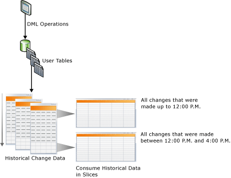
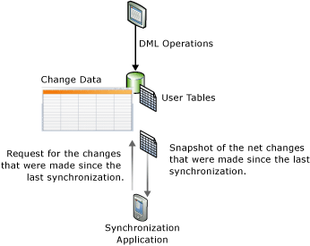

# Track Data Changes (SQL Server)
[!INCLUDE[ssCurrent](../../Topics/TopicNameContainA/includes/ssCurrent_md.md)] provides two features that track changes to data in a database: [change data capture](#Capture) and [change tracking](#Tracking). These features enable applications to determine the DML changes (insert, update, and delete operations) that were made to user tables in a database. Change data capture and change tracking can be enabled on the same database; no special considerations are required. For the editions of [!INCLUDE[ssNoVersion](../../Topics/TopicNameContainA/includes/ssNoVersion_md.md)] that support change data capture and change tracking, see [Features Supported by the Editions of SQL Server 2016](../../Topics/TopicNameNotContainA/Features-Supported-by-the-Editions-of-SQL-Server-2016.md).  
  
## Benefits of Using Change Data Capture or Change Tracking  
 The ability to query for data that has changed in a database is an important requirement for some applications to be efficient. Typically, to determine data changes, application developers must implement a custom tracking method in their applications by using a combination of triggers, timestamp columns, and additional tables. Creating these applications usually involves a lot of work to implement, leads to schema updates, and often carries a high performance overhead.  
  
 Using change data capture or change tracking in applications to track changes in a database, instead of developing a custom solution, has the following benefits:  
  
-   There is reduced development time. Because functionality is available in [!INCLUDE[ssCurrent](../../Topics/TopicNameContainA/includes/ssCurrent_md.md)], you do not have to develop a custom solution.  
  
-   Schema changes are not required. You do not have to add columns, add triggers, or create side table in which to track deleted rows or to store change tracking information if columns cannot be added to the user tables.  
  
-   There is a built-in cleanup mechanism. Cleanup for change tracking is performed automatically in the background. Custom cleanup for data that is stored in a side table is not required.  
  
-   Functions are provided to obtain change information.  
  
-   There is low overhead to DML operations. Synchronous change tracking will always have some overhead. However, using change tracking can help minimize the overhead. The overhead will frequently be less than that of using alternative solutions, especially solutions that require the use triggers.  
  
-   Change tracking is based on committed transactions. The order of the changes is based on transaction commit time. This allows for reliable results to be obtained when there are long-running and overlapping transactions. Custom solutions that use **timestamp** values must be specifically designed to handle these scenarios.  
  
-   Standard tools are available that you can use to configure and manage. [!INCLUDE[ssCurrent](../../Topics/TopicNameContainA/includes/ssCurrent_md.md)] provides standard DDL statements, [!INCLUDE[ssManStudioFull](../../Topics/TopicNameContainA/includes/ssManStudioFull_md.md)], catalog views, and security permissions.  
  
## Feature Differences Between Change Data Capture and Change Tracking  
 The following table lists the feature differences between change data capture and change tracking. The tracking mechanism in change data capture involves an asynchronous capture of changes from the transaction log so that changes are available after the DML operation. In change tracking, the tracking mechanism involves synchronous tracking of changes in line with DML operations so that change information is available immediately.  
  
|Feature|Change data capture|Change tracking|  
|-------------|-------------------------|---------------------|  
|**Tracked changes**|||  
|DML changes|Yes|Yes|  
|**Tracked information**|||  
|Historical data|Yes|No|  
|Whether column was changed|Yes|Yes|  
|DML type|Yes|Yes|  
  
##   Change Data Capture  
 Change data capture provides historical change information for a user table by capturing both the fact that DML changes were made and the actual data that was changed. Changes are captured by using an asynchronous process that reads the transaction log and has a low impact on the system.  
  
 As shown in the following illustration, the changes that were made to user tables are captured in corresponding change tables. These change tables provide an historical view of the changes over time. The [change data capture](assetId:///e5270557-aca3-44ab-8715-daccd498b88d)functions that [!INCLUDE[ssNoVersion](../../Topics/TopicNameContainA/includes/ssNoVersion_md.md)] provides enable the change data to be consumed easily and systematically.  
  
   
  
### Security Model  
 This section describes the change data capture security model.  
  
 **Configuration and Administration**  
 To either enable or disable change data capture for a database, the caller of [sys.sp_change data capture _enable_db (Transact-SQL)](assetId:///176d83b3-493d-43cd-800e-aa123c3bdf17) or [sys.sp_change data capture _disable_db (Transact-SQL)](assetId:///420fb99e-e60f-445b-b568-da96471f1e8f) must be a member of the fixed server **sysadmin** role. Enabling and disabling change data capture at the table level requires the caller of [sys.sp_change data capture _enable_table (Transact-SQL)](assetId:///26150c09-2dca-46ad-bb01-3cb3165bcc5d) and [sys.sp_change data capture _disable_table (Transact-SQL)](assetId:///da2156c0-504e-4d76-b9a0-4448becf9bda) to either be a member of the sysadmin role or a member of the database **database db_owner** role.  
  
 Use of the stored procedures to support the administration of change data capture jobs is restricted to members of the server **sysadmin** role and members of the **database db_owner** role.  
  
 **Change Enumeration and Metadata Queries**  
 To gain access to the change data that is associated with a capture instance, the user must be granted select access to all the captured columns of the associated source table. In addition, if a gating role is specified when the capture instance is created, the caller must also be a member of the specified gating role. Other general change data capture functions for accessing metadata will be accessible to all database users through the public role, although access to the returned metadata will also typically be gated by using select access to the underlying source tables, and by membership in any defined gating roles.  
  
 **DDL Operations to Change Data Capture Enabled Source Tables**  
 When a table is enabled for change data capture, DDL operations can only be applied to the table by a member of the fixed server role **sysadmin**, a member of the **database role db_owner**, or a member of the **database role db_ddladmin**. Users who have explicit grants to perform DDL operations on the table will receive error 22914 if they try these operation.  
  
### Data Type Considerations for Change Data Capture  
 All base column types are supported by change data capture. The following table lists the behavior and limitations for several column types.  
  
|Type of Column|Changes Captured in Change Tables|Limitations|  
|--------------------|---------------------------------------|-----------------|  
|Sparse Columns|Yes|Does not support capturing changes when using a columnset.|  
|Computed Columns|No|Changes to computed columns are not tracked. The column will appear in the change table with the appropriate type, but will have a value of NULL.|  
|XML|Yes|Changes to individual XML elements are not tracked.|  
|Timestamp|Yes|The data type in the change table is converted to binary.|  
|BLOB data types|Yes|The previous image of the BLOB column is stored only if the column itself is changed.|  
  
### Change Data Capture and Other SQL Server Features  
 This section describes how the following features interact with change data capture:  
  
-   Database mirroring  
  
-   Transactional replication  
  
-   Database restore or attach  
  
#### Database Mirroring  
 A database that is enabled for change data capture can be mirrored. To ensure that capture and cleanup happen automatically on the mirror, follow these steps:  
  
1.  Ensure that [!INCLUDE[ssNoVersion](../../Topics/TopicNameContainA/includes/ssNoVersion_md.md)] Agent is running on the mirror.  
  
2.  Create the capture job and cleanup job on the mirror after the principal has failed over to the mirror. To create the jobs, use the stored procedure [sp_cdc_add_job](assetId:///c4458738-ed25-40a6-8294-a26ca5a05bd9).  
  
 For more information about database mirroring, see [Database Mirroring (SQL Server)](../../Topics/TopicNameNotContainA/Database-Mirroring--SQL-Server-.md).  
  
#### Transactional Replication  
 Change data capture and transactional replication can coexist in the same database, but population of the change tables is handled differently when both features are enabled. Change data capture and transactional replication always use the same procedure, [sp_replcmds](assetId:///7e932f80-cc6e-4109-8db4-2b7c8828df73), to read changes from the transaction log. When change data capture is enabled on its own, a [!INCLUDE[ssNoVersion](../../Topics/TopicNameContainA/includes/ssNoVersion_md.md)] Agent job calls **sp_replcmds**. When both features are enabled on the same database, the Log Reader Agent calls **sp_replcmds**. This agent populates both the change tables and the distribution database tables. For more information, see [Replication Log Reader Agent](../../Topics/TopicNameNotContainA/Replication-Log-Reader-Agent.md).  
  
 Consider a scenario in which change data capture is enabled on the [!INCLUDE[ssSampleDBobject](../../Topics/TopicNameContainA/includes/ssSampleDBobject_md.md)] database, and two tables are enabled for capture. To populate the change tables, the capture job calls **sp_replcmds**. The database is enabled for transactional replication, and a publication is created. Now, the Log Reader Agent is created for the database and the capture job is deleted. The Log Reader Agent continues to scan the log from the last log sequence number that was committed to the change table. This ensures data consistency in the change tables. If transactional replication is disabled in this database, the Log Reader Agent is removed and the capture job is re-created.  
  
> [!NOTE]  
>  When the Log Reader Agent is used for both change data capture and transactional replication, replicated changes are first written to the distribution database. Then, captured changes are written to the change tables. Both operations are committed together. If there is any latency in writing to the distribution database, there will be a corresponding latency before changes appear in the change tables.  
  
#### Restoring or Attaching a Database Enabled for Change Data Capture  
 [!INCLUDE[ssNoVersion](../../Topics/TopicNameContainA/includes/ssNoVersion_md.md)] uses the following logic to determine if change data capture remains enabled after a database is restored or attached:  
  
-   If a database is restored to the same server with the same database name, change data capture remains enabled.  
  
-   If a database is restored to another server, by default change data capture is disabled and all related metadata is deleted.  
  
     To retain change data capture, use the **KEEP_CDC** option when restoring the database. For more information about this option, see [RESTORE](assetId:///877ecd57-3f2e-4237-890a-08f16e944ef1).  
  
-   If a database is detached and attached to the same server or another server, change data capture remains enabled.  
  
-   If a database is attached or restored with the **KEEP_CDC** option to any edition other than Enterprise, the operation is blocked because change data capture requires [!INCLUDE[ssNoVersion](../../Topics/TopicNameContainA/includes/ssNoVersion_md.md)] Enterprise. Error message 932 is displayed:  
  
     `SQL Server cannot load database '%.*ls' because change data capture is enabled. The currently installed edition of SQL Server does not support change data capture. Either disable change data capture in the database by using a supported edition of SQL Server, or upgrade the instance to one that supports change data capture.`  
  
 You can use [sys.sp_cdc_disable_db](assetId:///420fb99e-e60f-445b-b568-da96471f1e8f) to remove change data capture from a restored or attached database.  
  
##   Change Tracking  
 Change tracking captures the fact that rows in a table were changed, but does not capture the data that was changed. This enables applications to determine the rows that have changed with the latest row data being obtained directly from the user tables. Therefore, change tracking is more limited in the historical questions it can answer compared to change data capture. However, for those applications that do not require the historical information, there is far less storage overhead because of the changed data not being captured. A synchronous tracking mechanism is used to track the changes. This has been designed to have minimal overhead to the DML operations.  
  
 The following illustration shows a synchronization scenario that would benefit by using change tracking. In the scenario, an application requires the following information: all the rows in the table that were changed since in the last time that the table was synchronized, and only the current row data. Because a synchronous mechanism is used to track the changes, an application can perform two-way synchronization and reliably detect any conflicts that might have occurred.  
  
   
  
### Change Tracking and Sync Services for ADO.NET  
 [!INCLUDE[sql_sync_long](../../Topics/TopicNameNotContainA/includes/sql_sync_long_md.md)] enables synchronization between databases, providing an intuitive and flexible API that enables you to build applications that target offline and collaboration scenarios. [!INCLUDE[sql_sync_long](../../Topics/TopicNameNotContainA/includes/sql_sync_long_md.md)] provides an API to synchronize changes, but it does not actually track changes in the server or peer database. You can create a custom change tracking system, but this typically introduces significant complexity and performance overhead. To track changes in a server or peer database, we recommend that you use change tracking in [!INCLUDE[ssCurrent](../../Topics/TopicNameContainA/includes/ssCurrent_md.md)] because it is easy to configure and provides high performance tracking.  
  
 For more information about change tracking and [!INCLUDE[sql_sync_long](../../Topics/TopicNameNotContainA/includes/sql_sync_long_md.md)], use the following links:  
  
-   [About Change Tracking (SQL Server)](../../Topics/TopicNameNotContainA/About-Change-Tracking--SQL-Server-.md)  
  
     Describes change tracking, provides a high-level overview of how change tracking works, and describes how change tracking interacts with other [!INCLUDE[ssDEnoversion](../../Topics/TopicNameContainA/includes/ssDEnoversion_md.md)] features.  
  
-   [Microsoft Sync Framework Developer Center](http://go.microsoft.com/fwlink/?LinkId=108054)  
  
     Provides complete documentation for [!INCLUDE[ssSyncFrameLong](../../Topics/TopicNameNotContainA/includes/ssSyncFrameLong_md.md)] and [!INCLUDE[sql_sync_short](../../Topics/TopicNameNotContainA/includes/sql_sync_short_md.md)]. In the documentation for [!INCLUDE[sql_sync_short](../../Topics/TopicNameNotContainA/includes/sql_sync_short_md.md)], the topic "How to: Use SQL Server Change Tracking" contains detailed information and code examples.  
  
## Related Tasks (required)  
  
|||  
|-|-|  
|**Task**|**Topic**|  
|Provides an overview of change data capture.|[About Change Data Capture (SQL Server)](../../Topics/TopicNameNotContainA/About-Change-Data-Capture--SQL-Server-.md)|  
|Describes how to enable and disable change data capture on a database or table.|[Enable and Disable Change Data Capture (SQL Server)](../../Topics/TopicNameNotContainA/Enable-and-Disable-Change-Data-Capture--SQL-Server-.md)|  
|Describes how to administer and monitor change data capture.|[Administer and Monitor Change Data Capture (SQL Server)](../../Topics/TopicNameNotContainA/Administer-and-Monitor-Change-Data-Capture--SQL-Server-.md)|  
|Describes how to work with the change data that is available to change data capture consumers. This topic covers validating LSN boundaries, the query functions, and query function scenarios.|[Work with Change Data (SQL Server)](../../Topics/TopicNameNotContainA/Work-with-Change-Data--SQL-Server-.md)|  
|Provides an overview of change tracking.|[About Change Tracking (SQL Server)](../../Topics/TopicNameNotContainA/About-Change-Tracking--SQL-Server-.md)|  
|Describes how to enable and disable change tracking on a database or table.|[Enable and Disable Change Tracking (SQL Server)](../../Topics/TopicNameNotContainA/Enable-and-Disable-Change-Tracking--SQL-Server-.md)|  
|Describes how to manage change tracking, configure security, and determine the effects on storage and performance when change tracking is used.|[Manage Change Tracking (SQL Server)](../../Topics/TopicNameNotContainA/Manage-Change-Tracking--SQL-Server-.md)|  
|Describes how applications that use change tracking can obtain tracked changes, apply these changes to another data store, and update the source database. This topic also describes the role change tracking plays when a failover occurs and a database must be restored from a backup.|[Work with Change Tracking (SQL Server)](../../Topics/TopicNameNotContainA/Work-with-Change-Tracking--SQL-Server-.md)|  
  
## See Also  
 [Change Data Capture Functions (Transact-SQL)](assetId:///e5270557-aca3-44ab-8715-daccd498b88d)   
 [Change Tracking Functions (Transact-SQL)](assetId:///04eb53c4-8b69-414e-9696-185d227fea35)   
 [Change Data Capture Stored Procedures (Transact-SQL)](assetId:///7da7068d-6388-465a-b708-a2f27ded1efe)   
 [Change Data Capture Tables (Transact-SQL)](assetId:///a4372d0b-50ca-4e58-80f6-2ed3cb52a84a)   
 [Change Data Capture Related Dynamic Management Views (Transact-SQL)](assetId:///2a771d7d-693a-4f56-9227-02cd00e0e200)