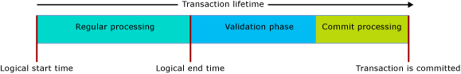

# Transactions with Memory-Optimized Tables
  
This article describes all the aspects of transactions that are specific to memory-optimized tables and natively compiled stored procedures.  
  
The transaction isolation levels in SQL Server apply differently to memory-optimized tables versus disk-based tables, and the underlying mechanisms are different. An understanding of the differences helps the programmer design a high throughput system. The goal of transaction integrity is shared in all cases.  
  
For general information, see [SET TRANSACTION ISOLATION LEVEL (Transact-SQL)](SET%20TRANSACTION%20ISOLATION%20LEVEL%20%28Transact-SQL%29.xml).  
  
  
  
#### Sections in this article:  
  
- [Pessimistic versus Optimistic](#pessvoptim22ni)  
- [Transaction Initiation Modes](#txninitmodes24ni)  
  - [Code Example with Explicit Mode](#codeexamexpmode25ni)  
- [Row Versioning](#rowver28ni)  
- [Conflicts per Degrees of Isolation](#confdegreeiso30ni)  
- [Transaction Phases and Lifetime](#txnphaslife32ni)  
- [Conflict Detection and Retry](#confdetretry34ni)  
  - [Retry T-SQL Code Example](#retrytsqlcodeexam35ni)  
- [Cross-Container Transaction](#crossconttxn38ni)  
- [Limitations](#limitations40ni)  
- [Natively Compiled Stored Procedures](#natcompstorprocs42ni)  
- [Other Transaction Links](#othertxnlinks44ni)  
  
  
  
<a name="pessvoptim22ni"/>  
  
## Pessimistic versus Optimistic  
  
The functional differences are due to pessimistic versus optimistic approaches to transaction integrity. Memory-optimized tables use the optimistic approach:  
  
- Pessimistic approach uses locks to block potential conflicts before they occur. Lock are taken when the statement is executed, and released when the transaction is committed.  
  
- Optimistic approach detects conflicts as the occur and performs validation checks at commit time.  
  - Error 1205, a deadlock, cannot occur for a memory-optimized table.  
  
The optimistic approach is less overhead and is usually more efficient, partly because transaction conflicts are uncommon in most applications. The main functional difference between the pessimistic and optimistic approaches is that if a conflict occurs, in the pessimistic approach you wait, while in the optimistic approach one of the transactions fails and needs to be retried by the client. The functional differences are bigger when the REPEATABLE READ isolation level is in force, and are biggest for the SERIALIZABLE level.  
  
<a name="txninitmodes24ni"/>  
  
## Transaction Initiation Modes  
  
SQL Server has the following modes for transaction initiation:  
  
- **Autocommit** - The start of a simple query or DML statement implicitly opens a transaction, and the end of the statement implicitly commits the transaction. This is the default.  
  - In autocommit mode, usually you are not required to code a table hint about the transaction isolation level on the memory-optimized table in the FROM clause.  
  
- **Explicit** - Your Transact-SQL contains the code BEGIN TRANSACTION, along with an eventual COMMIT TRANSACTION. Two or more statements statements can be corralled into the same transaction.  
  - In explicit mode, you must either use the database option MEMORY_OPTIMIZED_ELEVATE_TO_SNAPSHOT or code a table hint about the transaction isolation level on the memory-optimized table in the FROM clause.  
  
- **Implicit** - When SET IMPLICIT_TRANSACTION ON is in force. Perhaps a better name would have been IMPLICIT_BEGIN_TRANSACTION, because all this option does is implicitly perform the equivalent of an explicit BEGIN TRANSACTION before each UPDATE statement if 0 = @@trancount. Therefore it is up to your T-SQL code to eventually issue an explicit COMMIT TRANSACTION.   
  
- **ATOMIC BLOCK** - All statements in ATOMIC blocks, which are required with natively compiled stored procedures, always run as part of a single transaction - either the actions of the atomic block as a whole are committed, or they are all rolled back, in case of a failure.  
  
<a name="codeexamexpmode25ni"/>  
  
### Code Example with Explicit Mode  
  
The following interpreted Transact-SQL script uses:  
  
- An explicit transaction.  
  
- A memory-optimized table, named dbo.Order_mo.  
  
- The READ COMMITTED transaction isolation level context.  
  
Therefore it is necessary to have a table hint on the memory-optimized table. The hint must be for SNAPSHOT or an even more isolating level. In the case of the code example, the hint is WITH (SNAPSHOT). If this hint is removed, the script would suffer an error 41368, for which an automated retry would be inappropriate:  
  
- 41368: Accessing memory optimized tables using the READ COMMITTED isolation level is supported only for autocommit transactions. It is not supported for explicit or implicit transactions. Provide a supported isolation level for the memory-optimized table using a table hint, such as WITH (SNAPSHOT).  
  
  
  
    SET TRANSACTION ISOLATION LEVEL READ COMMITTED;  
    GO  
  
    BEGIN TRANSACTION;  -- Explicit transaction.  
  
      -- Order_mo  is a memory-optimized table.  
    SELECT *  
       FROM  
                dbo.Order_mo  as o  WITH (SNAPSHOT)  -- Table hint.  
           JOIN dbo.Customer  as c  on c.CustomerId = o.CustomerId;  
      
    COMMIT TRANSACTION;  
  
Note that the need for the `WITH (SNAPSHOT)` hint can be avoided through the use of the database option `MEMORY_OPTIMIZED_ELEVATE_TO_SNAPSHOT`. When this option is set to `ON`, access to a memory-optimized table under a lower isolation level is automatically elevated to SNAPSHOT isolation.  
  
    ALTER DATABASE CURRENT SET MEMORY_OPTIMIZED_ELEVATE_TO_SNAPSHOT=ON  
  
<a name="rowver28ni"/>  
  
## Row Versioning  
  
Memory-optimized tables use a highly sophisticated row versioning system that makes the optimistic approach efficient, even at the most strict isolation level of SERIALIZABLE. For details see [Introduction to Memory-Optimized Tables](../../Topics/TopicNameNotContainA/Introduction-to-Memory-Optimized-Tables.md).  
  
Disk-based tables indirectly have a row versioning system when READ_COMMITTED_SNAPSHOT or the SNAPSHOT isolation level is in effect. This system is based on tempdb, while memory-optimized data structures have row versioning built-in, for maximum efficiency.  
  
<a name="confdegreeiso30ni"/>  
  
## Isolation Levels and Conflicts  
  
The following table lists the possible levels of transaction isolation, in sequence from least isolation to most. The types of potential conflicts between transactions vary from level to level. To handle conflicts, consider adding retry logic to your T-SQL: [Retry T-SQL Code Example](#retrytsqlcodeexam35ni).  
  
| Level Name | Description | Error Code |  
| :-- | :-- | :-- |  
| READ UNCOMMITTED | Not available: memory-optimized tables cannot be accessed under Read Uncommitted isolation. It is still possible to access memory-optimized tables under SNAPSHOT isolation if the session-level TRANSACTION ISOLATION LEVEL is set to READ UNCOMMITTED, by using the WITH (SNAPSHOT) table hint or setting the database setting MEMORY_OPTIMIZED_ELEVATE_TO_SNAPSHOT to ON. | . |  
| READ COMMITTED | Supported for memory-optimized tables only when the autocommit mode is in effect. It is still possible to access memory-optimized tables under SNAPSHOT isolation if the session-level TRANSACTION ISOLATION LEVEL is set to READ COMMITTED, by using the WITH (SNAPSHOT) table hint or setting the database setting MEMORY_OPTIMIZED_ELEVATE_TO_SNAPSHOT to ON.    Note that if the database option READ_COMMITTED_SNAPSHOT is set to ON, it is not allowed to access both a memory-optimized and a disk-based table under READ COMMITTED isolation in the same statement. | . |  
| SNAPSHOT | Supported for memory-optimized tables.    Internally SNAPSHOT is the least demanding transaction isolation level for memory-optimized tables.    SNAPSHOT uses fewer system resources than does REPEATABLE READ or SERIALIZABLE. | **41302:** Attempted to update a row that was updated in a different transaction since the start of the present transaction.    This error condition occurs if two concurrent transactions attempt to update or delete the same row at the same time. One of the two transactions receives this error message and will need to be retried.    Note that constraint validation always happens under SERIALIZABLE isolation, and thus concurrent transactions causing violations of primary, unique, or foreign key constraints can result in repeatable read or serializable validation failures. |  
| REPEATABLE READ | Supported for memory-optimized tables. The guarantee provided by REPEATABLE READ isolation is that, at commit time, no concurrent transaction has updated any of the rows read by this transaction.    Because of the optimistic model, concurrent transactions are not prevented from updating rows read by this transaction. Instead, at commit time this transaction validated that REPEATABLE READ isolation has not been violated. If it has, this transaction is rolled back and must be retried. | **41305:** A row read from a memory-optimized table earlier in the transaction has since been updated.    This error can occur when using REPEATABLE READ or SERIALIZABLE isolation, and also if the actions of a concurrent transaction cause violation of a foreign key constraint. |  
| SERIALIZABLE | Supported for memory-optimized tables.    Named *Serializable* because the isolation is so strict that it is almost a bit like having the transactions run in series rather than concurrently. | **41325:** A new row was inserted into a range that was scanned earlier by the present transaction. We call this a phantom row.    This error can occur when using SERIALIZABLE isolation, and also if the actions of a concurrent transaction cause violation of a primary, unique, or foreign key constraint. |  
| . | . | **41301:** A dependency was taken on another transaction that later failed to commit. The dependency is thus invalid. |  
  
<a name="txnphaslife32ni"/>  
  
## Transaction Phases and Lifetime  
  
When a memory-optimized table is involved, the lifetime of a transaction progresses through the phases as displayed in the following image.  
  
  
  
Descriptions of the phases follow.  
  
#### Regular Processing: Phase 1 (of 3)  
  
- This phase is comprised of the execution of all queries and DML statements in the query.  
- During this phase, the statements see the version of the memory-optimized tables as of the logical start time of the transaction.  
  
#### Validation: Phase 2 (of 3)  
  
- The validation phase begins by assigning the end time, thereby marking the transaction as logically complete. This makes all changes of the transaction visible to other transactions, which will take a dependency on this transaction, and will not be allowed to commit until this transaction has successfully committed. In addition, transactions which hold such dependencies are not allowed to return result sets to the client to ensure the client only sees data that has been successfully committed to the database.  
- This phase comprises the repeatable read and serializable validation. For repeatable read validation it checks whether any of the rows read by the transaction has since been updated. For serializable validation it checks whether any row has been inserted into any data range scanned by this transaction. Note that, per the table in [Isolation Levels and Conflicts](#confdegreeiso30ni), both repeatable read and serializable validation can happen when using snapshot isolation, to validate consistency of unique and foreign key constraints.  
  
#### Commit Processing: Phase 3 (of 3)  
  
- During the commit phase, the changes to durable tables are written to the log, and the log is written to disk. Then control is returned to the client.  
- After commit processing completes, all dependent transactions are notified that they can commit.  
  
As always, you should try to keep your transactional units of work as minimal and brief as is valid for your data needs.  
  
<a name="confdetretry34ni"/>  
  
## Conflict Detection and Retry  
  
SQL Server detects conflicts between concurrent transactions. Your choice of transaction isolation level partially determines what constitutes a conflict.  
  
When a conflict is detected, one transaction must be rolled back and terminated. The client should retry the transaction for all the conflict conditions listed in [Isolation Levels and Conflicts](#confdegreeiso30ni).   
  
Retry logic can be implemented at the client or server side. The general recommendation is to implement retry logic on the client side, as it is more efficient, and allows you to deal with result sets returned by the transaction before the failure occurs.  
  
<a name="retrytsqlcodeexam35ni"/>  
  
### Retry T-SQL Code Example  
  
Server-side retry logic using T-SQL should only be used for transactions that do not return result sets to the client, since retries can potentially result on additional result sets being returned to the client that may not be anticipated.  
  
The following interpreted T-SQL script illustrates what retry logic can look like for the errors associated with transaction conflicts involving memory-optimized tables.  
  
      -- Retry logic, in Transact-SQL.  
    DROP PROCEDURE If Exists usp_update_salesorder_dates;  
    GO  
  
    CREATE PROCEDURE usp_update_salesorder_dates  
    AS  
    BEGIN  
        DECLARE @retry INT = 10;  
  
        WHILE (@retry > 0)  
        BEGIN  
            BEGIN TRY  
                BEGIN TRANSACTION;  
  
                UPDATE dbo.SalesOrder_mo WITH (SNAPSHOT)  
                    set OrderDate = GetUtcDate()  
                    where CustomerId = 42;  
  
                UPDATE dbo.SalesOrder_mo WITH (SNAPSHOT)  
                    set OrderDate = GetUtcDate()  
                    where CustomerId = 43;  
  
                COMMIT TRANSACTION;  
                SET @retry = 0;  -- //Stops the loop.  
            END TRY  
  
            BEGIN CATCH  
                SET @retry -= 1;  
  
                IF (@retry > 0 AND  
                    ERROR_NUMBER() in (41302, 41305, 41325, 41301, 1205)  
                    )  
                BEGIN  
                    IF XACT_STATE() = -1  
                        ROLLBACK TRANSACTION;  
  
                    WAITFOR DELAY '00:00:00.001';  
                END  
                ELSE  
                BEGIN  
                    PRINT 'Suffered an error for which Retry is inappropriate.';  
                    THROW;  
                END  
            END CATCH  
  
        END -- //While loop  
    END;  
    GO  
  
      --  EXECUTE usp_update_salesorder_dates;  
  
  
  
<a name="crossconttxn38ni"/>  
  
## Cross-Container Transaction  
  
  
A transaction is called a cross-container transaction if it:  
  
- Accesses a memory-optimized table from interpreted Transact-SQL; or  
- Executes a native proc when a transaction is already open (XACT_STATE() = 1).  
  
The term "cross-container" derives from the fact that the transaction runs across the two transaction management containers, one for disk-based tables and one for memory-optimized tables.  
  
Within a single cross-container transaction, different isolation levels can be used for accessing disk-based and memory-optimized tables. This difference is expressed through explicit table hints such as WITH (SERIALIZABLE) or through the database option MEMORY_OPTIMIZED_ELEVATE_TO_SNAPSHOT, which implicitly elevates the isolation level for memory-optimized table to snapshot if the TRANSACTION ISOLATION LEVEL is configured as READ COMMITTED or READ UNCOMMITTED.  
  
In the following Transact-SQL code example:  
  
- The disk-based table, Table_D1, is accessed using the READ COMMITTED isolation level.  
- The memory-optimized table Table_MO7 is accessed using the SERIALIZABLE isolation level. Table_MO6 does not have a specific associated isolation level, since inserts are always consistent and executed essentially under serializable isolation.  
  
  
  
      -- Different isolation levels for  
      -- disk-based tables versus memory-optimized tables,  
      -- within one explicit transaction.  
  
    SET TRANSACTION ISOLATION LEVEL READ COMMITTED;  
    go  
  
    BEGIN TRANSACTION;  
  
        -- Table_D1 is a traditional disk-based table, accessed using READ COMMITTED isolation.  
        --  
        SELECT * FROM Table_D1;  
  
  
  
        -- Table_MO6 and Table_MO7 are memory-optimized tables. Table_MO7 is accessed using SERIALIZABLE isolation,  
	--   while Table_MO6 does not have a specific   
        --  
        INSERT Table_MO6  
            SELECT * FROM Table_MO7 WITH (SERIALIZABLE);  
  
  
    COMMIT TRANSACTION;  
    go  
  
  
  
<a name="limitations40ni"/>  
  
## Limitations  
  
  
- Cross-database transactions are not supported for memory-optimized tables. If a transaction accesses a memory-optimized table, the transaction cannot access any other database, except for:  
  - tempdb database.  
  - Read-only from the master database.  
  
- Distributed transactions are not supported: When BEGIN DISTRIBUTED TRANSACTION  is used, the transaction cannot access a memory-optimized table.  
  
  
<a name="natcompstorprocs42ni"/>  
  
## Natively Compiled Stored Procedures  
  
- In a native proc, the ATOMIC block must declare the transaction isolation level for the whole block, such as:  
  - `... BEGIN ATOMIC WITH (TRANSACTION ISOLATION LEVEL = SNAPSHOT, ...) ...`  
  
- No explicit transaction control statements are allowed within the body of a native proc. BEGIN TRANSACTION, ROLLBACK TRANSACTION and so on are all disallowed.  
  
- For more information about transaction control with ATOMIC blocks see [Atomic Blocks](https://msdn.microsoft.com/library/dn452281.aspx)  
  
<a name="othertxnlinks44ni"/>  
  
## Other Transaction Links  
  
- [SET IMPLICIT_TRANSACTIONS](SET%20IMPLICIT_TRANSACTIONS%20%28Transact-SQL%29.xml)  
  
- [sp_getapplock (Transact-SQL)](sp_getapplock%20%28Transact-SQL%29.xml)  
  
- [Row Versioning-based Isolation Levels in the Database Engine](http://msdn.microsoft.com/library/ms177404.aspx)  
  
- [Control Transaction Durability](../../Topics/TopicNameNotContainA/Control-Transaction-Durability.md)   
  
<!--  
Link Guids:  
016fb05e-a702-484b-bd2a-a6eabd0d76fd , ms173763.aspx , "SET TRANSACTION ISOLATION LEVEL (Transact-SQL)"  
  
ef1cc7de-63be-4fa3-a622-6d93b440e3ac , dn511014(v=sql.130,d=robot).aspx , "Introduction to Memory-Optimized Tables"  
  
a300ac43-e4c0-4329-8b79-a1a05e63370a , ms187807.aspx , "SET IMPLICIT_TRANSACTIONS (Transact-SQL)"  
  
e1e85908-9f31-47cf-8af6-88c77e6f24c9 , ms189823.aspx , "sp_getapplock (Transact-SQL)"  
  
3ac93b28-cac7-483e-a8ab-ac44e1cc1c76 , dn449490.aspx , "Control Transaction Durability"  
  
Image: 'hekaton_transactions' , e9c5eb2f-c9a3-4625-8ae4-ac91447db42f  
See also XMetal articles: dn133169.aspx , "Transaction Lifetime"  
  
Transactions with In-Memory Tables and Procedures  
{ba6f1a15-8b69-4ca6-9f44-f5e3f2962bc5} , dn479429.aspx  
Maybe replaces: 06075248-705e-4563-9371-b64cd609793c , dn479429.aspx , "Understanding Transactions on Memory-Optimized Tables"  
  
GeneMi , 2016-03-28 11:40am  
-->  
  
  
  
  
