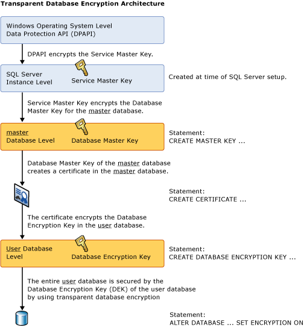

# Transparent Data Encryption (TDE)
*Transparent Data Encryption* (TDE) encrypts [!INCLUDE[ssNoVersion](../../Topics/TopicNameContainA/includes/ssNoVersion_md.md)], [!INCLUDE[ssSDSfull](../../Topics/TopicNameContainA/includes/ssSDSfull_md.md)], and [!INCLUDE[ssSDWfull](../../Topics/TopicNameNotContainA/includes/ssSDWfull_md.md)] data files, known as encrypting data at rest. You can take several precautions to help secure the database such as designing a secure system, encrypting confidential assets, and building a firewall around the database servers. However, in a scenario where the physical media (such as drives or backup tapes) are stolen, a malicious party can just restore or attach the database and browse the data. One solution is to encrypt the sensitive data in the database and protect the keys that are used to encrypt the data with a certificate. This prevents anyone without the keys from using the data, but this kind of protection must be planned in advance.  
  
 TDE performs real-time I/O encryption and decryption of the data and log files. The encryption uses a database encryption key (DEK), which is stored in the database boot record for availability during recovery. The DEK is a symmetric key secured by using a certificate stored in the master database of the server or an asymmetric key protected by an EKM module. TDE protects data "at rest", meaning the data and log files. It provides the ability to comply with many laws, regulations, and guidelines established in various industries. This enables software developers to encrypt data by using AES and 3DES encryption algorithms without changing existing applications.  
  
> [!IMPORTANT]  
>  TDE does not provide encryption across communication channels. For more information about how to encrypt data across communication channels, see [Enable Encrypted Connections to the Database Engine (SQL Server Configuration Manager)](../../Topics/TopicNameNotContainA/Enable-Encrypted-Connections-to-the-Database-Engine--SQL-Server-Configuration-Manager-.md).  
>   
>  **Related topics:**  
>   
>  -   [Transparent Data Encryption with Azure SQL Database](../../Topics/TopicNameNotContainA/Transparent-Data-Encryption-with-Azure-SQL-Database.md)  
> -   [Get started with Transparent Data Encryption (TDE) on SQL Data Warehouse](https://azure.microsoft.com/documentation/articles/sql-data-warehouse-encryption-tde-tsql/)  
> -   [Move a TDE Protected Database to Another SQL Server](../../Topics/TopicNameContainA/Move-a-TDE-Protected-Database-to-Another-SQL-Server.md)  
> -   [Enable TDE on SQL Server Using EKM](../../Topics/TopicNameNotContainA/Enable-TDE-on-SQL-Server-Using-EKM.md)  
  
## About TDE  
 Encryption of the database file is performed at the page level. The pages in an encrypted database are encrypted before they are written to disk and decrypted when read into memory. TDE does not increase the size of the encrypted database.  
  
 **Information applicable to [!INCLUDE[ssSDS](../../Topics/TopicNameContainA/includes/ssSDS_md.md)]**  
  
 When using TDE with [!INCLUDE[sqldbesa](../../Topics/TopicNameNotContainA/includes/sqldbesa_md.md)] V12 the server-level certificate stored in the master database is automatically created for you by [!INCLUDE[ssSDS](../../Topics/TopicNameContainA/includes/ssSDS_md.md)]. To move a TDE database on [!INCLUDE[ssSDS](../../Topics/TopicNameContainA/includes/ssSDS_md.md)] you must decrypt the database, move the database, and then re-enable TDE on the destination [!INCLUDE[ssSDS](../../Topics/TopicNameContainA/includes/ssSDS_md.md)]. For step-by-step instructions for TDE on [!INCLUDE[ssSDS](../../Topics/TopicNameContainA/includes/ssSDS_md.md)], see [Transparent Data Encryption with Azure SQL Database](../../Topics/TopicNameNotContainA/Transparent-Data-Encryption-with-Azure-SQL-Database.md).  
  
 **Information applicable to [!INCLUDE[ssNoVersion](../../Topics/TopicNameContainA/includes/ssNoVersion_md.md)]**  
  
 After it is secured, the database can be restored by using the correct certificate. For more information about certificates, see [SQL Server Certificates and Asymmetric Keys](../../Topics/TopicNameNotContainA/SQL-Server-Certificates-and-Asymmetric-Keys.md).  
  
 When enabling TDE, you should immediately back up the certificate and the private key associated with the certificate. If the certificate ever becomes unavailable or if you must restore or attach the database on another server, you must have backups of both the certificate and the private key or you will not be able to open the database. The encrypting certificate should be retained even if TDE is no longer enabled on the database. Even though the database is not encrypted, parts of the transaction log may still remain protected, and the certificate may be needed for some operations until the full backup of the database is performed. A certificate that has exceeded its expiration date can still be used to encrypt and decrypt data with TDE.  
  
 **Encryption Hierarchy**  
  
 The following illustration shows the architecture of TDE encryption. Only the database level items (the database encryption key and ALTER DATABASE portions are user-configurable when using TDE on [!INCLUDE[ssSDS](../../Topics/TopicNameContainA/includes/ssSDS_md.md)].  
  
   
  
## Using Transparent Data Encryption  
 To use TDE, follow these steps.  
  
||  
|-|  
|**Applies to**: [!INCLUDE[ssNoVersion](../../Topics/TopicNameContainA/includes/ssNoVersion_md.md)].|  
  
-   Create a master key  
  
-   Create or obtain a certificate protected by the master key  
  
-   Create a database encryption key and protect it by the certificate  
  
-   Set the database to use encryption  
  
 The following example illustrates encrypting and decrypting the `AdventureWorks2012` database using a certificate installed on the server named `MyServerCert`.  
  
```  
USE master;  
GO  
CREATE MASTER KEY ENCRYPTION BY PASSWORD = '<UseStrongPasswordHere>';  
go  
CREATE CERTIFICATE MyServerCert WITH SUBJECT = 'My DEK Certificate';  
go  
USE AdventureWorks2012;  
GO  
CREATE DATABASE ENCRYPTION KEY  
WITH ALGORITHM = AES_128  
ENCRYPTION BY SERVER CERTIFICATE MyServerCert;  
GO  
ALTER DATABASE AdventureWorks2012  
SET ENCRYPTION ON;  
GO  
```  
  
 The encryption and decryption operations are scheduled on background threads by [!INCLUDE[ssNoVersion](../../Topics/TopicNameContainA/includes/ssNoVersion_md.md)]. You can view the status of these operations using the catalog views and dynamic management views in the list that appears later in this topic.  
  
> [!CAUTION]  
>  Backup files of databases that have TDE enabled are also encrypted by using the database encryption key. As a result, when you restore these backups, the certificate protecting the database encryption key must be available. This means that in addition to backing up the database, you have to make sure that you maintain backups of the server certificates to prevent data loss. Data loss will result if the certificate is no longer available. For more information, see [SQL Server Certificates and Asymmetric Keys](../../Topics/TopicNameNotContainA/SQL-Server-Certificates-and-Asymmetric-Keys.md).  
  
## Commands and Functions  
 The TDE certificates must be encrypted by the database master key to be accepted by the following statements. If they are encrypted by password only, the statements will reject them as encryptors.  
  
> [!IMPORTANT]  
>  Altering the certificates to be password-protected after they are used by TDE will cause the database to become inaccessible after a restart.  
  
 The following table provides links and explanations of TDE commands and functions.  
  
|Command or function|Purpose|  
|-------------------------|-------------|  
|[CREATE DATABASE ENCRYPTION KEY (Transact-SQL)](assetId:///2ee95a32-5140-41bd-9ab3-a947b9990688)|Creates a key that is used to encrypt a database.|  
|[ALTER DATABASE ENCRYPTION KEY (Transact-SQL)](assetId:///f88dac4b-efe0-47ed-9808-972a4381377e)|Changes the key that is used to encrypt a database.|  
|[DROP DATABASE ENCRYPTION KEY (Transact-SQL)](assetId:///9231bd89-75e1-45c4-b4c8-13f08695af68)|Removes the key that was used to encrypt a database.|  
|[ALTER DATABASE SET Options (Transact-SQL)](assetId:///f76fbd84-df59-4404-806b-8ecb4497c9cc)|Explains the **ALTER DATABASE** option that is used to enable TDE.|  
  
## Catalog Views and Dynamic Management Views  
 The following table shows TDE catalog views and dynamic management views.  
  
|Catalog view or dynamic management view|Purpose|  
|---------------------------------------------|-------------|  
|[sys.databases (Transact-SQL)](assetId:///46c288c1-3410-4d68-a027-3bbf33239289)|Catalog view that displays database information.|  
|[sys.certificates (Transact-SQL)](assetId:///e5046102-a65c-401e-b80d-05636884dec9)|Catalog view that shows the certificates in a database.|  
|[sys.dm_database_encryption keys](assetId:///56fee8f3-06eb-4fff-969e-abeaa0c4b8e4)|Dynamic management view that provides information about the encryption keys used in a database, and the state of encryption of a database.|  
  
## Permissions  
 Each TDE feature and command has individual permission requirements, described in the tables shown earlier.  
  
 Viewing the metadata involved with TDE requires the VIEW DEFINITION permission on the certificate.  
  
## Considerations  
 While a re-encryption scan for a database encryption operation is in progress, maintenance operations to the database are disabled. You can use the single user mode setting for the database to perform the maintenance operation. For more information, see [Set a Database to Single-user Mode](../../Topics/TopicNameContainA/Set-a-Database-to-Single-user-Mode.md).  
  
 You can find the state of the database encryption using the sys.dm_database_encryption_keys dynamic management view. For more information, see the "Catalog Views and Dynamic Management Views"section earlier in this topic).  
  
 In TDE, all files and filegroups in the database are encrypted. If any filegroups in a database are marked READ ONLY, the database encryption operation will fail.  
  
 If a database is being used in database mirroring or log shipping, both databases will be encrypted. The log transactions will be encrypted when sent between them.  
  
> [!IMPORTANT]  
>  Any new full-text indexes will be encrypted when a database is set for encryption. Previously-created full-text indexes will be imported during upgrade and they will be in TDE after the data is loaded into [!INCLUDE[ssNoVersion](../../Topics/TopicNameContainA/includes/ssNoVersion_md.md)]. Enabling a full-text index on a column can cause that column's data to be written in plain text onto the disk during a full-text indexing scan. We recommend that you do not create a full-text index on sensitive encrypted data.  
  
 Encrypted data compresses significantly less than equivalent unencrypted data. If TDE is used to encrypt a database, backup compression will not be able to significantly compress the backup storage. Therefore, using TDE and backup compression together is not recommended.  
  
### Restrictions  
 The following operations are not allowed during initial database encryption, key change, or database decryption:  
  
-   Dropping a file from a filegroup in the database  
  
-   Dropping the database  
  
-   Taking the database offline  
  
-   Detaching a database  
  
-   Transitioning a database or filegroup into a READ ONLY state  
  
 The following operations are not allowed during the CREATE DATABASE ENCRYPTION KEY, ALTER DATABASE ENCRYPTION KEY, DROP DATABASE ENCRYPTION KEY, or ALTER DATABASE...SET ENCRYPTION statements.  
  
-   Dropping a file from a filegroup in the database.  
  
-   Dropping the database.  
  
-   Taking the database offline.  
  
-   Detaching a database.  
  
-   Transitioning a database or filegroup into a READ ONLY state.  
  
-   Using an ALTER DATABASE command.  
  
-   Starting a database or database file backup.  
  
-   Starting a database or database file restore.  
  
-   Creating a snapshot.  
  
 The following operations or conditions will prevent the CREATE DATABASE ENCRYPTION KEY, ALTER DATABASE ENCRYPTION KEY, DROP DATABASE ENCRYPTION KEY, or ALTER DATABASE...SET ENCRYPTION statements.  
  
-   The database is read-only or has any read-only file groups.  
  
-   An ALTER DATABASE command is executing.  
  
-   Any data backup is running.  
  
-   The database is in an offline or restore condition.  
  
-   A snapshot is in progress.  
  
-   Database maintenance tasks.  
  
 When creating database files, instant file initialization is not available when TDE is enabled.  
  
 In order to encrypt the database encryption key with an asymmetric key, the asymmetric key must reside on an extensible key management provider.  
  
### Transparent Data Encryption and Transaction Logs  
 Enabling a database to use TDE has the effect of "zeroing out" the remaining part of the virtual transaction log to force the next virtual transaction log. This guarantees that no clear text is left in the transaction logs after the database is set for encryption. You can find the status of the log file encryption by viewing the `encryption_state` column in the `sys.dm_database_encryption_keys` view, as in this example:  
  
```  
USE AdventureWorks2012;  
GO  
/* The value 3 represents an encrypted state   
   on the database and transaction logs. */  
SELECT *  
FROM sys.dm_database_encryption_keys  
WHERE encryption_state = 3;  
GO  
```  
  
 For more information about the [!INCLUDE[ssNoVersion](../../Topics/TopicNameContainA/includes/ssNoVersion_md.md)] log file architecture, see [The Transaction Log (SQL Server)](../../Topics/TopicNameNotContainA/The-Transaction-Log--SQL-Server-.md).  
  
 All data written to the transaction log before a change in the database encryption key will be encrypted by using the previous database encryption key.  
  
 After a database encryption key has been modified twice, a log backup must be performed before the database encryption key can be modified again.  
  
### Transparent Data Encryption and the tempdb System Database  
 The tempdb system database will be encrypted if any other database on the instance of [!INCLUDE[ssNoVersion](../../Topics/TopicNameContainA/includes/ssNoVersion_md.md)] is encrypted by using TDE. This might have a performance effect for unencrypted databases on the same instance of [!INCLUDE[ssNoVersion](../../Topics/TopicNameContainA/includes/ssNoVersion_md.md)]. For more information about the tempdb system database, see [tempdb Database](../../Topics/TopicNameNotContainA/tempdb-Database.md).  
  
### Transparent Data Encryption and Replication  
 Replication does not automatically replicate data from a TDE-enabled database in an encrypted form. You must separately enable TDE if you want to protect the distribution and subscriber databases. Snapshot replication, as well as the initial distribution of data for transactional and merge replication, can store data in unencrypted intermediate files; for example, the bcp files.  During transactional or merge replication, encryption can be enabled to protect the communication channel. For more information, see [Enable Encrypted Connections to the Database Engine (SQL Server Configuration Manager)](../../Topics/TopicNameNotContainA/Enable-Encrypted-Connections-to-the-Database-Engine--SQL-Server-Configuration-Manager-.md).  
  
### Transparent Data Encryption and FILESTREAM DATA  
 FILESTREAM data is not encrypted even when TDE is enabled.  
  
## Transparent Data Encryption and Buffer Pool Extension  
 Files related to buffer pool extension (BPE) are not encrypted when database is encrypted using TDE. You must use file system level encryption tools like Bitlocker or EFS for BPE related files.  
  
## Transparent Data Encryption and In-Memory OLTP  
 TDE can be enabled on a database that has In-Memory OLTP objects. In-Memory OLTP log records are encrypted if TDE is enabled. Data in a MEMORY_OPTIMIZED_DATA filegroup is not encrypted if TDE is enabled.  
  
## Related Tasks  
 [Move a TDE Protected Database to Another SQL Server](../../Topics/TopicNameContainA/Move-a-TDE-Protected-Database-to-Another-SQL-Server.md)  
  
 [Enable TDE on SQL Server Using EKM](../../Topics/TopicNameNotContainA/Enable-TDE-on-SQL-Server-Using-EKM.md)  
  
 [Extensible Key Management Using Azure Key Vault (SQL Server)](../../Topics/TopicNameNotContainA/Extensible-Key-Management-Using-Azure-Key-Vault--SQL-Server-.md)  
  
## Related Content  
 [Transparent Data Encryption with Azure SQL Database](../../Topics/TopicNameNotContainA/Transparent-Data-Encryption-with-Azure-SQL-Database.md) [Get started with Transparent Data Encryption (TDE) on SQL Data Warehouse](https://azure.microsoft.com/documentation/articles/sql-data-warehouse-encryption-tde-tsql/) [SQL Server Encryption](../../Topics/TopicNameNotContainA/SQL-Server-Encryption.md)  
  
 [SQL Server and Database Encryption Keys (Database Engine)](../../Topics/TopicNameNotContainA/SQL-Server-and-Database-Encryption-Keys--Database-Engine-.md)  
  
## See Also  
 [Security Center for SQL Server Database Engine and Azure SQL Database](../../Topics/TopicNameNotContainA/Security-Center-for-SQL-Server-Database-Engine-and-Azure-SQL-Database.md)   
 [FILESTREAM (SQL Server)](../../Topics/TopicNameNotContainA/FILESTREAM--SQL-Server-.md)