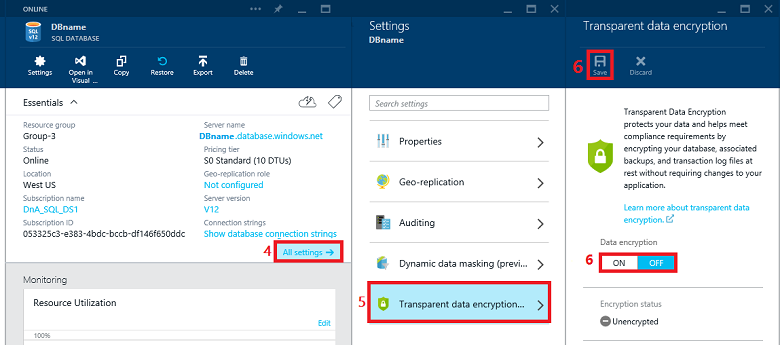

# Transparent Data Encryption with Azure SQL Database
[!INCLUDE[ssSDSfull](../../Topics/TopicNameContainA/includes/ssSDSfull_md.md)] transparent data encryption helps protect against the threat of malicious activity by performing real-time encryption and decryption of the database, associated backups, and transaction log files at rest without requiring changes to the application.  
  
 TDE encrypts the storage of an entire database by using a symmetric key called the database encryption key. In [!INCLUDE[ssSDS](../../Topics/TopicNameContainA/includes/ssSDS_md.md)] the database encryption key is protected by a built-in server certificate. The built-in server certificate is unique for each [!INCLUDE[ssSDS](../../Topics/TopicNameContainA/includes/ssSDS_md.md)] server. If a database is in a GeoDR relationship, it is protected by a different key on each server. If 2 databases are connected to the same server, they share the same built-in certificate. [!INCLUDE[msCoName](../../Topics/TopicNameContainA/includes/msCoName_md.md)] automatically rotates these certificates at least every 90 days. For a general description of TDE, see [Transparent Data Encryption (TDE)](../../Topics/TopicNameNotContainA/Transparent-Data-Encryption--TDE-.md).  
  
 [!INCLUDE[ssSDSfull](../../Topics/TopicNameContainA/includes/ssSDSfull_md.md)] does not support Azure Key Vault integration with TDE. [!INCLUDE[ssNoVersion](../../Topics/TopicNameContainA/includes/ssNoVersion_md.md)] running on an Azure virtual machine can use an asymmetric key from the Key Vault. For more information, see [Extensible Key Management Using Azure Key Vault (SQL Server)](../../Topics/TopicNameNotContainA/Extensible-Key-Management-Using-Azure-Key-Vault--SQL-Server-.md).  
  
##  <a name="Permissions"></a> Permissions  
 To configure TDE through the Azure portal, by using the REST API, or by using PowerShell, you must be connected as the Azure Owner, Contributor, or SQL Security Manager.  
  
 To configure TDE by using [!INCLUDE[tsql](../../Topics/TopicNameContainA/includes/tsql_md.md)] requires the following:  
  
-   To execute the ALTER DATABASE statement with the SET option requires membership in the **dbmanager** role.  
  
##  <a name="Preview"></a> Enable TDE on a Database Using the Portal  
  
1.  Visit the Azure Portal at [https://portal.azure.com](https://portal.azure.com) and sign-in with your Azure Administrator or Contributor account.  
  
2.  On the left banner, click to **BROWSE**, and then click **SQL databases**.  
  
3.  With **SQL databases** selected in the left pane, click your user database.  
  
4.  In the database blade, click **All settings**.  
  
5.  In the **Settings** blade, click **Transparent data encryption** part to open the **Transparent data encryption** blade.  
  
6.  In the **Data encryption** blade, move the **Data encryption** button to **On**, and then click **Save** (at the top of the page) to apply the setting. The **Encryption status** will approximate the progress of the transparent data encryption.  
  
       
  
     You can also monitor the progress of encryption by connecting to [!INCLUDE[ssSDS](../../Topics/TopicNameContainA/includes/ssSDS_md.md)] using a query tool such as [!INCLUDE[ssManStudioFull](../../Topics/TopicNameContainA/includes/ssManStudioFull_md.md)] as a database user with the **VIEW DATABASE STATE** permission. Query the **encryption_state** column of the [sys.dm_database_encryption_keys](assetId:///56fee8f3-06eb-4fff-969e-abeaa0c4b8e4) view.  
  
##  <a name="Encrypt"></a> Enabling TDE on [!INCLUDE[ssSDS](../../Topics/TopicNameContainA/includes/ssSDS_md.md)] by Using Transact-SQL  
 The following steps enable TDE.  
  
###  <a name="TsqlProcedure"></a>  
  
1.  Connect to the database using a login that is an administrator or a member of the **dbmanager** role in the master database.  
  
2.  Execute the following statements to encrypt the database.  
  
    ```  
    -- Enable encryption  
    ALTER DATABASE [AdventureWorks] SET ENCRYPTION ON;  
    GO  
    ```  
  
3.  To monitor the progress of encryption on [!INCLUDE[ssSDS](../../Topics/TopicNameContainA/includes/ssSDS_md.md)], database users with the **VIEW DATABASE STATE** permission can query the **encryption_state** column of the [sys.dm_database_encryption_keys](assetId:///56fee8f3-06eb-4fff-969e-abeaa0c4b8e4) view.  
  
##  <a name="EncryptPS"></a> Enabling and Disabling TDE on [!INCLUDE[ssSDS](../../Topics/TopicNameContainA/includes/ssSDS_md.md)] by Using PowerShell  
 Using the Azure PowerShell you can run the following command to turn TDE on/off. You must connect your account to the PS window before running the command. Customize the example to use your values for the `ServerName`, `ResourceGroupName`, and `DatabaseName` parameters. For additional information about PowerShell, see [How to install and configure Azure PowerShell](http://azure.microsoft.com/documentation/articles/powershell-install-configure/).  
  
> [!NOTE]  
>  To continue, you  should install and configure version 1.0 of Azure PowerShell. Version 0.9.8 can be used but it is deprecated and it requires switching to the AzureResourceManager cmdlets by using the `PS C:\> Switch-AzureMode -Name AzureResourceManager` command.  
  
###  <a name="PSlProcedure"></a>  
  
1.  To enable TDE, return the TDE status, and view the encryption activity:  
  
    ```  
    PS C:\> Set-AzureRMSqlDatabaseTransparentDataEncryption -ServerName "myserver" -ResourceGroupName "Default-SQL-WestUS" -DatabaseName "database1" -State "Enabled"  
  
    PS C:\> Get-AzureRMSqlDatabaseTransparentDataEncryption -ServerName "myserver" -ResourceGroupName "Default-SQL-WestUS" -DatabaseName "database1"  
  
    PS C:\> Get-AzureRMSqlDatabaseTransparentDataEncryptionActivity -ServerName "myserver" -ResourceGroupName "Default-SQL-WestUS" -DatabaseName "database1"  
    ```  
  
     If using version 0.9.8 use the Set-AzureSqlDatabaseTransparentDataEncryption, Get-AzureSqlDatabaseTransparentDataEncryption, and Get-AzureSqlDatabaseTransparentDataEncryptionActivity commands.  
  
2.  To disable TDE:  
  
    ```  
    PS C:\> Set-AzureRMSqlDatabaseTransparentDataEncryption -ServerName "myserver" -ResourceGroupName "Default-SQL-WestUS" -DatabaseName "database1" -State "Disabled"  
  
    ```  
  
     If using version 0.9.8 use the Set-AzureSqlDatabaseTransparentDataEncryption command.  
  
##  <a name="Decrypt"></a> Decrypting a TDE Protected Database on [!INCLUDE[ssSDS](../../Topics/TopicNameContainA/includes/ssSDS_md.md)]  
  
#### To Disable TDE by Using the Azure Portal  
  
1.  Visit the Azure Portal at [https://portal.azure.com](https://portal.azure.com) and sign-in with your Azure Administrator or Contributor account.  
  
2.  On the left banner, click to **BROWSE**, and then click **SQL databases**.  
  
3.  With **SQL databases** selected in the left pane, click your user database.  
  
4.  In the database blade, click **All settings**.  
  
5.  In the **Settings** blade, click **Transparent Data encryption** part to open the **Transparent data encryption** blade.  
  
6.  In the **Transparent data encryption** blade, move the **Data encryption** button to **Off**, and then click **Save** (at the top of the page) to apply the setting. The **Encryption status** will approximate the progress of the transparent data decryption.  
  
     You can also monitor the progress of decryption by connecting to [!INCLUDE[ssSDS](../../Topics/TopicNameContainA/includes/ssSDS_md.md)] using a query tool such as [!INCLUDE[ssManStudio](../../Topics/TopicNameContainA/includes/ssManStudio_md.md)] as a database user with the **VIEW DATABASE STATE** permission. Query the **encryption_state** column of the [sys.dm_database_encryption_keys](assetId:///56fee8f3-06eb-4fff-969e-abeaa0c4b8e4) view.  
  
#### To Disable TDE by Using Transact-SQL  
  
1.  Connect to the database using a login that is an administrator or a member of the **dbmanager** role in the master database.  
  
2.  Execute the following statements to decrypt the database.  
  
    ```  
    -- Enable encryption  
    ALTER DATABASE [AdventureWorks] SET ENCRYPTION OFF;  
    GO  
    ```  
  
3.  To monitor the progress of encryption on [!INCLUDE[ssSDS](../../Topics/TopicNameContainA/includes/ssSDS_md.md)], database users with the **VIEW DATABASE STATE** permission can query the **encryption_state** column of the [sys.dm_database_encryption_keys](assetId:///56fee8f3-06eb-4fff-969e-abeaa0c4b8e4) view.  
  
##  <a name="Working"></a> Moving a TDE Protected Database on [!INCLUDE[ssSDS](../../Topics/TopicNameContainA/includes/ssSDS_md.md)]  
 You do not need to decrypt databases for operations within Azure. The TDE settings on the source database or primary database are transparently inherited on the target. This includes operations involving:  
  
-   Geo-Restore  
  
-   Self-Service Point in Time Restore  
  
-   Restore a Deleted Database  
  
-   Active Geo_Replication  
  
-   Creating a Database Copy  
  
 When exporting a TDE protected database using the Export Database function in the [!INCLUDE[ssSDSfull](../../Topics/TopicNameContainA/includes/ssSDSfull_md.md)] Portal or the [!INCLUDE[ssNoVersion](../../Topics/TopicNameContainA/includes/ssNoVersion_md.md)] Import and Export Wizard, the content of the database is not encrypted. The content is stored in .bacpac files which are not encrypted. Be sure to protect the .bacpac files appropriately and enable TDE once import of the new database is completed.  
  
## Related SQL Server Topic  
 [Enable TDE on SQL Server Using EKM](../../Topics/TopicNameNotContainA/Enable-TDE-on-SQL-Server-Using-EKM.md)  
  
## See Also  
 [Transparent Data Encryption (TDE)](../../Topics/TopicNameNotContainA/Transparent-Data-Encryption--TDE-.md)   
 [CREATE CREDENTIAL (Transact-SQL)](assetId:///d5e9ae69-41d9-4e46-b13d-404b88a32d9d)   
 [CREATE ASYMMETRIC KEY (Transact-SQL)](assetId:///141bc976-7631-49f6-82bd-a235028645b1)   
 [ALTER DATABASE (Transact-SQL)](assetId:///15f8affd-8f39-4021-b092-0379fc6983da)