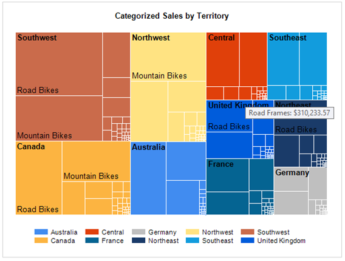
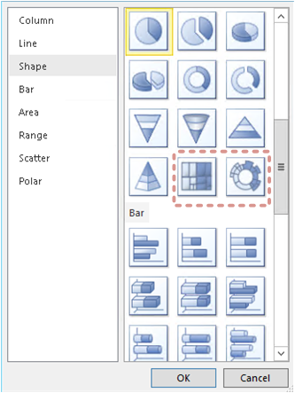
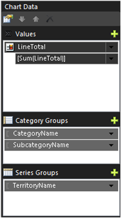
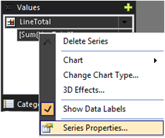
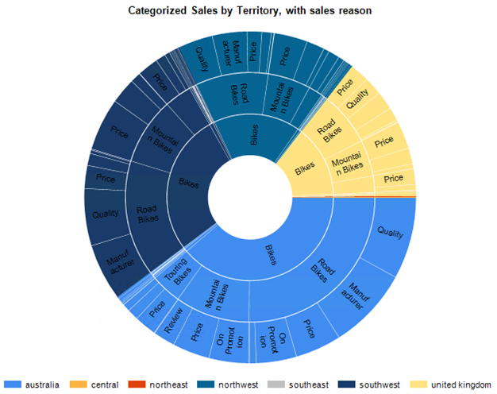
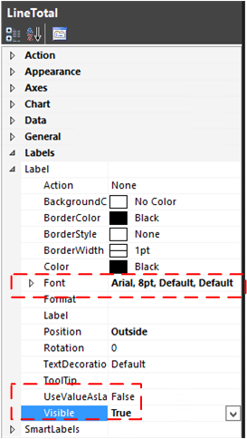
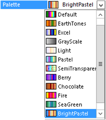

# Tree Map and Sunburst Charts in Reporting Services
The [!INCLUDE[ssRSnoversion](../../Topics/TopicNameContainA/includes/ssRSnoversion_md.md)] Tree Map and sunburst visualizations are great for visually representing hierarchal data.   This topic is an overview of how to add a Tree Map or Sunburst chart to a [!INCLUDE[ssRSnoversion](../../Topics/TopicNameContainA/includes/ssRSnoversion_md.md)] report. The topic also includes a sample Adventureworks query to help get you started.  
  
##  <a name="bkmk_top"></a> In this topic  
  
-   [Tree Map Chart](#bkmk_treemap_chart)  
  
-   [Sunburst Chart](#bkmk_sunburst_chart)  
  
-   [Sample Adventureworks data](#bkmk_sample_data)  
  
##  <a name="bkmk_treemap_chart"></a> Tree Map Chart  
   
  
 A tree map chart divides the chart area into rectangles that represent the different levels and relative sizes of the data hierarchy. The map is similar to branches on a tree that start with a trunk and divide into smaller and smaller branches. Each rectangle is broken into smaller rectangles representing the next level in the hierarchy. The top level tree map rectangles are arranged with the largest rectangle in the upper left corner of the chart to the smallest rectangle in the lower right corner.  Within a rectangle, the next level of the higher is also arranged with rectangles from the upper left to the lower right.  
  
 For example,  in the following image of the sample tree map, the Southwest territory is th largest and Germany is the smallest. Within the Southwest, Road Bikes are larger than Mountain Bikes.  
  
   
  
### To insert a tree map chart and configure for the sample Adventureworks data  
 **Note:** Before you add a chart to your report, create a data source and dataset.  For sample data and a sample query, see the section [Sample Adventureworks data](#bkmk_sample_data) in this topic.  
  
1.  Right-click the design surface, click **Insert**, and then click **Chart** .  
  
     Select Tree Map .  
  
       
  
2.  Reposition and resize the chart.   For use with the sample data, a chart  that is 5 inches wide is a good start.  
  
3.  Add the following fields from the sample data:  
  
    |||  
    |-|-|  
    ||**Values:** LineTotal<br /><br /> **Category Groups:** Add them in the order of:<br /><br /> 1) CategoryName<br /><br /> 2) SubcategoryName<br /><br /> **Series Groups:** TerritoryName|  
  
4.  To optimize the page size for general shape of a Tree Map, set the legend position to the bottom.  
  
5.  To add tool tips that display the subcategory and the line total, right-click **LineTotal** and then click **Series Properties**.  
  
       
  
     Set the **Tooltip** property to the following:  
  
    ```  
    =Fields!SubcategoryName.Value &": " &Format(Sum(Fields!LineTotal.Value),"C")  
    ```  
  
     For more information, see [Show ToolTips on a Series (Report Builder and SSRS)](../../Topics/TopicNameContainA/Show-ToolTips-on-a-Series--Report-Builder-and-SSRS-.md).  
  
6.  Change the default chart title to "Categorized Sales by Territory".  
  
7.  The number of label values that are displayed are affected by the size of the font, the size of the overall chart area, and the size of specific rectangles.  To see more of the labels, change the Label font property of LineTotal to 10pt instead of the default 8pt.  
  
  [In this topic](#bkmk_top)  
  
##  <a name="bkmk_sunburst_chart"></a> Sunburst Chart  
   
  
 In a sunburst chart, the hierarchy is represented by a series of  circles, with the highest level of  the hierarchy in the center and lower levels of the hierarchy as rings displayed outside the center.  The lowest level of the hierarchy is the outside ring.  
  
   
  
### To insert a sunburst chart and configure for the sample Adventureworks data  
 **Note:** Before you add a chart to your report, create a data source and dataset.  For sample data and a sample query, see the section [Sample Adventureworks data](#bkmk_sample_data) in this topic.  
  
1.  Right-click the design surface, click **Insert**, and then click **Chart** .  
  
     Select Sunburst .  
  
       
  
2.  Reposition and resize the chart.   For use with the sample data., a chart  that is 5 inches wide is a good start.  
  
3.  Add the following fields from the sample data:  
  
    |||  
    |-|-|  
    ||**Values:** LineTotal<br /><br /> **Category Groups:** Add them in the order of :<br /><br /> 1) CategoryName<br /><br /> 2) SubcategoryName,<br /><br /> 3) SalesReasonName<br /><br /> **Series Groups:** TerritoryName .|  
  
4.  To optimize the page size for the general shape of a Sunburst, set the legend position to the bottom.  
  
5.  Change the default chart title to "Categorized Sales by Territory, with sales reason".  
  
6.  |||  
    |-|-|  
    ||To add the values of the category groups to the sunburst as labels, set the label property **Visible** = true and the **UseValueAsLabel**=False.<br /><br /> The label values that are displayed are affected by the size of the font, the size of the overall chart area, and the size of specific rectangles.  To see more of the labels, change the Label font property of LineTotal to 8pt instead of the default 10pt.|  
  
7.  If you want a different range of colors, change the chart **Palette** property.  
  
       
  
  [In this topic](#bkmk_top)  
  
##  <a name="bkmk_sample_data"></a> Sample Adventureworks data  
 This sections includes a sample query and the basic steps for creating a data source and dataset in [!INCLUDE[ssRBnoversion](../../Topics/TopicNameContainA/includes/ssRBnoversion_md.md)]. If your report already contains a data source and dataset you can skip this section.  
  
 The query returns Adventureworks sales order detail data with sales territory, product category,  product sub category, and sales reason data.  
  
1.  **Get the Data:**  
  
     The query in this section is based on the Adventureworks database which is available for download from  [Adventure Works 2014 Full Database Backup](https://msftdbprodsamples.codeplex.com/releases/view/125550).  
  
     For more information on how to install the database, see [How to install Adventure Works 2014 Sample Databases.pdf](https://msftdbprodsamples.codeplex.com/releases/view/125550).  
  
2.  **Create a data source:**  
  
    1.  In the **Report Data** pane,  right-click **Data Sources** and click **Add data source**.  
  
    2.  Select **Use a connection embedded in my report**.  
  
    3.  Select the connection type of **Microsoft SQL Server**.  
  
    4.  Type in the connection string to your server and database, for example the following:  
  
        ```  
        Data Source=[server name];Initial Catalog=AdventureWorks2014  
        ```  
  
    5.  It is a good idea to verify with the **Test Connection** button and then click **OK**.  
  
     For more information on creating a data source, see [Add and Verify a Data Connection (Report Builder and SSRS)](../../Topics/TopicNameContainA/Add-and-Verify-a-Data-Connection--Report-Builder-and-SSRS-.md)..  
  
3.  **Create a dataset:**  
  
    -   In the **Report Data** pane,  right-click **Datasets** and click **Add dataset**.  
  
    -   Select **Use a dataset embedded in my report**.  
  
    -   Select the data source you created in the previous steps.  
  
    -   Select the **Text** query type and then copy and paste the following query into the **Query:** text box:  
  
        ```  
        SELECT    Sales.SalesOrderHeader.SalesOrderID, Sales.SalesOrderHeader.OrderDate, Sales.SalesOrderDetail.SalesOrderDetailID, Sales.SalesOrderDetail.ProductID, Sales.SalesOrderDetail.LineTotal,   
                                 Sales.SalesOrderDetail.UnitPrice, Sales.SalesOrderDetail.OrderQty, Production.Product.Name, Production.Product.ProductNumber, Sales.SalesTerritory.TerritoryID, lower(Sales.SalesTerritory.Name) AS TerritoryName,   
                                 Production.ProductSubcategory.Name AS SubcategoryName, Production.ProductCategory.Name AS CategoryName, Sales.SalesReason.SalesReasonID, Sales.SalesReason.Name AS SalesReasonName  
        FROM            Sales.SalesOrderDetail INNER JOIN  
                                 Sales.SalesOrderHeader ON Sales.SalesOrderDetail.SalesOrderID = Sales.SalesOrderHeader.SalesOrderID INNER JOIN  
                                 Production.Product ON Sales.SalesOrderDetail.ProductID = Production.Product.ProductID INNER JOIN  
                                 Sales.SalesTerritory ON Sales.SalesOrderHeader.TerritoryID = Sales.SalesTerritory.TerritoryID AND Sales.SalesOrderHeader.TerritoryID = Sales.SalesTerritory.TerritoryID AND   
                                 Sales.SalesOrderHeader.TerritoryID = Sales.SalesTerritory.TerritoryID INNER JOIN  
                                 Production.ProductSubcategory ON Production.Product.ProductSubcategoryID = Production.ProductSubcategory.ProductSubcategoryID AND   
                                 Production.Product.ProductSubcategoryID = Production.ProductSubcategory.ProductSubcategoryID AND   
                                 Production.Product.ProductSubcategoryID = Production.ProductSubcategory.ProductSubcategoryID INNER JOIN  
                                 Production.ProductCategory ON Production.ProductSubcategory.ProductCategoryID = Production.ProductCategory.ProductCategoryID AND   
                                 Production.ProductSubcategory.ProductCategoryID = Production.ProductCategory.ProductCategoryID AND   
                                 Production.ProductSubcategory.ProductCategoryID = Production.ProductCategory.ProductCategoryID INNER JOIN  
                                 Sales.SalesOrderHeaderSalesReason ON Sales.SalesOrderHeader.SalesOrderID = Sales.SalesOrderHeaderSalesReason.SalesOrderID AND   
                                 Sales.SalesOrderHeader.SalesOrderID = Sales.SalesOrderHeaderSalesReason.SalesOrderID AND Sales.SalesOrderHeader.SalesOrderID = Sales.SalesOrderHeaderSalesReason.SalesOrderID AND   
                                 Sales.SalesOrderHeader.SalesOrderID = Sales.SalesOrderHeaderSalesReason.SalesOrderID INNER JOIN  
                                 Sales.SalesReason ON Sales.SalesOrderHeaderSalesReason.SalesReasonID = Sales.SalesReason.SalesReasonID AND   
                                 Sales.SalesOrderHeaderSalesReason.SalesReasonID = Sales.SalesReason.SalesReasonID AND Sales.SalesOrderHeaderSalesReason.SalesReasonID = Sales.SalesReason.SalesReasonID AND   
                                 Sales.SalesOrderHeaderSalesReason.SalesReasonID = Sales.SalesReason.SalesReasonID  
        ```  
  
    -   click **OK**.  
  
     For more information on creating a dataset, see [Create a Shared Dataset or Embedded Dataset (Report Builder and SSRS)](../../Topics/TopicNameContainA/Create-a-Shared-Dataset-or-Embedded-Dataset--Report-Builder-and-SSRS-.md).  
  
  [In this topic](#bkmk_top)  
  
## See Also  
 [Shared Dataset Design View (Report Builder)](../../Topics/TopicNameNotContainA/Shared-Dataset-Design-View--Report-Builder-.md)   
 [Show ToolTips on a Series (Report Builder and SSRS)](../../Topics/TopicNameContainA/Show-ToolTips-on-a-Series--Report-Builder-and-SSRS-.md)   
 [Tutorial: Treemaps in Power BI](https://support.powerbi.com/knowledgebase/articles/556200-tutorial-treemaps-in-power-bi)   
 [Treemap: Microsoft Research Data Visualization Apps for Office](http://research.microsoft.com/en-us/projects/msrdatavis/treemap.aspx)