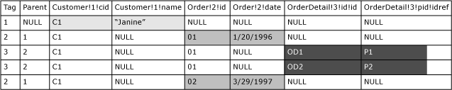

# Use EXPLICIT Mode with FOR XML
As described in the topic, [Constructing XML Using FOR XML](../../Topics/TopicNameNotContainA/FOR-XML--SQL-Server-.md), RAW and AUTO mode do not provide much control over the shape of the XML generated from a query result. However, EXPLICIT mode provides the most flexibility in generating the XML you want from a query result.  
  
 The EXPLICIT mode query must be written in a specific way so that the additional information about the required XML, such as expected nesting in the XML, is explicitly specified as part of the query. Depending on the XML you request, writing EXPLICIT mode queries can be cumbersome. You may find that [Using PATH Mode](../../Topics/TopicNameNotContainA/Use-PATH-Mode-with-FOR-XML.md) with nesting is a simpler alternative to writing EXPLICIT mode queries.  
  
 Because you describe the XML you want as part of the query in EXPLICIT mode, you must ensure that the generated XML is well formed and valid.  
  
## Rowset Processing in EXPLICIT Mode  
 The EXPLICIT mode transforms the rowset that results from the query execution into an XML document. In order for EXPLICIT mode to produce the XML document, the rowset must have a specific format. This requires that you write the SELECT query to produce the rowset, the **universal table**, with a specific format so the processing logic can then produce the XML you want.  
  
 First, the query must produce the following two metadata columns:  
  
-   The first column must provide the tag number, integer type, of the current element, and the column name must be **Tag**. Your query must provide a unique tag number for each element that will be constructed from the rowset.  
  
-   The second column must provide a tag number of the parent element, and this column name must be **Parent**. In this way, the Tag and the Parent column provide hierarchy information.  
  
 These metadata column values, together with the information in the column names, are used to produce the XML you want. Note that your query must provide column names in a specific way. Also note that a 0 or NULL in the **Parent** column indicates that the corresponding element has no parent. The element is added to the XML as a top-level element.  
  
 To understand how the universal table generated by a query is processed into generating XML result, assume that you have written a query that produces this universal table:  
  
   
  
 Note the following about this universal table:  
  
-   The first two columns are **Tag** and **Parent** and are meta columns. These values determine the hierarchy.  
  
-   The column names are specified in a certain way, as described later in this topic.  
  
-   In generating the XML from this universal table, the data in this table is partitioned vertically into column groups. The grouping is determined based on the **Tag** value and the column names. In constructing XML, the processing logic selects one group of columns for each row and constructs an element. The following applies in this example:  
  
    -   For **Tag** column value 1 in the first row, the columns whose names include the same tag number, **Customer!1!cid** and **Customer!1!name**, form a group. These columns are used in processing the row, and you may have noticed that the shape of the generated element is <`Customer id=... name=...`>. Column name format is described later in this topic.  
  
    -   For rows with **Tag** column value 2, columns **Order!2!id** and **Order!2!date** form a group that is then used in constructing elements, <`Order id=... date=... /`>.  
  
    -   For rows with **Tag** column value 3, columns **OrderDetail!3!id!id** and **OrderDetail!3!pid!idref** form a group. Each of these rows generates an element, <`OrderDetail id=... pid=...`>, from these columns.  
  
-   Note that in generating XML hierarchy, the rows are processed in order. The XML hierarchy is determined as shown in the following:  
  
    -   The first row specifies **Tag** value 1 and **Parent** value NULL. Therefore, the corresponding element, <`Customer`> element, is added as a top-level element in the XML.  
  
        ```  
        <Customer cid="C1" name="Janine">  
        ```  
  
    -   The second row identifies **Tag** value 2 and **Parent** value 1. Therefore, the element, <`Order`> element, is added as a child of the <`Customer`> element.  
  
        ```  
        <Customer cid="C1" name="Janine">  
           <Order id="O1" date="1/20/1996">  
        ```  
  
    -   The next two rows identify **Tag** value 3 and **Parent** value 2. Therefore, the two elements, <`OrderDetail`> elements, are added as children of the <`Order`> element.  
  
        ```  
        <Customer cid="C1" name="Janine">  
           <Order id="O1" date="1/20/1996">  
              <OrderDetail id="OD1" pid="P1"/>  
              <OrderDetail id="OD2" pid="P2"/>  
        ```  
  
    -   The last row identifies 2 as the **Tag** number and 1 as the **Parent** tag number. Therefore, another <`Order`> element child is added to the <`Customer`> parent element.  
  
        ```  
        <Customer cid="C1" name="Janine">  
           <Order id="O1" date="1/20/1996">  
              <OrderDetail id="OD1" pid="P1"/>  
              <OrderDetail id="OD2" pid="P2"/>  
           </Order>  
           <Order id="O2" date="3/29/1997">  
        </Customer>  
        ```  
  
 To summarize, the values in the **Tag** and **Parent** meta columns, the information provided in the column names, and the correct ordering of the rows produce the XML you want when you use EXPLICIT mode.  
  
### Universal Table Row Ordering  
 In constructing the XML, the rows in the universal table are processed in order. Therefore, to retrieve the correct children instances associated with their parent, the rows in the rowset must be ordered so that each parent node is immediately followed by its children.  
  
## Specifying Column Names in a Universal Table  
 When writing EXPLICIT mode queries, column names in the resulting rowset must be specified by using this format. They provide transformation information including element and attribute names and other additional information, specified by using directives.  
  
 This is the general format:  
  
```  
  
ElementName!TagNumber!AttributeName!Directive  
```  
  
 Following is the description of the parts of the format.  
  
 *ElementName*  
 Is the resulting generic identifier of the element. For example, if **Customers** is specified as *ElementName*, the <Customers\> element is generated.  
  
 *TagNumber*  
 Is a unique tag value assigned to an element. This value, with the help of the two metadata columns, **Tag** and **Parent**, determines the nesting of the elements in the resulting XML.  
  
 *AttributeName*  
 Provides the name of the attribute to construct in the specified *ElementName*. This is the behavior if *Directive* is not specified.  
  
 If *Directive* is specified and it is **xml**, **cdata**, or **element**, this value is used to construct an element child of *ElementName*, and the column value is added to it.  
  
 If you specify the *Directive*, the *AttributeName* can be empty. For example, ElementName!TagNumber!!Directive. In this case, the column value is directly contained by the *ElementName*.  
  
 *Directive*  
 *Directive* is optional and you can use it to provide additional information for construction of the XML. *Directive* has two purposes.  
  
 One of the purposes is to encode values as ID, IDREF, and IDREFS. You can specify **ID**, **IDREF**, and **IDREFS** keywords as *Directives*. These directives overwrite the attribute types. This allows you to create intra-document links.  
  
 Also, you can use *Directive* to indicate how to map the string data to XML. The **hide**, **element, elementxsinil**, **xml**, **xmltext**, and **cdata** keywords can be used as the *Directive*. The **hide** directive hides the node. This is useful when you retrieve values only for sorting purposes, but you do not want them in the resulting XML.  
  
 The **element** directive generates a contained element instead of an attribute. The contained data is encoded as an entity. For example, the **<** character becomes &lt;. For NULL column values, no element is generated. If you want an element generated for null column values, you can specify the **elementxsinil** directive. This will generate an element that has the attribute xsi:nil=TRUE.  
  
 The **xml** directive is the same as an **element** directive, except that no entity encoding occurs. Note that the **element** directive can be combined with **ID**, **IDREF**, or **IDREFS**, whereas the **xml** directive is not allowed with any other directive, except **hide**.  
  
 The **cdata** directive contains the data by wrapping it with a CDATA section. The content is not entity encoded. The original data type must be a text type such as **varchar**, **nvarchar**, **text**, or **ntext**. This directive can be used only with **hide**. When this directive is used, *AttributeName* must not be specified.  
  
 Combining directives between these two groups is allowed in most cases, but combining them among themselves is not allowed.  
  
 If the *Directive* and the *AttributeName* is not specified, for example, **Customer!1**, an **element** directive is implied, such as **Customer!1!!element**, and column data is contained in the *ElementName*.  
  
 If the **xmltext** directive is specified, the column content is wrapped in a single tag that is integrated with the rest of the document. This directive is useful in fetching overflow, unconsumed, XML data stored in a column by OPENXML. For more information, see [OPENXML (SQL Server)](../../Topics/TopicNameNotContainA/OPENXML--SQL-Server-.md).  
  
 If *AttributeName* is specified, the tag name is replaced by the specified name. Otherwise, the attribute is appended to the current list of attributes of the enclosing elements by putting the content at the beginning of the containment without entity encoding. The column with this directive must be a text type, such as **varchar**, **nvarchar**, **char**, **nchar**, **text**, or **ntext**. This directive can be used only with **hide**. This directive is useful in fetching overflow data stored in a column. If the content is not a well-formed XML, the behavior is undefined.  
  
## In This Section  
 The following examples illustrate the use of EXPLICIT mode.  
  
-   [Example: Retrieving Employee Information](../Topic/Example:%20Retrieving%20Employee%20Information.md)  
  
-   [Example: Specifying the ELEMENT Directive](../Topic/Example:%20Specifying%20the%20ELEMENT%20Directive.md)  
  
-   [Example: Specifying the ELEMENTXSINIL Directive](../Topic/Example:%20Specifying%20the%20ELEMENTXSINIL%20Directive.md)  
  
-   [Example: Constructing Siblings with EXPLICIT Mode](../Topic/Example:%20Constructing%20Siblings%20with%20EXPLICIT%20Mode.md)  
  
-   [Example: Specifying the ID and IDREF Directives](../Topic/Example:%20Specifying%20the%20ID%20and%20IDREF%20Directives.md)  
  
-   [Example: Specifying the ID and IDREFS Directives](../Topic/Example:%20Specifying%20the%20ID%20and%20IDREFS%20Directives.md)  
  
-   [Example: Specifying the HIDE Directive](../Topic/Example:%20Specifying%20the%20HIDE%20Directive.md)  
  
-   [Example: Specifying the ELEMENT Directive and Entity Encoding](../Topic/Example:%20Specifying%20the%20ELEMENT%20Directive%20and%20Entity%20Encoding.md)  
  
-   [Example: Specifying the CDATA Directive](../Topic/Example:%20Specifying%20the%20CDATA%20Directive.md)  
  
-   [Example: Specifying the XMLTEXT Directive](../Topic/Example:%20Specifying%20the%20XMLTEXT%20Directive.md)  
  
## See Also  
 [Use RAW Mode with FOR XML](../../Topics/TopicNameNotContainA/Use-RAW-Mode-with-FOR-XML.md)   
 [Use AUTO Mode with FOR XML](../../Topics/TopicNameNotContainA/Use-AUTO-Mode-with-FOR-XML.md)   
 [Use PATH Mode with FOR XML](../../Topics/TopicNameNotContainA/Use-PATH-Mode-with-FOR-XML.md)   
 [SELECT (Transact-SQL)](assetId:///dc85caea-54d1-49af-b166-f3aa2f3a93d0)   
 [FOR XML (SQL Server)](../../Topics/TopicNameNotContainA/FOR-XML--SQL-Server-.md)