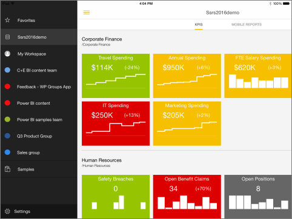
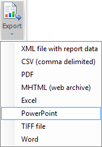
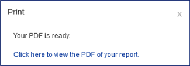
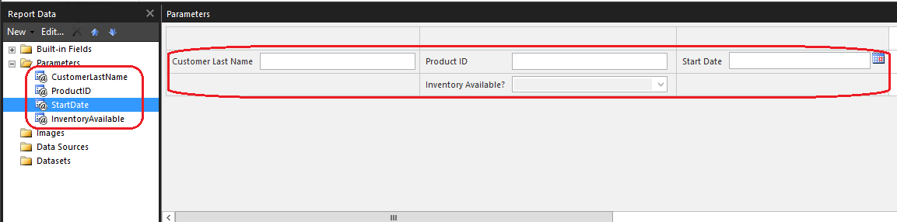
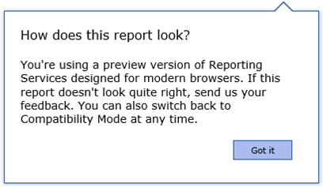
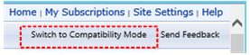
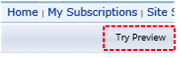
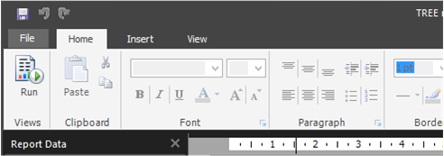
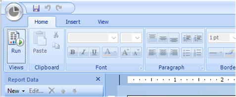

# What&#39;s New in Reporting Services (SSRS)
This topic summarizes the changes and updates in the [!INCLUDE[ssCurrent](../../Topics/TopicNameContainA/includes/ssCurrent_md.md)] release of [!INCLUDE[ssRSnoversion](../../Topics/TopicNameContainA/includes/ssRSnoversion_md.md)]. This document notes the version of the release that features first appeared. For example [CTP 2.3] represents "Community Technology Preview 2.3 (CTP 2.3)". For information on what's new in other areas of [!INCLUDE[ssSQL15](../../Topics/TopicNameContainA/includes/ssSQL15_md.md)], see [What's New in SQL Server 2016](../../Topics/TopicNameNotContainA/What-s-New-in-SQL-Server-2016.md).  
  
 **Download**   
  
-   To download [!INCLUDE[ssSQL15](../../Topics/TopicNameContainA/includes/ssSQL15_md.md)], go to  **[Evaluation Center](https://www.microsoft.com/en-us/evalcenter/evaluate-sql-server-2016)**.  
  
-   Have an Azure account?  Then go **[Here](https://azure.microsoft.com/en-us/marketplace/partners/microsoft/sqlserver2016rc0evaluationwindowsserver2012r2/?wt.mc_id=sqL16_vm)** to spin up a Virtual Machine with [!INCLUDE[ssCurrent](../../Topics/TopicNameContainA/includes/ssCurrent_md.md)] already installed.  
  
  For the current release notes, see [SQL Server 2016 Release Notes](../../Topics/TopicNameNotContainA/SQL-Server-2016-Release-Notes.md).  
  
## New in RC1  
 Visit the [Reporting Services team blog](https://blogs.msdn.microsoft.com/sqlrsteamblog/2016/03/07/get-more-done-in-the-new-reporting-services-web-portal-with-sql-server-2016-rc0/) for a more detailed introduction to the features in this release.  
  
 **Updates to [!INCLUDE[ssRSWebPortal-Non-Markdown](../../Topics/TopicNameNotContainA/includes/ssRSWebPortal-Non-Markdown_md.md)]**  
  
-   Report Manager has been removed and the [!INCLUDE[ssRSWebPortal-Non-Markdown](../../Topics/TopicNameNotContainA/includes/ssRSWebPortal-Non-Markdown_md.md)] is now the default when you browser to /reports.  
  
-   Search for KPIs, reports and other items  
  
-   Create data-driven subscriptions  
  
-   Open [!INCLUDE[SS_MobileReptPub_Short](../../Topics/TopicNameNotContainA/includes/SS_MobileReptPub_Short_md.md)] and Report Builder from the new [!INCLUDE[ssRSWebPortal-Non-Markdown](../../Topics/TopicNameNotContainA/includes/ssRSWebPortal-Non-Markdown_md.md)] using any modern browser. This no longer uses ClickOnce technology.  
  
 **Custom branding:** You can now customize the [!INCLUDE[ssRSWebPortal-Non-Markdown](../../Topics/TopicNameNotContainA/includes/ssRSWebPortal-Non-Markdown_md.md)] with your organization's logo and colors by using a branding pack.  
  
 **Report embedding:** You can now embed mobile and paginated reports in other web pages, and applications, by using an iframe along with URL parameters.  
  
 **Enhancements to KPIs and mobile reports**  
  
-   Choose a dataset field for a KPI value and summarize the values (sum, average, min, max, etc.).  
  
-   Select a KPI and see a view with more details.  
  
-   Connect KPIs and mobile reports to parameterized datasets.  
  
 **Mobile drill-through:** You can now select a KPI or mobile report visualization to drill through to more details. This can either be to another mobile report or a custom URL.  
  
 **Modern paginated reports:** Design beautifully modern paginated reports with new, modern styles for charts, gauges, maps and other data visualizations.  
  
 **Enhancements to the HTML5 renderer for modern browsers**  
  
-   Zoom into reports (now available in Edge, Chrome, Firefox and Safari)  
  
-   Choose date values for report parameters using a calendar control (now available in Safari)  
  
 **Power BI Desktop and Excel workbook storage:** Upload, organize and manage permissions for Power BI Desktop files and Excel workbooks.  
  
 For more detailed what's new information and information on previous months, see [What's New in Reporting Services](../../Topics/TopicNameNotContainA/What-s-New-in-Reporting-Services--SSRS-.md).  
  
## New in RC0  
 Visit the [Reporting Services team blog](https://blogs.msdn.microsoft.com/sqlrsteamblog/2016/03/07/get-more-done-in-the-new-reporting-services-web-portal-with-sql-server-2016-rc0/) for a more detailed introduction to the features in this release.  
  
### Manage subscriptions within the [!INCLUDE[ssRSWebPortal-Non-Markdown](../../Topics/TopicNameNotContainA/includes/ssRSWebPortal-Non-Markdown_md.md)]  
 You can now create and manage subscriptions from the [!INCLUDE[ssRSWebPortal-Non-Markdown](../../Topics/TopicNameNotContainA/includes/ssRSWebPortal-Non-Markdown_md.md)].  
  
### Pin report charts, gauges, maps, and images to dashboards in Power BI Groups  
 Pinning [!INCLUDE[ssRSnoversion](../../Topics/TopicNameContainA/includes/ssRSnoversion_md.md)] visualizations to a Power BI dashboard was introduced in CTP 3.0. In this release you can now pin visualizations to a dashboard in a Power BI Group.  
  
### Choose the currency for a KPI or mobile report  
 You now have the option of what currency to use for a KPI or mobile report.  
  
### Manage catalog items  
 You now have the ability to manage catalog items within the [!INCLUDE[ssRSWebPortal-Non-Markdown](../../Topics/TopicNameNotContainA/includes/ssRSWebPortal-Non-Markdown_md.md)]. This includes downloading, renaming, moving and deleting reports, datasets and other items.  
  
### Manage data caching and refresh  
 In this release, you can manage data caching and refresh within the web portal. This also includes feedback from customers which resulted in a simpler page. The page will adjust based on selections as to not overwhelm you.  
  
### Manage shared datasets  
 You can now manage shared datasets from the [!INCLUDE[ssRSWebPortal-Non-Markdown](../../Topics/TopicNameNotContainA/includes/ssRSWebPortal-Non-Markdown_md.md)].  
  
### Create linked reports  
 In this release, you can create linked reports with different default parameter values or other settings.  
  
## Reporting Services [!INCLUDE[ssRSWebPortal-Non-Markdown](../../Topics/TopicNameNotContainA/includes/ssRSWebPortal-Non-Markdown_md.md)]  
 **[CTP 3.2]**Starting with CTP 3.2, a new [!INCLUDE[ssRSnoversion](../../Topics/TopicNameContainA/includes/ssRSnoversion_md.md)][!INCLUDE[ssRSWebPortal-Non-Markdown](../../Topics/TopicNameNotContainA/includes/ssRSWebPortal-Non-Markdown_md.md)] is available. This is an updated, modern, portal which incorporates KPIs, Mobile Reports and Paginated Reports. Currently, the portal is for consumption. For adding new data sources, data sets and paginated reports, you will need to switch to the classic Report Manager. To create Mobile Reports, you will need the [!INCLUDE[SS_MobileReptPub_Short](../../Topics/TopicNameNotContainA/includes/SS_MobileReptPub_Short_md.md)].  
  
 You can browse to this portal by going to http://<server\>/reports_preview.  
  
 For more information about the [!INCLUDE[ssRSWebPortal-Non-Markdown](../../Topics/TopicNameNotContainA/includes/ssRSWebPortal-Non-Markdown_md.md)], see [Web portal (SSRS Native Mode)](../../Topics/TopicNameNotContainA/Web-portal--SSRS-Native-Mode-.md).  
  
   
  
## Mobile Report Publisher  
 **[CTP 3.2]** The [!INCLUDE[SS_MobileReptPub_Long](../../Topics/TopicNameContainA/includes/SS_MobileReptPub_Long_md.md)]allows you to create and publish SQL Server mobile reports to your [!INCLUDE[ssRSnoversion](../../Topics/TopicNameContainA/includes/ssRSnoversion_md.md)][!INCLUDE[ssRSWebPortal-Non-Markdown](../../Topics/TopicNameNotContainA/includes/ssRSWebPortal-Non-Markdown_md.md)].  
  
   
  
 For more information, see [Create mobile reports with SQL Server Mobile Report Publisher](../../Topics/TopicNameNotContainA/Create-mobile-reports-with-SQL-Server-Mobile-Report-Publisher.md).  
  
## SQL Server mobile reports hosted in Reporting Services available in Power BI Mobile app  
 **[CTP 3.2]**The Power BI Mobile app for iOS on iPad and iPhone can now display SQL Server mobile reports hosted on your local report server.  
  
   
  
 You can't connect by default without some configuration changes. For more information on how to allow the Power BI Mobile app to connect to your report server, see [Enable a report server for Power BI Mobile access](../../Topics/TopicNameContainA/Enable-a-report-server-for-Power-BI-Mobile-access.md).  
  
   
  
## Support of SharePoint mode and SharePoint 2016  
 **[CTP 3.1]**Starting with CTP 3.1, [!INCLUDE[ssRSnoversion](../../Topics/TopicNameContainA/includes/ssRSnoversion_md.md)] SharePoint mode is supported. [!INCLUDE[ssSQL15](../../Topics/TopicNameContainA/includes/ssSQL15_md.md)][!INCLUDE[ssRSnoversion](../../Topics/TopicNameContainA/includes/ssRSnoversion_md.md)] supports integration with SharePoint 2013 and SharePoint 2016.   
For more information, see:  
  
-   [Supported Combinations of SharePoint and Reporting Services Server and Add-in (SQL Server 2016)](../../Topics/TopicNameNotContainA/Supported-Combinations-of-SharePoint-and-Reporting-Services-Server-and-Add-in--SQL-Server-2016-.md)  
  
-   [Where to find the Reporting Services add-in for SharePoint Products](../../Topics/TopicNameNotContainA/Where-to-find-the-Reporting-Services-add-in-for-SharePoint-Products.md)  
  
-   [Install Reporting Services SharePoint Mode](../../Topics/TopicNameNotContainA/Install-Reporting-Services-SharePoint-Mode.md)  
  
   
  
## Pin Report Items to a Power BI Dashboard  
 **[CTP 3.0]** While viewing a report in Report Manager, you can select report items and pin them to a [!INCLUDE[sspowerbi](../../Topics/TopicNameNotContainA/includes/sspowerbi_md.md)] dashboard.   The items you can pin are charts, gauge panels, maps, and images. You can **(1)** select from your available dashboards and **(2)** configure how often the data is refreshed to the dashboard tile.  
  
   
  
 For more information, see [Power BI Report Server Integration (Configuration Manager)](../../Topics/TopicNameNotContainA/Power-BI-Report-Server-Integration--Configuration-Manager-.md) and [Pin Reporting Services items to Power BI Dashboards](../../Topics/TopicNameNotContainA/Pin-Reporting-Services-items-to-Power-BI-Dashboards.md).  
  
## SQL Server Data Tools (SSDT)  
 **[CTP 3.0]** The new release of SSDT includes the project templates for [!INCLUDE[ssRSCurrent](../../Topics/TopicNameContainA/includes/ssRSCurrent_md.md)]: Report Server Project Wizard and Report Server Project. For information about downloading SSDT, see [SQL Server Data Tools for Visual Studio 2015](http://go.microsoft.com/fwlink/?LinkId=627574).  
  
   
  
## PowerPoint Rendering and Export  
 **[CTP 2.4]** The Microsoft PowerPoint (PPTX) format is a new [!INCLUDE[ssRSCurrent](../../Topics/TopicNameContainA/includes/ssRSCurrent_md.md)] rendering extension. You can export reports in the PPTX format from the usual applications; Report Builder, Report Designer (in SSDT), Report Manager. For the example the following image shows the export menu from Report Builder. For more information, see [Export Reports (Report Builder and SSRS)](../../Topics/TopicNameNotContainA/Export-Reports--Report-Builder-and-SSRS-.md).  
  
   
  
 You can also select the PPTX format for subscription output and use Report Server URL access to render and export a report. For example the following  URL command in your browser exports a report from a named instance of the report server.  
  
```  
http://servername/ReportServer_THESQLINSTANCE/Pages/ReportViewer.aspx?%2freportfolder%2freport+name+with+spaces&rs:Format=pptx  
```  
  
 For more information, see [Export a Report Using URL Access](../../Topics/TopicNameContainA/Export-a-Report-Using-URL-Access.md).  
  
## PDF Replaces ActiveX for Remote Printing  
  
|||  
|-|-|  
|**[CTP 2.4]** The report viewer toolbar ActiveX print experience has been replaced with a modern PDF based experience that works across the matrix of supported browsers, including Microsoft Edge.<br /> No more ActiveX controls to download! Depending on the browser you use and the PDF viewing applications and services you have installed, [!INCLUDE[ssRSnoversion](../../Topics/TopicNameContainA/includes/ssRSnoversion_md.md)] will either open  a print dialog to print your report or prompt you to download a .PDF file of your report.  As an administrator, you can still disable client side printing from [!INCLUDE[ssManStudio](../../Topics/TopicNameContainA/includes/ssManStudio_md.md)]. For more information, see [Enable and Disable Client-Side Printing for Reporting Services](../../Topics/TopicNameNotContainA/Enable-and-Disable-Client-Side-Printing-for-Reporting-Services.md).||  
  
## Custom Parameters Pane  
 **[CTP 2.4]** You can now customize the parameters pane. Using the design surface in Report Builder, you can drag a parameter to a specific column and row in the parameters pane. You can add and remove columns to change the layout of the pane.   For more information, see [Customize the Parameters Pane in a Report (Report Builder)](../../Topics/TopicNameContainA/Customize-the-Parameters-Pane-in-a-Report--Report-Builder-.md).  
  
   
  
   
  
## HTML 5 Rendering Engine  
 **[CTP 2.3]** A new  HTML5 rendering engine that targets modern web "full" standards mode and modern browsers.  The new rendering engine no longer relies on quirks mode used by a few older browsers. The new rendering engine is used by default but you have the option of switching back to the previous rendering engine and providing feedback to Microsoft on the new HTML5 approach.  
  
|||  
|-|-|  
||When you preview reports in Report Manager,   you will see an information bubble noting you are using the new HTML 5, full standards rendering but you can switch to the old rendering engine.  The bubble appears the fist few times you preview a report.|  
|<br /><br /> |The ribbon allows you to toggle between:<br /><br /> -Comparability mode and running the old rendering engine.<br /><br /> -Preview of the new HTML 5 rendering mode<br /><br /> <br /><br /> To provide feedback on the new rendering engine, see the MSDN forum [SQL Server Reporting services](http://go.microsoft.com/fwlink/?linkid=620231).|  
  
 For more information on browser support, see [Browser Support for Reporting Services and Power View](../../Topics/TopicNameNotContainA/Browser-Support-for-Reporting-Services-and-Power-View.md).  
  
## New Report Builder User Interface  
 **[CTP 2.3]** The core [!INCLUDE[ssRBnoversion](../../Topics/TopicNameContainA/includes/ssRBnoversion_md.md)] user interface is now a modern look and feel with streamlined UI elements.  
  
|||  
|-|-|  
|New|Previous|  
|||  
  
## Tree Map and Sunburst Charts  
 **[CTP 2.3]**. Enhance your reports with Tree Map  and Sunburst  charts, great ways to display hierarchal data.  
  
 For more information, see [Tree Map and Sunburst Charts in Reporting Services](../../Topics/TopicNameNotContainA/Tree-Map-and-Sunburst-Charts-in-Reporting-Services.md).  
  
   
  
## Microsoft .NET Framework 4 Support  
 **[CTP 2.0]** [!INCLUDE[ssRSCurrent](../../Topics/TopicNameContainA/includes/ssRSCurrent_md.md)] supports the current versions of Microsoft .NET Framework 4. This includes version 4.0 and 4.5.1. If no version of .Net Framework 4.x is installed, [!INCLUDE[ssNoVersion](../../Topics/TopicNameContainA/includes/ssNoVersion_md.md)] setup installs .NET 4.0 during the feature installation step.  
  
## High DPI Support  
 **[CTP 2.0]** [!INCLUDE[ssRBnoversion](../../Topics/TopicNameContainA/includes/ssRBnoversion_md.md)] for [!INCLUDE[ssCurrent](../../Topics/TopicNameContainA/includes/ssCurrent_md.md)] supports High DPI (Dots Per Inch) scaling and devices.  For more information on High DPI, see the following:  
  
-   [Windows 8.1 DPI Scaling Enhancements](http://blogs.windows.com/bloggingwindows/2013/07/15/windows-8-1-dpi-scaling-enhancements/)  
  
-   [High DPI and Windows 8.1](http://technet.microsoft.com/library/dn528848.aspx)  
  
## Subscription Improvements  
 **[CTP 2.0]** Enhancements to [!INCLUDE[ssRSnoversion](../../Topics/TopicNameContainA/includes/ssRSnoversion_md.md)] Subscription features:  
  
|Feature|Supported server mode|  
|-------------|---------------------------|  
|**Enable and disable subscriptions**. New user interface options to quickly disable and enable subscriptions. The disabled subscriptions maintain their other configuration properties such as schedule and can be easily enabled.<br /><br /> <br /><br /> For more information, see [Disable or Pause Report and Subscription Processing](../../Topics/TopicNameNotContainA/Disable-or-Pause-Report-and-Subscription-Processing.md).|Native mode|  
|**Subscription description**. When you create a new subscription, you can now include a description of the report as part of the subscription properties. The description is included on the subscription summary page.|SharePoint and Native mode|  
|**Change subscription owner**. Enhanced user interface to quickly change the owner of a subscription. Previous versions of [!INCLUDE[ssRSnoversion](../../Topics/TopicNameContainA/includes/ssRSnoversion_md.md)] allow administrators to change subscription owners using script. Starting with the [!INCLUDE[ssSQL15](../../Topics/TopicNameContainA/includes/ssSQL15_md.md)] release, you can change subscription owners using the user interface or script. Changing the subscription owner is a common administrative task when users leave or change roles in your organization.|SharePoint and Native mode|  
|**Shared credential for file share subscriptions**. Two workflows now exist with [!INCLUDE[ssRSnoversion](../../Topics/TopicNameContainA/includes/ssRSnoversion_md.md)] file share subscriptions:<br /><br /> New in this release, your [!INCLUDE[ssRSnoversion](../../Topics/TopicNameContainA/includes/ssRSnoversion_md.md)] administrator can configure a single file share account, that is used for one to many subscriptions. The file share account is configured in the [!INCLUDE[ssRSnoversion](../../Topics/TopicNameContainA/includes/ssRSnoversion_md.md)] native mode configuration manager **Specify a file share account**, and then on the subscription configuration page, users select **Use file share account**.<br /><br /> Configure individual subscriptions with specific credentials for the destination file share.<br /><br /> You can also mix the two approaches and have some file share subscriptions use the central file share account while other subscriptions use specific credentials.|Native mode|  
  
## See Also  
 [What's New in SQL Server 2016](../../Topics/TopicNameNotContainA/What-s-New-in-SQL-Server-2016.md)   
 [What's New in Analysis Services](../../Topics/TopicNameNotContainA/What-s-New-in-Analysis-Services.md)   
 [SQL Server 2016 Release Notes](../../Topics/TopicNameNotContainA/SQL-Server-2016-Release-Notes.md)   
 [Reporting Services Backward Compatibility](../../Topics/TopicNameNotContainA/Reporting-Services-Backward-Compatibility.md)   
 [Features Supported by the Editions of SQL Server 2016](../../Topics/TopicNameNotContainA/Features-Supported-by-the-Editions-of-SQL-Server-2016.md)   
 [Upgrade and Migrate Reporting Services](../../Topics/TopicNameNotContainA/Upgrade-and-Migrate-Reporting-Services.md)   
 [Reporting Services (SSRS)](../../Topics/TopicNameNotContainA/Reporting-Services--SSRS-.md)