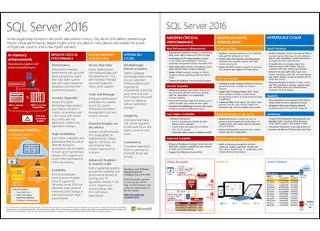

# What&#39;s New in SQL Server 2016
The improvements in SQL Server 2016 Release Candidate 3 (RC3) primarily consist of bug fixes and other work to increase the stability and reliability of [!INCLUDE[ssCurrent](../../Topics/TopicNameContainA/includes/ssCurrent_md.md)].  We continue to refine the product for general availability.  The topic also contains links to more detailed component level what's new information related to the previous monthly builds.  
  
 **Try it out :**  
  
-   To download [!INCLUDE[ssSQL15](../../Topics/TopicNameContainA/includes/ssSQL15_md.md)], go to  **[Evaluation Center](https://www.microsoft.com/en-us/evalcenter/evaluate-sql-server-2016)**.  
  
-   Have an Azure account?  Then go **[Here](https://azure.microsoft.com/en-us/marketplace/partners/microsoft/sqlserver2016rc0evaluationwindowsserver2012r2/?wt.mc_id=sqL16_vm)** to spin up a Virtual Machine with [!INCLUDE[ssCurrent](../../Topics/TopicNameContainA/includes/ssCurrent_md.md)] already installed.  
  
-   To get the latest version of SQL Server Management Studio, see **[Download SQL Server Management Studio (SSMS)](https://msdn.microsoft.com/library/mt238290.aspx)**.  
  
  For the current release notes, see [SQL Server 2016 Release Notes](../../Topics/TopicNameNotContainA/SQL-Server-2016-Release-Notes.md).  
  
## SQL Server Setup - new this month  
 No new features were added in this release. For information on previous months, see [Installation for SQL Server 2016](../../Topics/TopicNameNotContainA/Installation-for-SQL-Server-2016.md)  
  
## Analysis Services Engine (SSAS) - new this month  
 No new features were added in this release. For information on previous months, see [What's New in Analysis Services](../../Topics/TopicNameNotContainA/What-s-New-in-Analysis-Services.md).  
  
## Database Engine - new this month  
 No new features were added in this release. For information on previous months, see [What's New in Database Engine](../../Topics/TopicNameNotContainA/What-s-New-in-Database-Engine.md).  
  
## Integration Services (SSIS) - new this month  
 No new features were added in this release. For information on previous months, see [What's New in Integration Services](../../Topics/TopicNameNotContainA/What-s-New-in-Integration-Services.md).  
  
## Reporting Services (SSRS) - new this month  
 No new features were added in this release. For information on previous months, see [What's New in Reporting Services (SSRS)](../../Topics/TopicNameNotContainA/What-s-New-in-Reporting-Services--SSRS-.md).  
  
## Master Data Services (MDS) - new this month  
 No new features were added in this release. For information on previous months, see [What's New in Master Data Services (MDS)](../../Topics/TopicNameNotContainA/What-s-New-in-Master-Data-Services--MDS-.md).  
  
##   SQL Server R Services - new this month  
 No new features were added in this release. For information on previous months, see  [What's New in SQL Server R Services](../../Topics/TopicNameNotContainA/What-s-New-in-SQL-Server-R-Services.md).  
  
## More information about SQL Server 2016  
  To download the [!INCLUDE[ssSQL15](../../Topics/TopicNameContainA/includes/ssSQL15_md.md)] data sheet, see [SQL Server 2016 Preview](http://www.microsoft.com/en-us/server-cloud/products/sql-server-2016/default.aspx).  
  
  To download [!INCLUDE[ssSQL15](../../Topics/TopicNameContainA/includes/ssSQL15_md.md)], go to  **[Evaluation Center](https://www.microsoft.com/en-us/evalcenter/evaluate-sql-server-2016)**.  
  
   
  
   
  
## See Also  
 [SQL Server 2016 Release Notes](../../Topics/TopicNameNotContainA/SQL-Server-2016-Release-Notes.md)   
 [Hardware and Software Requirements for Installing SQL Server 2016](../../Topics/TopicNameNotContainA/Hardware-and-Software-Requirements-for-Installing-SQL-Server-2016.md)