# Working with KPIs in Reporting Services
A Key Performance Indicator (KPI) is a visual cue that communicates the amount of progress made toward a goal.  Key Performance Indicators are valuable for teams, managers, and businesses to evaluate quickly the progress made against measurable goals.   
  
By using KPIs in SQL Server 2016 Reporting Services, you can easily visualize answers to the following questions:  
  
-   What am I ahead or behind on?  
  
-   How far ahead or behind am I?  
  
-   What is the minimum I have completed?  
  
## Creating a Dataset  
A KPI will only use the first row of data from a shared dataset. Make sure that the data you want to use is located on that first row. To create a shared dataset, you can use either Report Builder or SQL Server Data Tools.  
  
> **Note**: The Dataset does not need to be in the same folder as the KPI.  
  
## Placement of KPIs  
  
KPIs can be created in any folder in your report server.  Before you create a KPI, you will want to think about where is the right location to place it in. You will want to place it in a folder that will be visible to the users, at the same time being relevant to other reports, and KPIs, around it.  
  
## Adding a KPI  
  
After you have determined the location of your KPI, go to that folder and select **New** > **KPI** from the top menu.  
  
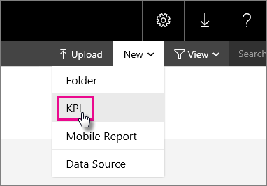  
  
This will present you with the **New KPI** screen.  
  
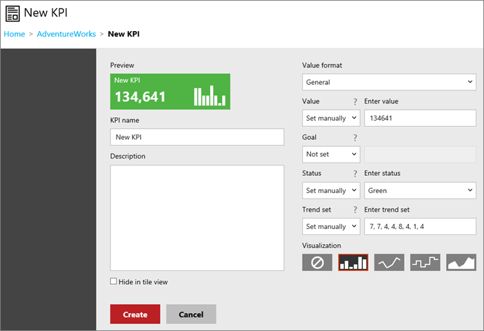  
  
You can either assign static values, or use data from a shared dataset. When you create a new KPI, it will be populated with a random set of manual data.  
  
|Field|Description|  
|---|---|  
|Value format|  Used to change the format of the value being displayed.|   
|Value|The value to display for the KPI.|  
|Goal|Used as a comparison to a numeric value and shown as a percent difference.|  
|Status|Numerical value used to determine the KPI Tile color. Valid values are 1 (green), 0 (amber) and -1 (red).|  
|Trend set|Comma-separated numeric values used for chart visualization. This can also be set to a column of a dataset with values that represent the trend.|  
  
> **Warning**: While you can use the word value for the **Status** field at design time, you should use the number value if refreshing a dataset. If you refresh a dataset with the word value, instead of the number, it could corrupt the KPIs on your server.  
  
> **Note**: The **Value**, **Goal** and **Status** fields can only choose a value from the first row of a dataset’s result. The **Trend set** field, however, can choose which column reflects the trend.  
  
To use data from a shared dataset, you can do the following.  
  
1.  Change the fields drop down box from **Set manually**, or **Not set**, to **Dataset field**.  
  
    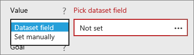  
  
2.  Select the **ellipse (…)** in the data box. This will bring up the **Pick a Dataset** screen.  
  
    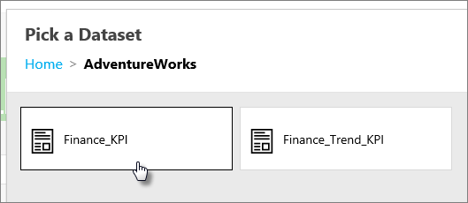  
  
3.  Select the dataset that has the data you want to display.  
  
4.  Choose the field you want to use. Select **OK**.  
  
    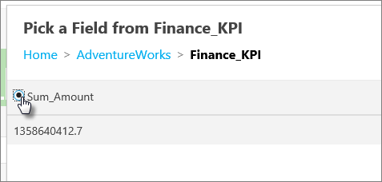  
  
5.  Change **Value format** to match the format of your value. In this example, the value is a currency.  
  
    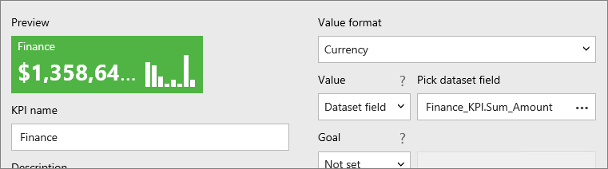  
  
6.  Select **Apply**.  
  
    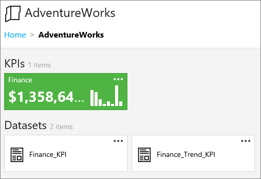  
  
## Removing a KPI  
  
To remove a KPI, you can do the following.  
  
1.  Select the **ellipse (…)** of the KPI you want to remove. Select **Manage**.  
  
    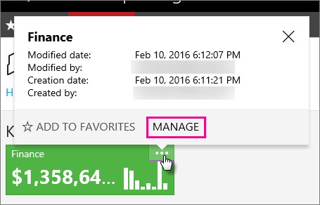  
  
2.  Select **Delete**. Select **Delete** again on the confirmation dialog.  
  
    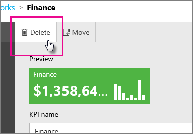  
  
## Refreshing a KPI  
  
To refresh the KPI, you will need to configure a **Cache Refresh Plan** for the shared dataset. Currently, you are not able to configure a cache refresh plan from the web portal. You will need to go over to the old Report Manager to do this.   
  
This will walk through how to setup a cache refresh plan with some basic settings. For more information regarding cache refresh plans, see [Cache Refresh Options (Report Manager)](../../Topics/TopicNameNotContainA/Cache-Refresh-Options--Report-Manager-.md).  
  
1.  Open Report Manager, and locate the shared dataset for which you want to configure cache refresh plan properties.   
  
2.  Hover over the report or shared dataset, and select the drop-down arrow.  
  
3.  In the drop-down list, select **Manage**. The **General properties** page opens.  
  
4.  Select the **Cache Refresh Options** tab.  
  
5.  To create a new cache plan, select **New Cache Refresh Plan**.  
  
    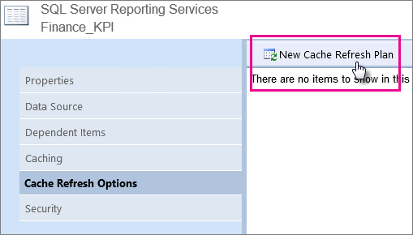  
  
6.  You will get a message asking if you want to enable caching for this item with default options. Select **OK**.  
  
    > **Note**: You must enable and start the SQL Server Agent service to create a cache refresh plan.  
  
7.  You can choose a specific schedule, or select a shared schedule if one exists.  
  
8.  The values for the KPI will update when the schedule for the cache refresh plan is run.  
  
    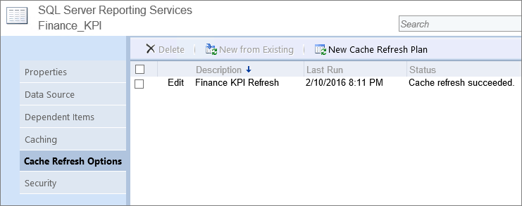  
  
## See also  
  
- [Web Portal (SSRS Native Mode)](../../Topics/TopicNameNotContainA/Web-portal--SSRS-Native-Mode-.md)  
  
- [Cache Refresh Options (Report Manager)](../../Topics/TopicNameNotContainA/Cache-Refresh-Options--Report-Manager-.md)  
  
    
  
  
  
