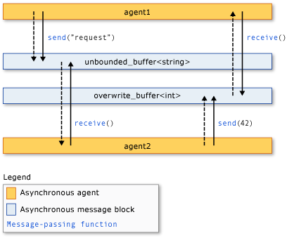

# Asynchronous Agents Library
The Asynchronous Agents Library (or just *Agents Library*) provides a programming model that lets you increase the robustness of concurrency-enabled application development. The Agents Library is a C++ template library that promotes an actor-based programming model and in-process message passing for coarse-grained dataflow and pipelining tasks. The Agents Library builds on the scheduling and resource management components of the Concurrency Runtime.  
  
## Programming Model  
 The Agents Library provides alternatives to shared state by letting you connect isolated components through an asynchronous communication model that is based on dataflow instead of control flow. *Dataflow* refers to a programming model where computations are made when all required data is available; *control flow* refers to a programming model where computations are made in a predetermined order.  
  
 The dataflow programming model is related to the concept of *message passing*, where independent components of a program communicate with one another by sending messages.  
  
 The Agents Library is composed of three components: *asynchronous agents*, *asynchronous message blocks*, and *message-passing functions*. Agents maintain state, and use message blocks and message-passing functions to communicate with one another and with external components. Message-passing functions enable agents to send and receive messages to and from the external components. Asynchronous message blocks hold messages and enable agents to communicate in a synchronized manner.  
  
 The following illustration shows how two agents use message blocks and message-passing functions to communicate. In this illustration, `agent1` sends a message to `agent2` by using the [concurrency::send](../VS_csharp/send-function.md) function and a [concurrency::unbounded_buffer](../VS_csharp/unbounded_buffer-class.md) object. `agent2` uses the [concurrency::receive](../VS_csharp/receive-function.md) function to read the message. `agent2` uses the same method to send a message to `agent1`. Dashed arrows represent the flow of data between agents. Solid arrows connect the agents to the message blocks that they write to or read from.  
  
   
  
 A code example that implements this illustration is shown later in this topic.  
  
 The agent programming model has several advantages over other concurrency and synchronization mechanisms, for example, events. One advantage is that by using message passing to transmit state changes between objects, you can isolate access to shared resources, and thereby improve scalability. An advantage to message passing is that it ties synchronization to data instead of tying it to an external synchronization object. This simplifies data transmission among components and can eliminate programming errors in your applications.  
  
## When to Use the Agents Library  
 Use the Agents library when you have multiple operations that must communicate with one another asynchronously. Message blocks and message-passing functions let you write parallel applications without requiring synchronization mechanisms such as locks. This lets you focus on application logic.  
  
 The agent programming model is often used to create *data pipelines* or *networks*. A data pipeline is a series of components, each of which performs a specific task that contributes to a larger goal. Every component in a dataflow pipeline performs work when it receives a message from another component. The result of that work is passed to other components in the pipeline or network. The components can use more fine-grained concurrency functionality from other libraries, for example, the [Parallel Patterns Library (PPL)](../VS_csharp/parallel-patterns-library--ppl-.md).  
  
## Example  
 The following example implements the illustration shown earlier in this topic.  
  
 [!code[concrt-basic-agents#1](../VS_csharp/codesnippet/CPP/asynchronous-agents-library_1.cpp)]  
  
 This example produces the following output:  
  
 **agent1: sending request...**  
**agent2: received 'request'.**  
**agent2: sending response...**  
**agent1: received '42'.** The following topics describe the functionality used in this example.  
  
## Related Topics  
 [Asynchronous Agents](../VS_csharp/asynchronous-agents.md)  
 Describes the role of asynchronous agents in solving larger computing tasks.  
  
 [Asynchronous Message Blocks](../VS_csharp/asynchronous-message-blocks.md)  
 Describes the various message block types that are provided by the Agents Library.  
  
 [Message Passing Functions](../VS_csharp/message-passing-functions.md)  
 Describes the various message passing routines that are provided by the Agents Library.  
  
 [How to: Implement Various Producer-Consumer Patterns](../VS_csharp/how-to--implement-various-producer-consumer-patterns.md)  
 Describes how to implement the producer-consumer pattern in your application.  
  
 [How to: Use the call and transformer Classes](../VS_csharp/how-to--provide-work-functions-to-the-call-and-transformer-classes.md)  
 Illustrates several ways to provide work functions to the [concurrency::call](../VS_csharp/call-class.md) and [concurrency::transformer](../VS_csharp/transformer-class.md) classes.  
  
 [How to: Use transformer in a Data Pipeline](../VS_csharp/how-to--use-transformer-in-a-data-pipeline.md)  
 Shows how to use the [concurrency::transformer](../VS_csharp/transformer-class.md) class in a data pipeline.  
  
 [How to: Select Among Completed Tasks](../VS_csharp/how-to--select-among-completed-tasks.md)  
 Shows how to use the [concurrency::choice](../VS_csharp/choice-class.md) and [concurrency::join](../VS_csharp/join-class.md) classes to select the first task to complete a search algorithm.  
  
 [How to: Send a Message at a Regular Interval](../VS_csharp/how-to--send-a-message-at-a-regular-interval.md)  
 Shows how to use the [concurrency::timer](../VS_csharp/timer-class.md) class to send a message at a regular interval.  
  
 [How-to: Use a Message Block Filter](../VS_csharp/how-to--use-a-message-block-filter.md)  
 Demonstrates how to use a filter to enable an asynchronous message block to accept or reject messages.  
  
 [Parallel Patterns Library (PPL)](../VS_csharp/parallel-patterns-library--ppl-.md)  
 Describes how to use various parallel patterns, such as parallel algorithms, in your applications.  
  
 [Concurrency Runtime](../VS_csharp/concurrency-runtime.md)  
 Describes the Concurrency Runtime, which simplifies parallel programming, and contains links to related topics.