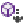

# Class View and Object Browser Icons
**Class View** and the **Object Browser** display icons that represent code entities, for example, namespaces, classes, functions, and variables. The following table illustrates and describes the icons.  
  
|Icon|Description|Icon|Description|  
|----------|-----------------|----------|-----------------|  
||Namespace||Method or Function|  
||Class||Operator|  
||Interface||Property|  
||Structure||Field or Variable|  
||Union||Event|  
||Enum||Constant|  
||TypeDef||Enum Item|  
||Module||Map Item|  
||Extension Method||External Declaration|  
||Delegate||Error|  
||Exception||Template|  
||Map||Unknown|  
||Type Forwarding|||  
  
## Signal Icons  
 The following signal icons apply to all the previous icons and indicate their accessibility.  
  
> [!NOTE]
>  If your project is included in a source control database, additional signal icons may be displayed to indicate source-control status, such as checked in or checked out.  
  
|Icon|Description|  
|----------|-----------------|  
|<No Signal Icon\>|Public. Accessible from anywhere in this component and from any component that references it.|  
||Protected. Accessible from the containing class or type, or those derived from the containing class or type.|  
||Private. Accessible only in the containing class or type.|  
||Sealed.|  
||Friend/Internal. Accessible only from the project.|  
||Shortcut. A shortcut to the object.|  
  
## See Also  
 [Viewing the Structure of Code](../VS_csharp/viewing-the-structure-of-code.md)