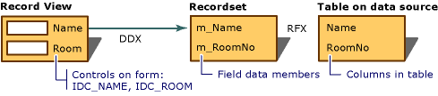

# Data Exchange for Record Views   (MFC Data Access)
When you use [Add Class](../VS_csharp/adding-an-mfc-odbc-consumer.md) to map the controls in a record view's dialog template resource to the fields of a recordset, the framework manages data exchange in both directions — from recordset to controls and from controls to recordset. Using the DDX mechanism means that you do not have to write the code to transfer data back and forth yourself.  
  
 DDX for record views works in conjunction with:  
  
-   [RFX](../VS_csharp/record-field-exchange--rfx-.md) for recordsets of class `CRecordset` (ODBC).  
  
-   DFX for recordsets of class `CDaoRecordset` (DAO).  
  
 Although they differ in implementation, at the interface level RFX and DFX are very similar data exchange mechanisms. The DAO version, DFX, is modeled closely on the earlier ODBC version, RFX. If you know how to use RFX, you know how to use DFX.  
  
 RFX and DFX move data between the current record of the data source and the field data members of a recordset object. DDX moves the data from the field data members to the controls in the form. This combination fills the form controls initially and as the user moves from record to record. It can also move updated data back to the recordset and then to the data source.  
  
 The following figure shows the relationship between DDX and RFX (or DFX) for record views.  
  
   
Dialog Data Exchange and Record Field Exchange  
  
 For more information about DDX, see [Dialog Data Exchange and Validation](../VS_csharp/dialog-data-exchange-and-validation.md). For more information about RFX, see [Record Field Exchange (RFX)](../VS_csharp/record-field-exchange--rfx-.md).  
  
## See Also  
 [Record Views  (MFC Data Access)](../VS_csharp/record-views---mfc-data-access-.md)   
 [ODBC Driver List](../VS_csharp/odbc-driver-list.md)