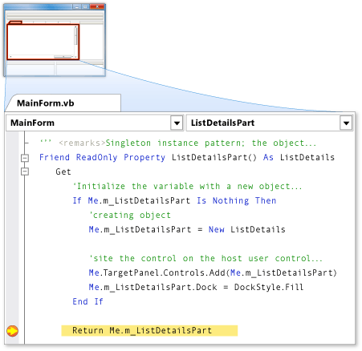

# Debugging Tools in LightSwitch
[!INCLUDE[smb_current_long](../VS_csharp/includes/smb_current_long_md.md)] provides many tools and techniques for debugging. Debugging is the process of finding and fixing bugs in an application.  
  
## Debugging in [!INCLUDE[smb_current_short](../VS_csharp/includes/smb_current_short_md.md)]  
 When you run or debug an application, the development environment changes to *run mode*. The application itself is started, and a window that is related to debugging appears. When the environment is in run mode, you cannot make changes in the **Form Designer**, **Properties** window, **Solution Explorer**, or **Code Editor**.  
  
 In run mode, the **Immediate** window appears at the bottom of the environment. If you put the application into *break mode*, you can query for values and test code in the **Immediate** window. Break mode is shown in the following illustration.  
  
   
Break mode  
  
 At run time, you can open additional windows for watching the values of variables, viewing output, and performing other debugging tasks. Use the **Debug** menu to open these windows.  
  
## See Also  
 [Debugging: Finding and Fixing Errors](../VS_csharp/debugging--finding-and-fixing-errors.md)   
 [Debugging Managed Code](http://go.microsoft.com/fwlink/?LinkID=209027)