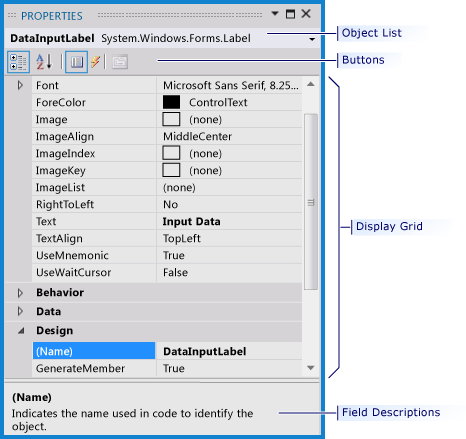

# Extending Properties
The [!INCLUDE[vsprvs](../VS_csharp/includes/vsprvs_md.md)] **Properties** window is a universal property browser for COM and COM+ components and supports all [!INCLUDE[vsprvs](../VS_csharp/includes/vsprvs_md.md)] products. The **Properties** window works with `ITypeInfo` type information and COM+ metadata to list the design-time properties for the currently selected object in any other window in the integrated development environment (IDE).  
  
 The **Properties** window, which can be opened by pressing F4 on the keyboard, or selecting **Properties Window** on the **View** menu, is used to view and edit configuration-independent, design-time properties and events of selected objects. Configuration-dependent properties, associated with solutions and projects, are displayed on [Property Pages](../VS_csharp/property-pages.md). For more information, see [NIB:Project Properties](assetId:///fb126574-24ad-4c96-9b2b-6e1f3879ba50), [Managing Configuration Options](../VS_csharp/managing-configuration-options.md), and [NIB:Item Management in Projects](assetId:///762e606b-7f44-4b66-97a1-e30a703654a0).  
  
   
Properties window  
  
 This section provides detailed information that relates to the individual areas of the **Properties** window and the interfaces that you must implement and call to populate the window.  
  
## In This Section  
 [Properties Window Overview](../VS_csharp/properties-window-overview.md)  
 Explains the purpose of the **Properties** window relative to the tool window and the document window.  
  
 [Template Policy and the Properties Window](../VS_csharp/template-policy-and-the-properties-window.md)  
 Discusses how a project is contained in an enterprise template project, and how that enterprise template project can enforce policy.  
  
 [Properties Window Fields and Interfaces](../VS_csharp/properties-window-fields-and-interfaces.md)  
 Explains the basis for selection that determines what information is displayed in the **Properties** window.  
  
 [Properties Window Object List](../VS_csharp/properties-window-object-list.md)  
 Describes the purpose of the **Properties** window object list, describing how, when a different object from this list triggers a call, the environment is informed that a new object has been selected.  
  
 [Properties Window Buttons](../VS_csharp/properties-window-buttons.md)  
 Explains the purpose of the four default buttons displayed on the **Properties** window toolbar.  
  
 [Properties Display Grid](../VS_csharp/properties-display-grid.md)  
 Explains where the property names and property values fields are found in the grid.  
  
 [How to: Announce Selection Tracking to the Environment](../Topic/Announcing%20Property%20Window%20Selection%20Tracking.md)  
 Describes selection tracking for the **Properties** window.  
  
 [Hiding Properties That Have Child Properties](../Topic/Hiding%20Properties%20That%20Have%20Child%20Properties.md)  
 Explains how to hide properties that have child properties by implementing the <xref:Microsoft.VisualStudio.Shell.Interop.IVsPerPropertyBrowsing*> interface.  
  
 [How to: Provide Your Own Properties Window](../Topic/Providing%20a%20Custom%20Properties%20Window.md)  
 Details the steps for providing your own property browser.  
  
 [Getting Field Descriptions from the Properties Window](../Topic/Getting%20Field%20Descriptions%20from%20the%20Properties%20Window.md)  
 Explains where to find the description area that displays information related to the selected property field.  
  
 [How to: Update Property Values in the Properties Window](../Topic/Updating%20Property%20Values%20in%20the%20Properties%20Window.md)  
 Provides step-by-step instructions that show the two ways to keep the **Properties** window synchronized with property value changes.  
  
## Related Sections  
 [Project Types](../VS_csharp/project-types.md)  
 Discusses projects as the building blocks of the [!INCLUDE[vsprvs](../VS_csharp/includes/vsprvs_md.md)] IDE.  
  
 [Compiling and Building](../VS_csharp/compiling-and-building-in-visual-studio.md)  
 Describes how you can use the [!INCLUDE[vsprvs](../VS_csharp/includes/vsprvs_md.md)] Platform for continuously testing and debugging applications as you build them.  
  
 [HTML Document Properties, Properties Window](assetId:///46e3d164-a1a7-42f9-87b0-344e10a37b62)  
 Provides instructions for editing an HTML document directly from the Properties window, and provides a table detailing the fields in an HTML document in the Properties window.  
  
 [IDispatch](assetId:///ebbff4bc-36b2-4861-9efa-ffa45e013eb5)  
 Describes the `IDispatch` interface, which was first designed to support automation, providing a late-bound mechanism to access and retrieve information about the methods and properties of an object.  
  
 [NIB: Introduction to Dynamic Properties (Visual Studio)](assetId:///f5102027-1431-4195-ae40-9b991de46d3a)  
 Provides an overview of dynamic properties that let you configure your application so that property values are stored in an external configuration file instead of the application's compiled code.  
  
 [NIB:Projects as Containers](assetId:///87d40f63-f487-4767-8963-64beec27ba1b)  
 Describes the role of the project as a container in a solution to logically manage, build, and debug the items that make up your application.  
  
 [NIB:Project Properties](assetId:///fb126574-24ad-4c96-9b2b-6e1f3879ba50)  
 Describes how the project manages settings that let you control properties that apply to the whole project and also properties that are limited to certain build configurations of the project.  
  
 [Solutions and Projects](../VS_csharp/solutions-and-projects-in-visual-studio.md)  
 Explains how [!INCLUDE[vsprvs](../VS_csharp/includes/vsprvs_md.md)] efficiently manages the items such as references, data connections, folders, and files that are required by your development effort through solutions and projects.  
  
 [User Interfaces](../VS_csharp/extending-other-parts-of-visual-studio.md)  
 Explains how to use [!INCLUDE[vsprvs](../VS_csharp/includes/vsprvs_md.md)] services to create UI elements that match the rest of [!INCLUDE[vsprvs](../VS_csharp/includes/vsprvs_md.md)].