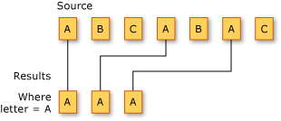

# Filtering Data (C#)
Filtering refers to the operation of restricting the result set to contain only those elements that satisfy a specified condition. It is also known as selection.  
  
 The following illustration shows the results of filtering a sequence of characters. The predicate for the filtering operation specifies that the character must be 'A'.  
  
   
  
 The standard query operator methods that perform selection are listed in the following section.  
  
## Methods  
  
|Method Name|Description|C# Query Expression Syntax|More Information|  
|-----------------|-----------------|---------------------------------|----------------------|  
|OfType|Selects values, depending on their ability to be cast to a specified type.|Not applicable.|\<xref:System.Linq.Enumerable.OfType*?displayProperty=fullName><br /><br /> \<xref:System.Linq.Queryable.OfType*?displayProperty=fullName>|  
|Where|Selects values that are based on a predicate function.|`where`|\<xref:System.Linq.Enumerable.Where*?displayProperty=fullName><br /><br /> \<xref:System.Linq.Queryable.Where*?displayProperty=fullName>|  
  
## Query Expression Syntax Example  
 The following example uses the `where` clause to filter from an array those strings that have a specific length.  
  
```c#  
string[] words = { "the", "quick", "brown", "fox", "jumps" };  
  
IEnumerable<string> query = from word in words  
                            where word.Length == 3  
                            select word;  
  
foreach (string str in query)  
    Console.WriteLine(str);  
  
/* This code produces the following output:  
  
    the  
    fox  
*/  
```  
  
## See Also  
 \<xref:System.Linq>   
 [Standard Query Operators Overview (C#)](../VS_csharp/standard-query-operators-overview--csharp-.md)   
 [where clause](../VS_csharp/where-clause--csharp-reference-.md)   
 [How to: Dynamically Specify Predicate Filters at Runtime](../VS_csharp/how-to--dynamically-specify-predicate-filters-at-runtime--csharp-programming-guide-.md)   
 [How to: Query An Assembly's Metadata with Reflection (LINQ) (C#)](../VS_csharp/how-to--query-an-assembly-s-metadata-with-reflection--linq---csharp-.md)   
 [How to: Query for Files with a Specified Attribute or Name (C#)](../VS_csharp/how-to--query-for-files-with-a-specified-attribute-or-name--csharp-.md)   
 [How to: Sort or Filter Text Data by Any Word or Field (LINQ) (C#)](../VS_csharp/how-to--sort-or-filter-text-data-by-any-word-or-field--linq---csharp-.md)