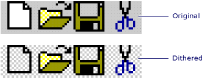

# Gray and Dithered Bitmap Functions
**Gray Bitmap Functions**  
  
 MFC provides two functions for giving a bitmap the appearance of a disabled control.  
  
   
  
|||  
|-|-|  
|[AfxDrawGrayBitmap](../VS_csharp/afxdrawgraybitmap.md)|Draws a gray version of a bitmap.|  
|[AfxGetGrayBitmap](../VS_csharp/afxgetgraybitmap.md)|Copies a gray version of a bitmap.|  
  
 **Dithered Bitmap Functions**  
  
 MFC also provides two functions for replacing a bitmap's background with a dithered pattern.  
  
   
  
|||  
|-|-|  
|[AfxDrawDitheredBitmap](../VS_csharp/afxdrawditheredbitmap.md)|Draws a bitmap with a dithered background.|  
|[AfxGetDitheredBitmap](../VS_csharp/afxgetditheredbitmap.md)|Copies a bitmap with a dithered background.|  
  
## See Also  
 [Macros and Globals](../VS_csharp/mfc-macros-and-globals.md)