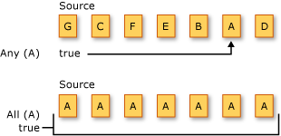

# Quantifier Operations (C#)
Quantifier operations return a \<xref:System.Boolean> value that indicates whether some or all of the elements in a sequence satisfy a condition.  
  
 The following illustration depicts two different quantifier operations on two different source sequences. The first operation asks if one or more of the elements are the character 'A', and the result is `true`. The second operation asks if all the elements are the character 'A', and the result is `true`.  
  
   
  
 The standard query operator methods that perform quantifier operations are listed in the following section.  
  
## Methods  
  
|Method Name|Description|C# Query Expression Syntax|More Information|  
|-----------------|-----------------|---------------------------------|----------------------|  
|All|Determines whether all the elements in a sequence satisfy a condition.|Not applicable.|\<xref:System.Linq.Enumerable.All*?displayProperty=fullName>   \<xref:System.Linq.Queryable.All*?displayProperty=fullName>|  
|Any|Determines whether any elements in a sequence satisfy a condition.|Not applicable.|\<xref:System.Linq.Enumerable.Any*?displayProperty=fullName>   \<xref:System.Linq.Queryable.Any*?displayProperty=fullName>|  
|Contains|Determines whether a sequence contains a specified element.|Not applicable.|\<xref:System.Linq.Enumerable.Contains*?displayProperty=fullName>   \<xref:System.Linq.Queryable.Contains*?displayProperty=fullName>|  
  
## See Also  
 \<xref:System.Linq>   
 [Standard Query Operators Overview (C#)](../VS_csharp/standard-query-operators-overview--csharp-.md)   
 [How to: Dynamically Specify Predicate Filters at Runtime](../VS_csharp/how-to--dynamically-specify-predicate-filters-at-runtime--csharp-programming-guide-.md)   
 [How to: Query for Sentences that Contain a Specified Set of Words (LINQ) (C#)](../VS_csharp/how-to--query-for-sentences-that-contain-a-specified-set-of-words--linq---csharp-.md)