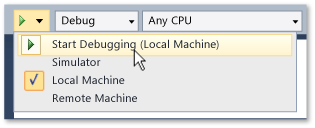

# Run Store apps from Visual Studio
Store apps run on a broad range of devices, and Visual Studio provides you with a number of ways to run and interact with those apps. The "F5" experience is enhanced to make it easy to debug, profile, and test apps during development.  
  
   
  
## In this section  
  
|||  
|-|-|  
|[Running Windows Store apps locally](../VS_csharp/run-windows-store-apps-on-the-local-machine.md)|Run your Windows Store app on the Visual Studio device.|  
|[Running Windows Store apps in the simulator](../VS_csharp/run-windows-store-apps-in-the-simulator.md)|Run your Windows Store app in a desktop window that simulates [!INCLUDE[win8_appname_long](../VS_csharp/includes/win8_appname_long_md.md)] functionality such as touch and orientation.|  
|[Running Windows Store apps remotely](../VS_csharp/run-windows-store-apps-on-a-remote-machine.md)|Deploy and run your Windows Store app on a device that is connected to the Visual Studio machine over a network or directly through an Ethernet cable.|  
|[Run Windows Phone apps in the emulator](../VS_csharp/run-windows-phone-apps-in-the-emulator.md)|Run your Windows Store app in a desktop window that simulates a Windows Phone.|  
|[Deploying Windows Store apps from Visual Studio](../VS_csharp/deploy-windows-store-apps-from-visual-studio.md)|Deploy and register your Windows Store app on a device for ad-hoc testing.|