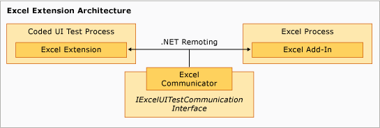

# Sample Coded UI Test Extension for Excel
The extension component of the sample runs in the [!INCLUDE[vsprvs](../VS_csharp/includes/vsprvs_md.md)] Coded UI Test process and is somewhat hierarchical with the `ExtensionPackage` class at the base. The `TechnologyManager`, `ActionFilter`, and `PropertyProvider` classes are at the next level, with the control elements at the top level.  
  
   
Excel Extension Architecture  
  
## Extension Points  
 These classes represent the extension points that are implemented in the sample to enable coded UI testing for [!INCLUDE[ofprexcel](../VS_csharp/includes/ofprexcel_md.md)].  
  
### ExtensionPackage  
 Inherited from the <xref:Microsoft.VisualStudio.TestTools.UITest.Extension.UITestExtensionPackage*> class, this is the entry point for the coded UI testing extension. Implementing this abstract class gives the coded UI testing framework internal access to your custom UI test technology manager, UI test property provider, and UI test action filter for testing the new UI. For more information, see [Sample Excel Extension: ExtensionPackage Class](../VS_csharp/sample-excel-extension--extensionpackage-class.md).  
  
### TechnologyManager  
 Inherited from the <xref:Microsoft.VisualStudio.TestTools.UITest.Extension.UITechnologyManager*> class, this class provides a technology manager for test recording and playback. For more information, see [Sample Excel Extension: TechnologyManager Class](../VS_csharp/sample-excel-extension--technologymanager-class.md).  
  
### ActionFilter  
 Inherited from the <xref:Microsoft.VisualStudio.TestTools.UITest.Common.UITestActionFilter*> class, this class provides a base class for aggregating similar test action results into a single test result. For more information, see [Sample Excel Extension: ActionFilter Classes](../VS_csharp/sample-excel-extension--actionfilter-class.md).  
  
### Technology Elements  
 A base class inherited from the <xref:Microsoft.VisualStudio.TestTools.UITest.Extension.UITechnologyElement*> class provides the foundation for the technology elements in your UI tests that can be recorded and played back. For more information, see [Sample Excel Extension: Element Classes](../VS_csharp/sample-excel-extension--element-classes.md).  
  
### PropertyProvider  
 Inherited from the <xref:Microsoft.VisualStudio.TestTools.UITesting.UITestPropertyProvider*> class, this class provides a base class for supporting the properties of UI elements for test recording and playback. For more information, see [Sample Excel Extension: PropertyProvider Class](../VS_csharp/sample-excel-extension--propertyprovider-class.md).  
  
## See Also  
 <xref:Microsoft.VisualStudio.TestTools.UITesting.UITestPropertyProvider*>   
 <xref:Microsoft.VisualStudio.TestTools.UITest.Extension.UITechnologyElement*>   
 <xref:Microsoft.VisualStudio.TestTools.UITest.Common.UITestActionFilter*>   
 <xref:Microsoft.VisualStudio.TestTools.UITest.Extension.UITestExtensionPackage*>   
 [Sample Excel Extension: ExtensionPackage Class](../VS_csharp/sample-excel-extension--extensionpackage-class.md)   
 [Sample Excel Extension: TechnologyManager Class](../VS_csharp/sample-excel-extension--technologymanager-class.md)   
 [Sample Excel Extension: Action Classes](../VS_csharp/sample-excel-extension--actionfilter-class.md)   
 [Sample Excel Extension: Element Classes](../VS_csharp/sample-excel-extension--element-classes.md)   
 [Sample Excel Extension: PropertyProvider Class](../VS_csharp/sample-excel-extension--propertyprovider-class.md)