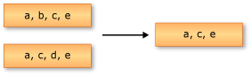

# Set Operations (C#)
Set operations in LINQ refer to query operations that produce a result set that is based on the presence or absence of equivalent elements within the same or separate collections (or sets).  
  
 The standard query operator methods that perform set operations are listed in the following section.  
  
## Methods  
  
|Method Name|Description|C# Query Expression Syntax|More Information|  
|-----------------|-----------------|---------------------------------|----------------------|  
|Distinct|Removes duplicate values from a collection.|Not applicable.|\<xref:System.Linq.Enumerable.Distinct*?displayProperty=fullName>   \<xref:System.Linq.Queryable.Distinct*?displayProperty=fullName>|  
|Except|Returns the set difference, which means the elements of one collection that do not appear in a second collection.|Not applicable.|\<xref:System.Linq.Enumerable.Except*?displayProperty=fullName>   \<xref:System.Linq.Queryable.Except*?displayProperty=fullName>|  
|Intersect|Returns the set intersection, which means elements that appear in each of two collections.|Not applicable.|\<xref:System.Linq.Enumerable.Intersect*?displayProperty=fullName>   \<xref:System.Linq.Queryable.Intersect*?displayProperty=fullName>|  
|Union|Returns the set union, which means unique elements that appear in either of two collections.|Not applicable.|\<xref:System.Linq.Enumerable.Union*?displayProperty=fullName>   \<xref:System.Linq.Queryable.Union*?displayProperty=fullName>|  
  
## Comparison of Set Operations  
  
### Distinct  
 The following illustration depicts the behavior of the \<xref:System.Linq.Enumerable.Distinct*?displayProperty=fullName> method on a sequence of characters. The returned sequence contains the unique elements from the input sequence.  
  
   
  
### Except  
 The following illustration depicts the behavior of \<xref:System.Linq.Enumerable.Except*?displayProperty=fullName>. The returned sequence contains only the elements from the first input sequence that are not in the second input sequence.  
  
   
  
### Intersect  
 The following illustration depicts the behavior of \<xref:System.Linq.Enumerable.Intersect*?displayProperty=fullName>. The returned sequence contains the elements that are common to both of the input sequences.  
  
   
  
### Union  
 The following illustration depicts a union operation on two sequences of characters. The returned sequence contains the unique elements from both input sequences.  
  
   
  
## See Also  
 \<xref:System.Linq>   
 [Standard Query Operators Overview (C#)](../VS_csharp/standard-query-operators-overview--csharp-.md)   
 [How to: Combine and Compare String Collections (LINQ) (C#)](../VS_csharp/how-to--combine-and-compare-string-collections--linq---csharp-.md)   
 [How to: Find the Set Difference Between Two Lists (LINQ) (C#)](../VS_csharp/how-to--find-the-set-difference-between-two-lists--linq---csharp-.md)