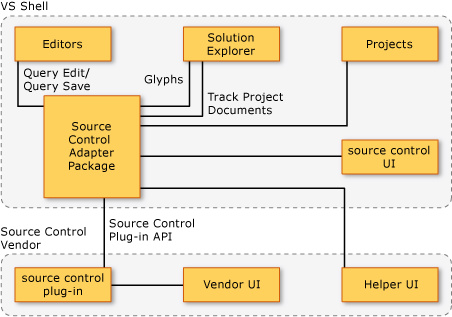

# Source Control Plug-in Architecture
You can add source control support to the [!INCLUDE[vsprvs](../VS_csharp/includes/vsprvs_md.md)] integrated development environment (IDE) by implementing and attaching a source control plug-in. The IDE connects to the source control plug-in via the well-defined Source Control Plug-In API. The IDE exposes the version control features of the source control system by providing a user interface (UI) that consists of toolbars and menu commands. The source control plug-in implements the source control functionality.  
  
## Source Control Plug-in Resources  
 The Source Control Plug-in provides resources to help create and connect your versioning application to the [!INCLUDE[vsprvs](../VS_csharp/includes/vsprvs_md.md)] IDE. The Source Control Plug-in contains the API specification that must be implemented by a source control plug-in so that it can be integrated into the [!INCLUDE[vsprvs](../VS_csharp/includes/vsprvs_md.md)] IDE. It also contains a code sample (written in C++) that implements a skeleton source control plug-in demonstrating implementation of essential functions compliant with the Source Control Plug-in API.  
  
 The Source Control Plug-in API specification lets you leverage any source control system of your choice if you create a source control DLL with the required set of functions implemented in accordance with the Source Control Plug-in API.  
  
## Components  
 The Source Control Adapter Package in the diagram is the component of the IDE that translates the user's request for a source control operation into a function call supported by the source control plug-in. For this to happen, the IDE and the source control plug-in must have an effective dialog that passes information back and forth between the IDE and the plug-in. For this dialog to take place, they both must speak the same language. The Source Control Plug-in API outlined in this documentation is the common vocabulary for this exchange.  
  
   
Architecture Diagram showing interaction between VS and source control plug-in  
  
 As shown in the architecture diagram, the [!INCLUDE[vsprvs](../VS_csharp/includes/vsprvs_md.md)] shell, labelled as VS shell in the diagram, hosts the user's working projects and associated components, such as the editors and Solution Explorer. The Source Control Adapter Package handles the interaction between the IDE and the source control plug-in. The Source Control Adapter Package provides its own source control UI. It is the top-level UI that the user interacts with in order to initiate and define the scope of a source control operation.  
  
 The source control plug-in can have its own UI, which may consist of two parts as shown in the figure. The box labeled "Vendor UI" represents custom user interface elements that you, as a source control plug-in creator, provide. These are displayed directly by the source control plug-in when the user invokes an advanced source control operation. The box labeled "Helper UI" is a set of source control plug-in UI features that are indirectly invoked through the IDE. The source control plug-in passes UI-related messages to the IDE through special callback functions provided by the IDE. The helper UI facilitates a more seamless integration with the IDE (often through the use of an **Advanced** button) and thus provides a more unified end-user experience.  
  
 A source control plug-in cannot make changes to the [!INCLUDE[vsprvs](../VS_csharp/includes/vsprvs_md.md)] shell and, consequently, to either the Source Control Adapter Package or the source control UI provided by the IDE. It must make maximum use of the flexibility offered through the implementation of the various Source Control Plug-in API functions that contribute to an integrated experience for the end user. The reference section of the Source Control Plug-in API documentation includes information for some advanced source control plug-in capabilities. To exploit these features, the source control plug-in must declare its advanced capabilities to the IDE during initialization, and it must implement specific advanced functions for each capability.  
  
## See Also  
 [Source Control Plug-ins](../VS_csharp/source-control-plug-ins.md)   
 [Glossary](../VS_csharp/source-control-plug-in-glossary.md)   
 [Creating a Source Control Plug-in](../VS_csharp/creating-a-source-control-plug-in.md)