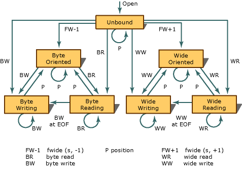

# Stream States
The valid states, and state transitions, for a stream are shown in the following figure.  
  
   
  
 Each of the circles denotes a stable state. Each of the lines denotes a transition that can occur as the result of a function call that operates on the stream. Five groups of functions can cause state transitions.  
  
 Functions in the first three groups are declared in <stdio.h>:  
  
-   The byte read functions — [fgetc](../VS_csharp/fgetc--fgetwc.md), [fgets](../VS_csharp/fgets--fgetws.md), [fread](../VS_csharp/fread.md), [fscanf](../VS_csharp/fscanf--_fscanf_l--fwscanf--_fwscanf_l.md), [getc](../VS_csharp/getc--getwc.md), [getchar](../VS_csharp/getc--getwc.md), [gets](../VS_csharp/gets--_getws.md), [scanf](../VS_csharp/scanf--_scanf_l--wscanf--_wscanf_l.md), and [ungetc](../VS_csharp/ungetc--ungetwc.md)  
  
-   The byte write functions — [fprintf](../VS_csharp/fprintf--_fprintf_l--fwprintf--_fwprintf_l.md), [fputc](../VS_csharp/fputc--fputwc.md), [fputs](../VS_csharp/fputs--fputws.md), [fwrite](../VS_csharp/fwrite.md), [printf](../VS_csharp/printf--_printf_l--wprintf--_wprintf_l.md), [putc](../VS_csharp/putc--putwc.md), [putchar](../VS_csharp/putc--putwc.md), [puts](../VS_csharp/puts--_putws.md), [vfprintf](../VS_csharp/vfprintf--_vfprintf_l--vfwprintf--_vfwprintf_l.md), and [vprintf](../VS_csharp/vprintf--_vprintf_l--vwprintf--_vwprintf_l.md)  
  
-   The position functions — [fflush](../VS_csharp/fflush.md), [fseek](../VS_csharp/fseek--_fseeki64.md), [fsetpos](../VS_csharp/fsetpos.md), and [rewind](../VS_csharp/rewind.md)  
  
 Functions in the remaining two groups are declared in <wchar.h>:  
  
-   The wide read functions — [fgetwc](../VS_csharp/fgetc--fgetwc.md), [fgetws](../VS_csharp/fgets--fgetws.md), [fwscanf](../VS_csharp/fscanf--_fscanf_l--fwscanf--_fwscanf_l.md), [getwc](../VS_csharp/getc--getwc.md), [getwchar](../VS_csharp/getc--getwc.md), [ungetwc](../VS_csharp/ungetc--ungetwc.md), and [wscanf](../VS_csharp/scanf--_scanf_l--wscanf--_wscanf_l.md),  
  
-   The wide write functions — [fwprintf](../VS_csharp/fprintf--_fprintf_l--fwprintf--_fwprintf_l.md), [fputwc](../VS_csharp/fputc--fputwc.md), [fputws](../VS_csharp/fputs--fputws.md), [putwc](../VS_csharp/putc--putwc.md), [putwchar](../VS_csharp/fputc--fputwc.md), [vfwprintf](../VS_csharp/vfprintf--_vfprintf_l--vfwprintf--_vfwprintf_l.md), [vwprintf](../VS_csharp/vprintf--_vprintf_l--vwprintf--_vwprintf_l.md), and [wprintf](../VS_csharp/printf--_printf_l--wprintf--_wprintf_l.md),  
  
 The state diagram shows that you must call one of the position functions between most write and read operations:  
  
-   You cannot call a read function if the last operation on the stream was a write.  
  
-   You cannot call a write function if the last operation on the stream was a read, unless that read operation set the end-of-file indicator.  
  
 Finally, the state diagram shows that a position operation never decreases the number of valid function calls that can follow.  
  
## See Also  
 [Files and Streams](../VS_csharp/files-and-streams.md)