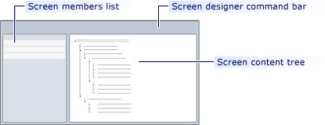
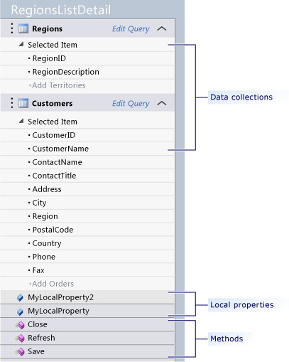

# Tour of the Screen Designer
You can design a screen by using the screen designer. The screen designer opens when you create a screen or when you double click any screen node in **Solution Explorer**.  
  
 This topic contains the following sections:  
  
-   [Screen Designer at a Glance](#Glance)  
  
-   [Screen Members List](#Members)  
  
-   [Screen Content Tree](#ContentTree)  
  
-   [Screen Designer Command Bar](#CommandBar)  
  
##   Screen Designer at a Glance  
 The screen designer consists of the *screen members list*, the *screen designer command bar*, and the *screen content tree*. The following illustration shows the location each area in the screen designer.  
  
   
  
##   Screen Members List  
 The screen members list contains items that are available for your screen. These items include data, methods, and local properties. You can incorporate these items into your screen by dragging them onto the screen content tree.  
  
 By default, the screen members list contains methods associated with the basic commands of a screen (For example: the **Save** command). The list also contains collections of data that you select in the **Add New Screen** wizard. You can also add items to the screen members list.  
  
 The following illustration shows the screen members list.  
  
   
  
### Data in the Screen Members List  
 In the screen members list, the data that is available to the screen appears as collection nodes. You can view the fields of a collection by expanding the collection node. You can add a collection of data to the screen by dragging the collection node from the screen members list onto the screen content tree. You can also drag individual fields from the screen members list onto the screen content tree.  
  
 You can modify the appearance and behavior of a collection by using the **Properties** window. You can specify which rows of data will appear in a collection by clicking the **Edit Query** link next to the name of the collection.  For more information, see [How to: Filter Data on a Screen](../VS_csharp/how-to--filter-data-on-a-silverlight-screen.md).  
  
### Local Properties in the Screen Members List  
 You can add custom fields called local properties to collect or display information. Like collections and fields, you can drag local properties from the screen members list onto the screen content tree. In the screen content tree, local properties appear as controls (For example: a text box). For more information, see [How to: Add a Local Property to a Screen](../VS_csharp/how-to--add-a-local-property-to-a-silverlight-screen.md).  
  
### Methods in the Screen Members List  
 A method is a unit of business logic that you can associate with a button on the screen. Drag methods to any command bar node in the screen content tree. The screen designer automatically adds a button that the user can click to execute the method. For more information, see [How to: Add a Custom Command to a Screen](../VS_csharp/how-to--add-a-custom-command-to-a-silverlight-screen.md).  
  
##   Screen Content Tree  
 The screen content tree represents the contents of a screen as a hierarchy of nodes called *groups*. You can expand or collapse groups to view the commands, local properties, and data fields that are contained in the group.  
  
 You can specify the way in which you want information organized within a group by selecting group control layouts. You can also add groups to other groups, and add, remove, and position fields and commands. For more information about how to accomplish any of these tasks in the screen content tree, see [How to: Design a Screen by Using the Screen Designer](../VS_csharp/how-to--design-a-silverlight-screen-by-using-the-screen-designer.md).  
  
##   Screen Designer Command Bar  
 The screen designer command bar appears directly above the screen content tree. This command bar contains commands that you can use to edit the query of a collection, add collections, create local properties and methods, remove information from a screen, and write custom code that runs when certain screen-related events occur. The following table describes each button on the screen designer command bar:  
  
|Command|Description|  
|-------------|-----------------|  
|**Edit Query**|Use this command to modify the query of a data collection. This command only appears if you select the heading of a collection in the screen members list. For more information, see [How to: Filter Data on a Screen](../VS_csharp/how-to--filter-data-on-a-silverlight-screen.md).|  
|**Add Data Item**|Use this command to add a method, local property or data collection to the screen.   For more information, see any of the following topics:   -   [How to: Add a Custom Command to a Screen](../VS_csharp/how-to--add-a-custom-command-to-a-silverlight-screen.md). -   [How to: Add Data to a Screen](../VS_csharp/how-to--add-data-to-a-screen.md). -   [How to: Add a Local Property to a Screen](../VS_csharp/how-to--add-a-local-property-to-a-silverlight-screen.md).|  
|**Add Layout Item**|Use this command to add a button, group, or custom control to the screen.   For more information about how to add buttons and groups, see [How to: Design a Screen by Using the Screen Designer](../VS_csharp/how-to--design-a-silverlight-screen-by-using-the-screen-designer.md).   For more information about how to add a custom control, see [How to: Add a Custom Control to a Screen](../VS_csharp/how-to--add-a-custom-control-to-a-silverlight-screen.md).|  
|**Delete**|Use this command to delete items that appear in the screen members list or the screen content tree.|  
|**Reset**|Use the command to reset controls to their default control type and add to add back fields that you have removed. This command only applies to certain types of controls.|  
|**Write Code**|Use this command to open the screen code file. In the screen code file, from the **Declarations** drop-down list, you can select methods that you want to extend.   In the Screen Designer command bar, you can click the drop-down arrow next to the **Write Code** button to reveal a list of methods that apply to the item that is currently selected in the screen content tree or screen members list. From this list, you can select methods that you want to extend. For more information, see [How to: Handle Screen Events](../VS_csharp/how-to--handle-silverlight-screen-events.md).|  
  
## See Also  
 [Screens: The User Interface of Your Application](../VS_csharp/screens--the-user-interface-of-your-lightswitch-application.md)   
 [How to: Create a Screen](../VS_csharp/how-to--create-a-silverlight-screen.md)   
 [How to: Design a Screen by Using the Screen Designer](../VS_csharp/how-to--design-a-silverlight-screen-by-using-the-screen-designer.md)   
 [How to: Customize a Screen in a Running Application](../VS_csharp/how-to--customize-a-silverlight-screen-in-a-running-application.md)   
 [Reference: Screen Designer Properties](../VS_csharp/reference--screen-designer-properties.md)   
 [How to: Create an HTML Client Screen](../VS_csharp/how-to--create-an-html-client-screen.md)   
 [How to: Design an HTML Screen by Using the Screen Designer](../VS_csharp/how-to--design-an-html-screen-by-using-the-screen-designer.md)