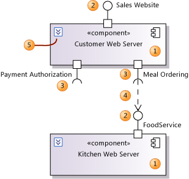
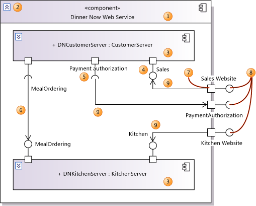
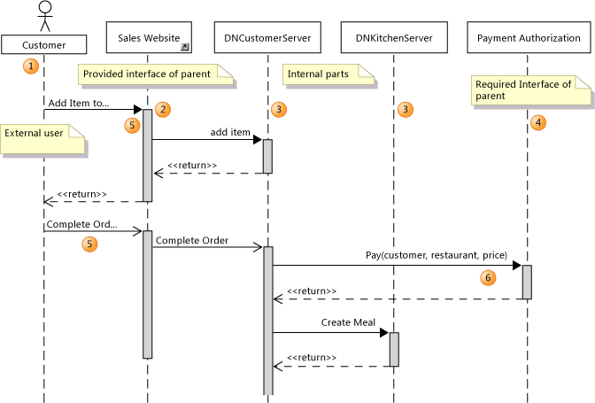
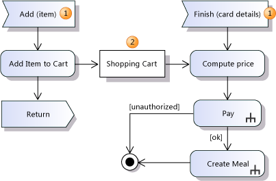
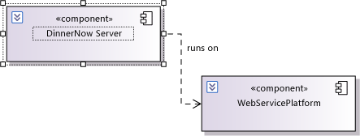

# UML Component Diagrams: Guidelines
In Visual Studio, you can draw a *component diagram* to show the structure a software system. For a video demonstration, see [Designing the Physical Structure by using Component Diagrams](http://channel9.msdn.com/posts/clinted/UML-with-VS-2010-Part-6-Designing-a-Projects-Physical-Structure/).  
  
 To see which versions of Visual Studio support this feature, see [Version support for architecture and modeling tools](../VS_csharp/what-s-new-for-design-in-visual-studio.md#VersionSupport).  
  
 To create a UML component diagram, on the **Architecture** menu, click **New UML or Layer Diagram**.  
  
 A component is a modular unit that is replaceable within its environment. Its internals are hidden, but it has one or more well-defined *provided interfaces* through which its functions can be accessed. A component can also have *required interfaces*. A required interface defines what functions or services it requires from other components. By connecting the provided and required interfaces of several components, a larger component can be constructed. A complete software system can be understood as a component.  
  
 Drawing component diagrams has several benefits:  
  
-   Thinking of your design with regard to the major blocks helps the development team to understand an existing design and create a new one.  
  
-   By thinking of your system as a collection of components with well-defined provided and required interfaces, you improve the separation between the components. This in turn makes the design easier to understand and easier to change when requirements change.  
  
 You can use a component diagram to represent your design regardless of what language or platform the design uses or will use.  
  
##   Relationship to Other Diagrams  
 You can use a component diagram in conjunction with other diagrams.  
  
|Other diagram|Helps you discuss and communicate these aspects of your design|  
|-------------------|--------------------------------------------------------------------|  
|UML Sequence Diagram|-   Interactions between a system's components -   Interactions and between the parts inside a component.   For more information, see [UML Sequence Diagrams: Guidelines](../VS_csharp/uml-sequence-diagrams--guidelines.md).|  
|UML Class Diagram|-   The interfaces of a component. The class diagram lets you detail the methods of the interface. -   The data sent in parameters across the components' interfaces.   For more information, see [UML Class Diagrams: Guidelines](../VS_csharp/uml-class-diagrams--guidelines.md).|  
|Activity Diagrams|-   The internal processing performed by a component in response to incoming messages.   For more information, see [Activity Diagrams: Guidelines](../VS_csharp/uml-activity-diagrams--guidelines.md).|  
|Layer Diagrams|-   Logical architectural tiers for your components.   For more information, see [Layer Diagrams: Introduction](../VS_csharp/layer-diagrams--reference.md).|  
  
##   Basic Steps for Drawing Component Diagrams  
 For reference information about the elements on component diagrams, see [Component Diagrams: Overview](../VS_csharp/uml-component-diagrams--reference.md).  
  
 For more information about how to use component diagrams in the process of design, see [Modeling the Architecture of a Software System](../VS_csharp/model-your-app-s-architecture.md).  
  
> [!NOTE]
>  Detailed steps for creating any of the modeling diagrams are described in [How to: Draw Modeling Diagrams](../VS_csharp/edit-uml-models-and-diagrams.md).  
  
#### To create a component diagram  
  
1.  On the **Architecture** menu, click **New UML or Layer Diagram**.  
  
2.  Under **Templates**, click **UML Component Diagram**.  
  
3.  Name the diagram.  
  
4.  In **Add to Modeling Project**, select an existing modeling project in your solution, or **Create a New Modeling Project**, and then click **OK**..  
  
     A new component diagram appears with the UML **Component Diagram** toolbox. The toolbox contains the required elements and relations.  
  
### Drawing Components  
   
  
 Create a *component* (1) for each major functional unit in your system or application.  
  
 Examples include an application, a hardware device, a Web service, a .NET assembly, a program class or group of classes, or any separable segment of a program.  
  
##### To create components  
  
1.  Click **Component** in the toolbox, and then click a blank part of the diagram.  
  
     \- or -  
  
     Copy and paste an existing component.  
  
    1.  Find an existing component in a diagram or in **UML Model Explorer**.  
  
    2.  Right-click the component and then click **Copy**.  
  
    3.  Open the diagram where you want the copied component to appear.  
  
    4.  Right-click a blank part of the diagram and then click **Paste**.  
  
         A copy of the component appears with a new name.  
  
2.  Click the name of the component to change it.  
  
3.  Click the chevron (5) if you want to see just the component's header.  
  
### Showing the Ports of a Component  
 A *port* (2, 3) represents a group of messages or operation calls that pass either into or out of a component. The group is described by an interface, which defines the port's type. A port can either provide an interface or require an interface.  
  
 A port with a *provided interface* (2) supplies operations that are implemented by the component, and that can be used by other components.  
  
 Examples include a user interface, a Web service, a .NET interface, or a collection of functions in any programming language.  
  
 A port with a *required interface* (3) represents a component's requirement for a group of operations or services to be provided by other components or external systems.  
  
 For example, a Web browser requires Web servers, or an application add-in requires services from the application.  
  
 A component can have any number of ports.  
  
##### To add ports to a component  
  
1.  In the toolbox, click **Provided Interface** or **Required Interface**.  
  
2.  Click the component that you want to add it to.  
  
     An port appears on the boundary of the component.  
  
     A new interface is created as the type of the port. This interface appears in **UML Model Explorer**.  
  
3.  Drag the port around the component boundary to place it where you want.  
  
4.  Drag the port's label to adjust its position.  
  
5.  Click the label to change it. The label shows the name of the interface. If you change it, you are changing the name of the interface.  
  
 If you want to list the attributes and operations of the interface, you can do so by adding them to the interface in UML Model Explorer. Alternatively, you can drag the interface from UML Model Explorer onto a class diagram, and add the operations and attributes there.  
  
### Linking between components  
 Use a dependency (4) to show that one component's requirement can be satisfied by the operations or services provided by another component.  
  
##### To show that a provided interface can satisfy a required interface  
  
1.  In the toolbox, click **Dependency**.  
  
2.  Click the port with the required interface on one component, and then click the port with the provided interface in another component.  
  
 You should try to avoid designing dependency loops in which every component in a group depends on all the other components.  
  
##### To add a port for an existing interface to a component  
  
-   Find the interface in **UML Model Explorer** and then drag it from there onto the component.  
  
     -or-  
  
-   Copy and paste a reference to an interface from a diagram.  
  
    1.  On a class diagram or a component diagram, right-click the interface and then click **Copy**.  
  
    2.  On the component diagram, right-click the component, and then click **Paste Reference**.  
  
         A provided interface appears on the component. An Action tag appears nearby.  
  
        > [!NOTE]
        >  If you use **Paste** instead of **Paste Reference**, a new interface that has a new name will be created.  
  
    3.  If you wanted to create a required interface, click the Action tag and then click **Convert to Required Interface**.  
  
##   Showing the Internal Parts of a Component  
   
  
 You can place parts (3) in a component (1) to show how it is composed of smaller components that interact with one another.  
  
 The diagram in the illustration states that every instance of the type Dinner Now Web Service contains one instance of Customer Server and one instance of Kitchen Server.  
  
 A part is a property of its parent component, much like an attribute belongs to an ordinary class. A part has its own type, which is usually also a component. The label of the part has the same form as an ordinary attribute:  
  
 `+ partName : TypeName`  
  
 Inside the parent component, each part shows the provided and required interfaces that are defined for its type (4, 5). The operations or services that are required by one part can be provided by another. You can use **Part Assembly** connectors to show how parts are connected with one another (6).  
  
 You can also show that an interface of the parent component is actually provided or required by one of its parts. You can connect a port of the parent to a port of an internal part using a **Delegation** relation (9). The two ports must be of the same kind (provided or required), and their interface types should be compatible.  
  
 You can create a new part either with a new type, or from an existing type.  
  
#### To add parts to a component  
  
1.  Create a part for each major functional unit that you consider to be a part of the parent component.  
  
    1.  Click **Component** in the toolbox, and then click inside the parent component (1).  
  
         A new part (3) appears inside the parent component.  
  
         A new component is created in **UML Model Explorer**. This is the new part's type.  
  
         \- or -  
  
         Drag an existing component from UML Model Explorer onto the parent component.  
  
         A new part (3) appears inside the parent component. Its type is the component you dragged from UML Model Explorer.  
  
         \- or -  
  
         Right-click a component, either in a diagram or in UML Model Explorer, and then click **Copy**.  
  
         Right-click on the parent component, and then click **Paste Reference**.  
  
         A new part (3) appears inside the parent component. Its type is the component you copied.  
  
    2.  Click the new part's name to change it. You cannot change its type.  
  
    3.  You can add provided and required interfaces (4, 5) to the new part. Click the **Provided Interface** or **Required Interface** tool, and then click in the part.  
  
         - or -  
  
         Drag an existing interface from **UML Model Explorer** onto the part.  
  
         The interfaces are added to the part's type, and appear on the part itself. The parent component adjusts its size if necessary.  
  
2.  Connect the parts to one another.  
  
    -   Use the **Dependency** tool to connect the ports of different parts (6).  
  
3.  Connect the parts to the parent component's ports:  
  
    1.  Create one or more ports (7) on the parent component. Click **Required Interface** or **Provided Interface** on the toolbox, and then click the parent component.  
  
    2.  Delegate (9) the port to one or more parts. Click the **Delegation** tool, then a port on the parent component, and then a port on a part. You can connect ports that either provide or require interfaces in the same way.  
  
### Showing the Parts of a Part  
 After you have decomposed a component into parts, you can decompose each of the part types into its own internal parts.  
  
 It is easiest to do each layer of decomposition in a separate component diagram. You must first locate the type of the part. For example, in the illustration, one of the parts is named `DNCustomerServer`, and its type is a component called `CustomerServer`. You can find that type in UML Model Explorer, and place it in another diagram. Then you can create its own internal parts.  
  
##### To place a part's type on a diagram  
  
1.  Determine the fully qualified name of the part's type.  
  
     Right-click the part and then click **Properties**.  
  
     The type name appears in the **Type** field of the Properties window.  
  
2.  Locate the part's type in **UML Model Explorer**.  
  
     Click **View**, point to **Other Windows**, and then click **UML Model Explorer**.  
  
     Expand the project and if necessary any package to which the type belongs.  
  
     The type will be listed as a **Component**.  
  
     You can change its name here if you want to.  
  
3.  Open or create another component diagram.  
  
4.  Drag from the type in UML Model Explorer onto the diagram.  
  
     A view of the type appears as a component in the diagram.  
  
     It has the same interfaces as you defined for the part.  
  
     You can now add parts inside it.  
  
##   Designing the Component  
  
### Describing How the Parts Collaborate  
 You can draw a sequence diagram to show how the parts work together in response to a message that arrives at the parent component.  
  
 You can use these diagrams both to explain an existing component, and to design a new component.  
  
 If you are still designing the component, you can draw sequence diagrams before you have decided what parts it will have. You can use the sequence diagrams to experiment with different parts, required interfaces, and message sequences. Draw sequence diagrams for the most frequent and the most important incoming messages. You can then create parts in your component that correspond to the lifelines you have decided on.  
  
 Use the sequence diagrams to assess how the system's work is spread between the different components.  
  
-   If too much is heaped on one part, the application will probably be more difficult to update, than if the work is evenly spread out.  
  
-   If the work is too thinly spread with many interactions, the system might perform badly and be difficult to understand.  
  
   
  
##### To draw a sequence diagram that shows collaboration between parts  
  
1.  Create a new sequence diagram.  
  
     For more information, see [UML Sequence Diagrams: Guidelines](../VS_csharp/uml-sequence-diagrams--guidelines.md).  
  
2.  Create a lifeline for an external component, user, device or other actor (1) that sends messages to this component.  
  
     You can set the **Actor** property of this lifeline to true, to indicate that it is external to the component under consideration. A stick figure appears above the lifeline.  
  
3.  Create a lifeline for the provided interface (2) of this component to which the chosen actor sends messages.  
  
4.  Create a lifeline for each part (3) of the component.  
  
5.  Create a lifeline for each required interface (4) of the component.  
  
6.  Draw messages from the external actor (5). Show how the message is passed to the parts, and how they collaborate to respond to the message.  
  
7.  Where necessary, show messages sent to a required interface (6). Do not show any detail within execution of the message.  
  
### Is the Component More than its Parts?  
 In some cases, a component is no more than a name given to a collection of parts. All the work is done by the parts, and at run time there is no code or other artifact that represents the component.  
  
 You can indicate this in the model by setting the **Is Indirectly Instantiated** property of the component. In this case, all the component's interfaces should be on ports, with delegations to internal parts.  
  
### Describing the Process Inside Each Part  
 You can use activity diagrams to show how a component processes each incoming message. For more information, see [Activity Diagrams: Guidelines](../VS_csharp/uml-activity-diagrams--guidelines.md).  
  
   
  
 Use an Accept Event Action (1) to show that an incoming message starts a new thread.  
  
 Use object nodes and input/output pins to show the flow of information, and to show where information is stored. In the example, an object node (2) is used to show items being buffered between one thread and another.  
  
### Defining Data and Classes  
 You can use a UML class diagram to describe the detailed content of:  
  
-   The interfaces of the components. When you add a requires or provides port to a component, an interface appears in UML Model Explorer. You can drag or copy this into a UML Class Diagram to show its attributes and operations, and relationships to other interfaces.  
  
-   Data passed in parameters of operations in the interfaces.  
  
-   Data stored in the components, for example as shown in object flows in activity diagrams.  
  
### General Dependencies Between Components  
 You can use a component diagram just to show the major parts of your design and their interdependencies.  
  
   
  
 Use the **Dependency** tool to draw a dependency. This indicates that the design of one component relies on another.  
  
 Typical kinds of dependency include the following:  
  
-   One component calls code within the other.  
  
-   One component instantiates a class that is defined within another class.  
  
-   One component uses information created by another component.  
  
 You can use the name of the dependency arrow to denote a particular kind of usage. To set the name, right-click the arrow, then click **Properties**, and set the **Name** field in the properties window.  
  
## See Also  
 [How to: Draw Modeling Diagrams](../VS_csharp/edit-uml-models-and-diagrams.md)   
 [Component Diagrams: Overview](../VS_csharp/uml-component-diagrams--reference.md)   
 [Sequence Diagrams: Overview](../VS_csharp/uml-sequence-diagrams--reference.md)   
 [Use Case Diagrams: Overview](../VS_csharp/uml-use-case-diagrams--reference.md)   
 [UML Class Diagrams: Overview](../VS_csharp/uml-class-diagrams--reference.md)   
 [Activity Diagrams: Overview](../VS_csharp/uml-component-diagrams--reference.md)   
 [Video: Designing the Physical Structure by using Component Diagrams](http://channel9.msdn.com/posts/clinted/UML-with-VS-2010-Part-6-Designing-a-Projects-Physical-Structure/)