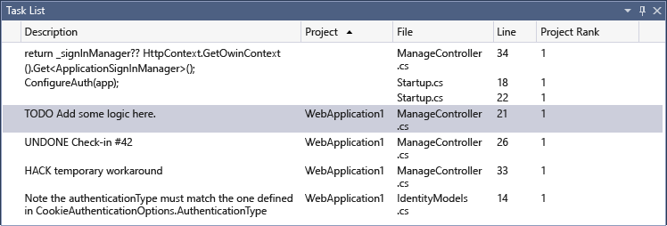
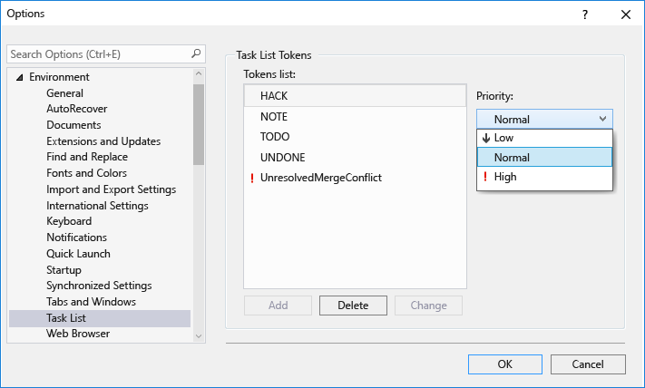

# Using the Task List
Use the **Task List** to track code comments that use tokens such as `TODO` and `HACK`, or custom tokens, and to manage shortcuts that will take you directly to a predefined location in the code. Click on the item in the list to go to its location in the source code.  
  
 In this topic:  
  
-   [The Task List window](../VS_csharp/using-the-task-list.md#taskListWindow)  
  
-   [User Tasks--deprecated](../VS_csharp/using-the-task-list.md#userTasks)  
  
-   [Tokens and comments](../VS_csharp/using-the-task-list.md#tokensComments)  
  
-   [Custom tokens](../VS_csharp/using-the-task-list.md#customTokens)  
  
-   [C++ TODO comments](../VS_csharp/using-the-task-list.md#cppComments)  
  
-   [Shortcuts](../VS_csharp/using-the-task-list.md#shortcuts)  
  
##  <a name="taskListWindow"></a> The Task List window  
 When the **Task List** is open, it appears at the bottom of the application window.  
  
#### To open the Task List  
  
-   On the **View** menu, choose **Task List** (Keyboard: Ctrl+\\,T).  
  
       
  
#### To change the sort order of the list  
  
-   Click the header of any column. To further refine your search results, press Shift and click a second column header.  
  
     As an alternative, on the shortcut menu, choose **Sort by**, and choose a header. To further refine your search results, press Shift and choose a second header.  
  
#### To show or hide columns  
  
-   On the shortcut menu, choose **Show Columns**. Choose the columns that you want to show or hide.  
  
#### To change the order of the columns  
  
-   Drag any column header to the location that you want.  
  
##  <a name="userTasks"></a> User Tasks  
 The user task feature has been removed in Visual Studio 2015. When you open a solution which has user task data from Visual Studio 2013 and earlier in Visual Studio 2015, the user task data in your .suo file will not be affected, but the user tasks will not be displayed in the task list.  
  
 If you wish to continue to access and update your user task data, you should open the project in Visual Studio 2013 and copy the content of any user tasks into your preferred project management tool (such as Team Foundation Server).  
  
##  <a name="tokensComments"></a> Tokens and comments  
 A comment in your code preceded by a comment marker and a predefined token will also appear in the **Task List** window. For example, the following C# comment has three distinct parts:  
  
-   The comment marker (`//`)  
  
-   The token, for example (`TODO`)  
  
-   The comment (the rest of the text)  
  
```  
// TODO: Load state from previously suspended application  
```  
  
 Because `TODO` is a predefined token,   this comment appears as a `TODO` task in the list.  
  
###  <a name="customTokens"></a> Custom tokens  
 By default, Visual Studio includes the following tokens: HACK, TODO, UNDONE, NOTE. These are not case sensitive.  
  
 You can also create your own custom tokens.  
  
##### To create a custom token  
  
1.  On the **Tools** menu, choose **Options**.  
  
2.  Open the **Environment** folder and then choose **Task List**.  
  
     The [Task List, Environment, Options Dialog Box](../VS_csharp/task-list--environment--options-dialog-box.md) is displayed.  
  
       
  
3.  In the **Tokens** category, in the **Name** text box, enter your token name, for example "BUG".  
  
4.  In the **Priority** drop-down list, choose a default priority for the new token. Choose the **Add** button.  
  
###  <a name="cppComments"></a> C++ TODO comments  
 By default, C++ TODO comments are displayed in the **Task List** window. You can change this behavior.  
  
##### To turn off C++ TODO comments  
  
1.  On the **Tools** menu, go to **Options &#124; Text Editor &#124; C/C++ &#124; View &#124; Enumerate Comment Tasks** and set the value to false.  
  
2.  In the **Options** dialog box, open **Text Editor**.  
  
3.  Under **C/C++**, choose **View**, and then set **Enumerate Comment Tasks** to **False**.  
  
##  <a name="shortcuts"></a> Shortcuts  
 A *shortcut* is a bookmark in the code that is tracked in the **Task List**; it has a different icon than a regular bookmark. Double-click the shortcut in the **Task List** to go to the corresponding location in the code.  
  
   
  
#### To create a shortcut  
  
-   Insert the pointer into the code where you want to place a shortcut. Choose **Edit &#124; Bookmarks &#124; Add Task List Shortcut** or press (Keyboard: Ctrl+K, Ctrl+H).  
  
     To navigate through the shortcuts in the code, choose a shortcut in the list, and then choose **Next Task** or **Previous Task** from the shortcut menu.  
  
## See Also  
 [Task List, Environment, Options Dialog Box](../VS_csharp/task-list--environment--options-dialog-box.md)