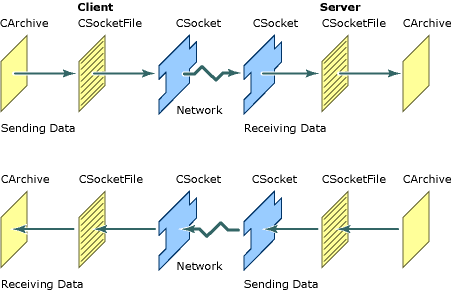

# Windows Sockets: How Sockets with Archives Work
This article explains how a [CSocket](../VS_csharp/csocket-class.md) object, a [CSocketFile](../VS_csharp/csocketfile-class.md) object, and a [CArchive](../VS_csharp/carchive-class.md) object are combined to simplify sending and receiving data through a Windows Socket.  
  
 The article [Windows Sockets: Example of Sockets Using Archives](../VS_csharp/windows-sockets--example-of-sockets-using-archives.md) presents the **PacketSerialize** function. The archive object in the **PacketSerialize** example works much like an archive object passed to an MFC [Serialize](../Topic/CObject::Serialize.md) function. The essential difference is that for sockets, the archive is attached not to a standard [CFile](../VS_csharp/cfile-class.md) object (typically associated with a disk file) but to a `CSocketFile` object. Rather than connecting to a disk file, the `CSocketFile` object connects to a `CSocket` object.  
  
 A `CArchive` object manages a buffer. When the buffer of a storing (sending) archive is full, an associated `CFile` object writes out the buffer's contents. Flushing the buffer of an archive attached to a socket is equivalent to sending a message. When the buffer of a loading (receiving) archive is full, the `CFile` object stops reading until the buffer is available again.  
  
 Class `CSocketFile` derives from `CFile`, but it does not support [CFile](../VS_csharp/cfile-class.md) member functions such as the positioning functions (`Seek`, `GetLength`, `SetLength`, and so on), the locking functions (`LockRange`, `UnlockRange`), or the `GetPosition` function. All the [CSocketFile](../VS_csharp/csocketfile-class.md) object must do is write or read sequences of bytes to or from the associated `CSocket` object. Because a file is not involved, operations such as `Seek` and `GetPosition` make no sense. `CSocketFile` is derived from `CFile`, so it would normally inherit all of these member functions. To prevent this, the unsupported `CFile` member functions are overridden in `CSocketFile` to throw a [CNotSupportedException](../VS_csharp/cnotsupportedexception-class.md).  
  
 The `CSocketFile` object calls member functions of its `CSocket` object to send or receive data.  
  
 The following figure shows the relationships among these objects on both sides of the communication.  
  
   
CArchive, CSocketFile, and CSocket  
  
 The purpose of this apparent complexity is to shield you from the necessity of managing the details of the socket yourself. You create the socket, the file, and the archive, and then begin sending or receiving data by inserting it to the archive or extracting it from the archive. [CArchive](../VS_csharp/carchive-class.md), [CSocketFile](../VS_csharp/csocketfile-class.md), and [CSocket](../VS_csharp/csocket-class.md) manage the details behind the scenes.  
  
 A `CSocket` object is actually a two-state object: sometimes asynchronous (the usual state) and sometimes synchronous. In its asynchronous state, a socket can receive asynchronous notifications from the framework. However, during an operation such as receiving or sending data the socket becomes synchronous. This means the socket will receive no further asynchronous notifications until the synchronous operation has completed. Because it switches modes, you can, for example, do something like the following:  
  
 [!code[NVC_MFCSimpleSocket#2](../VS_csharp/codesnippet/CPP/windows-sockets--how-sockets-with-archives-work_1.cpp)]  
  
 If `CSocket` were not implemented as a two-state object, it might be possible to receive additional notifications for the same kind of event while you were processing a previous notification. For example, you might get an `OnReceive` notification while processing an `OnReceive`. In the code fragment above, extracting `str` from the archive might lead to recursion. By switching states, `CSocket` prevents recursion by preventing additional notifications. The general rule is no notifications within notifications.  
  
> [!NOTE]
>  A `CSocketFile` can also be used as a (limited) file without a `CArchive` object. By default, the `CSocketFile` constructor's `bArchiveCompatible` parameter is **TRUE**. This specifies that the file object is for use with an archive. To use the file object without an archive, pass **FALSE** in the `bArchiveCompatible` parameter.  
  
 In its "archive compatible" mode, a `CSocketFile` object provides better performance and reduces the danger of a "deadlock." A deadlock occurs when both the sending and receiving sockets are waiting on each other, or waiting for a common resource. This situation might occur if the `CArchive` object worked with the `CSocketFile` the way it does with a `CFile` object. With `CFile`, the archive can assume that if it receives fewer bytes than it requested, the end of file has been reached. With `CSocketFile`, however, data is message based; the buffer can contain multiple messages, so receiving fewer than the number of bytes requested does not imply end of file. The application does not block in this case as it might with `CFile`, and it can continue reading messages from the buffer until the buffer is empty. The [IsBufferEmpty](../Topic/CArchive::IsBufferEmpty.md) function in `CArchive` is useful for monitoring the state of the archive's buffer in such a case.  
  
 For more information, see [Windows Sockets: Using Sockets with Archives](../VS_csharp/windows-sockets--using-sockets-with-archives.md)  
  
## See Also  
 [Windows Sockets in MFC](../VS_csharp/windows-sockets-in-mfc.md)   
 [CObject::Serialize](../Topic/CObject::Serialize.md)