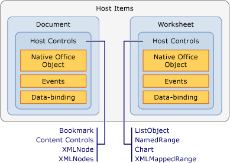

# Host Items and Host Controls Overview
  Host items and host controls are types that help provide the programming model for Office solutions that are created by using the Office development tools in Visual Studio. Host items and host controls make interacting with the object models of Microsoft Office Word and Microsoft Office Excel, which are based on COM, more like interacting with managed objects such as Windows Forms controls.  
  
 [!INCLUDE[appliesto_controls](../VS_officedev/includes/appliesto_controls_md.md)]  
  
## Host Items  
 Host items are types that are at the top of object model hierarchies in Office projects. The [!INCLUDE[vsto_runtime](../VS_officedev/includes/vsto_runtime_md.md)] defines the following host items for Word and Excel solutions:  
  
-   \<xref:Microsoft.Office.Tools.Word.Document>  
  
-   \<xref:Microsoft.Office.Tools.Excel.Workbook>  
  
-   \<xref:Microsoft.Office.Tools.Excel.Worksheet>  
  
-   \<xref:Microsoft.Office.Tools.Excel.ChartSheet>  
  
 Each of these types extends an object that exists natively in the Word or Excel object model, called a *native Office object*. For example, the \<xref:Microsoft.Office.Tools.Word.Document> host item extends the \<xref:Microsoft.Office.Interop.Word.Document> object, which is defined in the primary interop assembly for Word.  
  
 Host items generally have the same base functionality as the corresponding Office objects, but are enhanced with the following features:  
  
-   The ability to host managed controls, including host controls and Windows Forms controls.  
  
-   Richer event models. Some document, workbook, and worksheet events in the native Word and Excel object models are raised only at the application level. Host items provide these events at the document level, so that it is easier to handle the events for a specific document.  
  
### Understanding Host Items in Document-Level Projects  
 In document-level projects, host items provide an entry point for your code, and they have designers that help you develop your solution.  
  
 The \<xref:Microsoft.Office.Tools.Word.Document> and \<xref:Microsoft.Office.Tools.Excel.Worksheet> host items have associated designers that are the visual representation of the document or worksheet, like a Windows Forms designer. You can use this designer to modify the content of the document or worksheet directly in Word or Excel, and to drag controls onto the design surface. For more information, see [Document Host Item](../VS_officedev/document-host-item.md) and [Worksheet Host Item](../VS_officedev/worksheet-host-item.md).  
  
 The \<xref:Microsoft.Office.Tools.Excel.Workbook> host item does not act as a container for controls that have a user interface. Instead, the designer for this host item functions as a component tray, which enables you to drag a component, such as a \<xref:System.Data.DataSet>, onto its design surface. For more information, see [Workbook Host Item](../VS_officedev/workbook-host-item.md).  
  
 Host items cannot be created programmatically in document-level projects. Instead, use the `ThisDocument`, `ThisWorkbook`, or `Sheet`*n* classes that Visual Studio automatically generates in your project at design time. These generated classes derive from the host items, and they provide an entry point for your code. For more information, see [Programmatic Limitations of Host Items and Host Controls](../VS_officedev/programmatic-limitations-of-host-items-and-host-controls.md).  
  
### Understanding Host Items in VSTO Add-in projects  
 When you create an VSTO Add-in, you do not have access to any host items by default. However, you can generate \<xref:Microsoft.Office.Tools.Word.Document>, \<xref:Microsoft.Office.Tools.Excel.Workbook>, and \<xref:Microsoft.Office.Tools.Excel.Worksheet> host items in Word and Excel VSTO Add-ins at run time.  
  
 After you generate a host item, you can perform tasks such as adding controls to documents. For more information, see [Extending Word Documents and Excel Workbooks in VSTO Add-ins at Run Time](../VS_officedev/extending-word-documents-and-excel-workbooks-in-vsto-add-ins-at-run-time.md).  
  
## Host Controls  
 Host controls extend various user interface (UI) objects in the Word and Excel object models, such as Microsoft.Office.Interop.Word.ContentControl and \<xref:Microsoft.Office.Interop.Excel.Range> objects.  
  
 The following host controls are available for Excel projects:  
  
-   [Chart Control](../VS_officedev/chart-control.md)  
  
-   [ListObject Control](../VS_officedev/listobject-control.md)  
  
-   [NamedRange Control](../VS_officedev/namedrange-control.md)  
  
-   [XmlMappedRange Control](../VS_officedev/xmlmappedrange-control.md)  
  
 The following host controls are available for Word projects:  
  
-   [Bookmark Control](../VS_officedev/bookmark-control.md)  
  
-   [Content Controls](../VS_officedev/content-controls.md)  
  
-   [XMLNode Control](../VS_officedev/xmlnode-control.md)  
  
-   [XMLNodes Control](../VS_officedev/xmlnodes-control.md)  
  
 Host controls that are added to Office documents behave like the native Office objects; however, host controls have additional functionality, including events and data-binding capabilities. For example, when you want to capture the events of a native \<xref:Microsoft.Office.Interop.Excel.Range> object in Excel, you must first handle the change event of the worksheet. Then you must determine whether the change occurred within the \<xref:Microsoft.Office.Interop.Excel.Range>. In contrast, the \<xref:Microsoft.Office.Tools.Excel.NamedRange> host control has a \<xref:Microsoft.Office.Tools.Excel.NamedRange.Change> event that you can handle directly.  
  
 The relationship between a host item and host controls is very similar to the relationship between a Windows Form and Windows Forms controls. Just as you would place a text box control on a Windows Form, you place a \<xref:Microsoft.Office.Tools.Excel.NamedRange> control on a \<xref:Microsoft.Office.Tools.Excel.Worksheet> host item. The following illustration shows the relationship between host items and host controls.  
  
   
  
 You can also use Windows Forms controls in your Office solutions by adding them directly to the Word and Excel document surface. For more information, see [Windows Forms Controls on Office Documents Overview](../VS_officedev/windows-forms-controls-on-office-documents-overview.md).  
  
> [!NOTE]  
>  Adding host controls or Windows Forms controls to a Word subdocument is not supported.  
  
### Adding Host Controls to Your Documents  
 In document-level projects, you can add host controls to your Word documents or Excel worksheets at design time in the following ways:  
  
-   Add host controls to your document at design time in the same manner you would add a native object.  
  
-   Drag host controls from the **Toolbox** onto your documents and worksheets. Excel host controls are available in the **Excel Controls** tab in Excel projects, and Word host controls are available in the **Word Controls** tab in Word projects.  
  
-   Drag host controls from the **Data Sources** window onto your documents and worksheets. This enables you to add controls that are already bound to data. For more information, see [Binding Data to Controls in Office Solutions](../VS_officedev/binding-data-to-controls-in-office-solutions.md).  
  
 In document-level and VSTO Add-in projects, you can also add some host controls to documents at run time. For more information, see [Adding Controls to Office Documents at Run Time](../VS_officedev/adding-controls-to-office-documents-at-run-time.md).  
  
 For more information about how to add host controls to documents, see the following topics:  
  
-   [How to: Add Chart Controls to Worksheets](../VS_officedev/how-to--add-chart-controls-to-worksheets.md)  
  
-   [How to: Add ListObject Controls to Worksheets](../VS_officedev/how-to--add-listobject-controls-to-worksheets.md)  
  
-   [How to: Add NamedRange Controls to Worksheets](../VS_officedev/how-to--add-namedrange-controls-to-worksheets.md)  
  
-   [How to: Add XMLMappedRange Controls to Worksheets](../VS_officedev/how-to--add-xmlmappedrange-controls-to-worksheets.md)  
  
-   [How to: Add Bookmark Controls to Word Documents](../VS_officedev/how-to--add-bookmark-controls-to-word-documents.md)  
  
-   [How to: Add Content Controls to Word Documents](../VS_officedev/how-to--add-content-controls-to-word-documents.md)  
  
-   [How to: Add XMLNode Controls to Word Documents](../VS_officedev/how-to--add-xmlnode-controls-to-word-documents.md)  
  
-   [How to: Add XMLNodes Controls to Word Documents](../VS_officedev/how-to--add-xmlnodes-controls-to-word-documents.md)  
  
### Naming Host Controls  
 When you drag a host control from the **Toolbox** to your document, the control is automatically named using the control type with an incremental number at the end. For example, bookmarks are named **bookmark1**, **bookmark2**, and so on. If you use the native functionality of Word or Excel to add the control, you can give it a specific name at the time that you create it. You can also rename your controls by changing the value of the **Name** property in the **Properties** window.  
  
> [!NOTE]  
>  You cannot use reserved words to name host controls. For example, if you add a \<xref:Microsoft.Office.Tools.Excel.NamedRange> control to a worksheet and change the name to **System**, errors occur when you build the project.  
  
### Deleting Host Controls  
 In document-level projects, you can delete host controls at design time by selecting the control on the Excel worksheet or Word document and pressing the Delete key. However, you must use the **Define Name** dialog box in Excel to delete \<xref:Microsoft.Office.Tools.Excel.NamedRange> controls.  
  
 If you add a host control to a document at design time, you should not remove it programmatically at run time because the next time you try to use the control in code, an exception is thrown. The `Delete` method of a host control only removes host controls that are added to the document at run time. If you call the `Delete` method of a host control that was created at design time, an exception is thrown.  
  
 For example, the \<xref:Microsoft.Office.Tools.Excel.NamedRange.Delete*> method of a \<xref:Microsoft.Office.Tools.Excel.NamedRange> only successfully deletes the \<xref:Microsoft.Office.Tools.Excel.NamedRange> if it was programmatically added to the worksheet, which is known as creating host controls dynamically. Dynamically created host controls can also be removed by passing the control name to the `Remove` method of the \<xref:Microsoft.Office.Tools.Excel.Worksheet.Controls*> or \<xref:Microsoft.Office.Tools.Word.Document.Controls*> property. For more information, see [Adding Controls to Office Documents at Run Time](../VS_officedev/adding-controls-to-office-documents-at-run-time.md).  
  
 If end users delete a host control from the document at run time, the solution might fail in unexpected ways. You can use the document protection features in Word and Excel to protect the host controls from being deleted. For more information, see [Office Development Samples and Walkthroughs](../VS_officedev/office-development-samples-and-walkthroughs.md).  
  
> [!NOTE]  
>  Do not programmatically remove controls during the `Shutdown` event handler of the document or worksheet. The UI elements are no longer available when the `Shutdown` event occurs. If you want to remove controls before the application closes, add your code to another event handler such as `BeforeClose` or `BeforeSave`.  
  
### Programming Against Host Control Events  
 One way that host controls extend Office objects is by adding events. For example, the \<xref:Microsoft.Office.Interop.Excel.Range> object in Excel and \<xref:Microsoft.Office.Interop.Word.Bookmark> object in Word do not have events, but the [!INCLUDE[vsto_runtime](../VS_officedev/includes/vsto_runtime_md.md)] extends these objects by adding programmable events. You can access and code against these events the same way you access events of controls on Windows Forms: through the event drop-down list in Visual Basic and the event property page in C#. For more information, see [Walkthrough: Programming Against Events of a NamedRange Control](../VS_officedev/walkthrough--programming-against-events-of-a-namedrange-control.md).  
  
> [!NOTE]  
>  You should not set the \<xref:Microsoft.Office.Interop.Excel._Application.EnableEvents*> property of the \<xref:Microsoft.Office.Interop.Excel.Application> object in Excel to **false**. Setting this property to **false** prevents Excel from raising any events, including the events of host controls.  
  
## See Also  
 [Programmatic Limitations of Host Items and Host Controls](../VS_officedev/programmatic-limitations-of-host-items-and-host-controls.md)   
 [Programming VSTO Add-Ins](../VS_officedev/programming-vsto-add-ins.md)   
 [Programming Document-Level Customizations](../VS_officedev/programming-document-level-customizations.md)   
 [Automating Word by Using Extended Objects](../VS_officedev/automating-word-by-using-extended-objects.md)   
 [Automating Excel by Using Extended Objects](../VS_officedev/automating-excel-by-using-extended-objects.md)   
 [Controls on Office Documents](../VS_officedev/controls-on-office-documents.md)   
 [Binding Data to Controls in Office Solutions](../VS_officedev/binding-data-to-controls-in-office-solutions.md)  
  
  