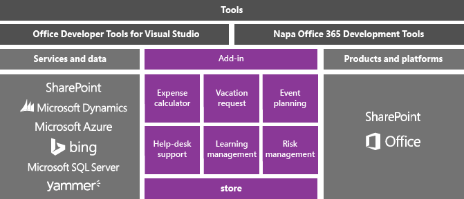
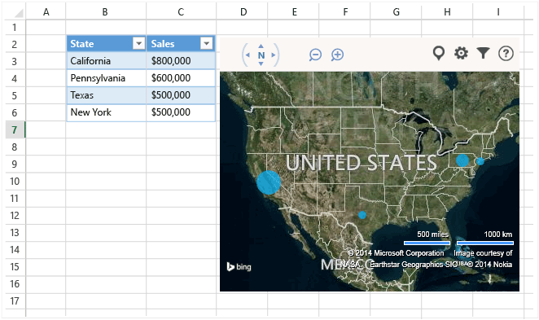
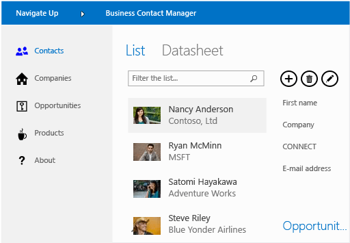
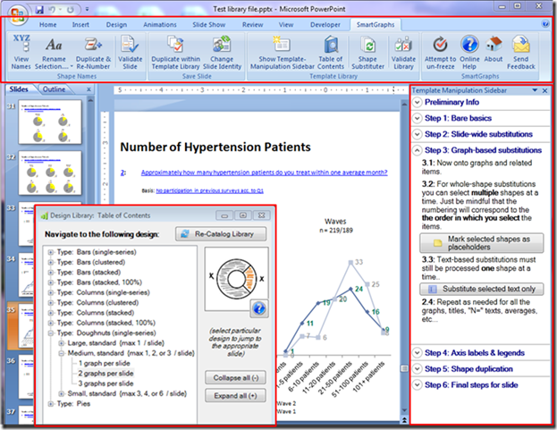

# Office and SharePoint Development in Visual Studio
  You can extend Microsoft Office and SharePoint by creating a lightweight app or add-in that users download from the [Office Store](https://store.office.com/) or an organizational catalog, or by creating a .NET Framework-based solution that users install on a computer.  
  
 In this topic:  
  
-   [Create add-ins for Office and SharePoint](#Apps)  
  
-   [Create a VSTO add-in](#Add-ins)  
  
-   [Create a SharePoint solution](#Solutions)  
  
##   Create add-ins for Office and SharePoint  
 Office 2013 and SharePoint 2013 introduce a new add-in model that helps you build, distribute, and monetize add-ins that extend Office and SharePoint.  These add-ins can run in Office or SharePoint Online, and users can interact with them from many devices.  
  
 Find out how to use the new [Office add-in model](https://msdn.microsoft.com/library/office/jj220082.aspx) to extend the Office experience for your users.  
  
 These add-ins have very small footprints compared to VSTO add-ins and solutions, and you can build them by using almost any web programming technology such as HTML5, JavaScript, CSS3, and XML.  To get started, use the Office Developer Tools in Visual Studio, or the lightweight web-based tool code-named Napa Office 365 Development Tools, which lets you create projects, write code, and run your add-ins in a browser.  
  
   
  
 **Learn more**  
  
|To|See|  
|--------|---------|  
|Learn more about Napa Office 365 Development Tools.|[Napa Office 365 Development Tools](https://msdn.microsoft.com/library/dn974046.aspx)|  
  
### Build an Office add-in  
 To extend the functionality of Office, build an Office add-in. It’s basically a webpage that’s hosted in an Office application such as Excel, Word, Outlook, and PowerPoint. Your app can add functionality to documents, worksheets, email messages, appointments, presentations, and projects.  
  
 You can sell your app in the Office Store.  The [Office Store](https://store.office.com/) makes it easy to monetize your add-ins, manage updates, and track telemetry. You can also publish your app to users through an app catalog in SharePoint, or on Exchange Server.  
  
 The following app for Office shows worksheet data in a Bing map.  
  
   
  
 **Learn more**  
  
|To|See|  
|--------|---------|  
|Learn more about Office add-ins, and then build one.|[Office add-ins](http://msdn.microsoft.com/office/dn448457)|  
|Compare the different ways in which you can extend Office, and decide whether you should use an app or an Office add-in.|[Roadmap for Office add-ins, VSTO, and VBA](http://blogs.msdn.com/b/officeapps/archive/2013/06/18/roadmap-for-apps-for-office-vsto-and-vba.aspx)|  
|Learn more about Napa Office 365 Development Tools.|[Napa Office 365 Development Tools](https://msdn.microsoft.com/library/dn974046.aspx)|  
  
### Build a SharePoint add-in  
 To extend SharePoint for your users, build a SharePoint add-in. It’s basically a small, easy-to-use, stand-alone application that solves a need for your users or business.  
  
 You can sell your app for SharePoint in the [Office Store](https://store.office.com/). You can also publish your add-in to users through an add-in catalog in SharePoint.  Site owners can install, upgrade, and uninstall your add-in on their SharePoint sites without the help of a farm server or site collection administrator.  
  
 Here’s an example of an app for SharePoint that helps users manage business contacts.  
  
   
  
 **Learn more**  
  
|To|See|  
|--------|---------|  
|Learn more about SharePoint add-ins, and then build one.|[SharePoint Add-ins](https://msdn.microsoft.com/library/office/fp179930.aspx)|  
|Compare add-ins for SharePoint with traditional SharePoint solutions.|[SharePoint add-ins compared with SharePoint solutions](http://msdn.microsoft.com/library/office/jj163114.aspx)|  
|Choose whether to build a SharePoint add-in or a SharePoint solution.|[Deciding between SharePoint add-ins and SharePoint solutions](https://msdn.microsoft.com/library/office/jj163114.aspx)|  
|Learn more about Napa Office 365 Development Tools.|[Napa Office 365 Development Tools](https://msdn.microsoft.com/library/dn974046.aspx)|  
  
##   Create a VSTO add-in  
 Create a VSTO add-in to target Office 2007 or Office 2010, or to extend Office 2013 and Office 2016 beyond what’s possible with Office add-ins. VSTO add-ins run only on the desktop. Users have to install VSTO add-ins, so they’re typically more difficult to deploy and support.  However, your VSTO add-in can be integrated more closely with Office. For example, it can add tabs and controls to the Office Ribbon and perform advanced automation tasks such as merging documents or modifying charts. You can leverage the .NET Framework and use C# and Visual Basic to interact with Office objects.  
  
 Here’s an example what a VSTO add-in can do. This VSTO add-in adds Ribbon controls, a custom task pane, and a dialog box to PowerPoint.  
  
   
  
 **Learn more**  
  
|To|Read|  
|--------|----------|  
|Compare the different ways in which you can extend Office, and decide whether you should use a VSTO add-in or an Office add-in.|[Roadmap for Office add-ins, VSTO, and VBA](http://blogs.msdn.com/b/officeapps/archive/2013/06/18/roadmap-for-apps-for-office-vsto-and-vba.aspx)|  
|Create a VSTO add-in.|[VSTO add-ins build with Visual Studio](https://msdn.microsoft.com/library/jj620922.aspx)|  
  
##   Create a SharePoint solution  
 Create a SharePoint solution to target SharePoint Foundation 2010 and SharePoint Server 2010, or to extend SharePoint 2013 and SharePoint 2016 in ways beyond what’s possible with a SharePoint add-in.  
  
 SharePoint solutions require on-premises SharePoint farm servers. Administrators must install them, and because solutions execute in SharePoint, they can affect the performance of the server. However, solutions provide deeper access to SharePoint objects. Also, when you build a SharePoint solution, you can leverage the .NET Framework and use C# and Visual Basic to interact with SharePoint objects.  
  
 **Learn more**  
  
|To|See|  
|--------|---------|  
|Compare SharePoint solutions with SharePoint add-ins.|[SharePoint add-ins compared with SharePoint solutions](http://msdn.microsoft.com/library/office/jj163114.aspx)|  
|Create a SharePoint solution.|[Create SharePoint Solutions](../VS_officedev/create-sharepoint-solutions.md)|  
  
  