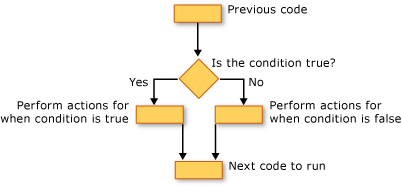

# Decision Structures (Visual Basic)
[!INCLUDE[vbprvb](../VS_visualbasic/includes/vbprvb_md.md)] lets you test conditions and perform different operations depending on the results of that test. You can test for a condition being true or false, for various values of an expression, or for various exceptions generated when you execute a series of statements.  
  
 The following illustration shows a decision structure that tests for a condition being true and takes different actions depending on whether it is true or false.  
  
   
Taking different actions when a condition is true and when it is false  
  
## If...Then...Else Construction  
 `If...Then...Else` constructions let you test for one or more conditions and run one or more statements depending on each condition. You can test conditions and take actions in the following ways:  
  
-   Run one or more statements if a condition is `True`  
  
-   Run one or more statements if a condition is `False`  
  
-   Run some statements if a condition is `True` and others if it is `False`  
  
-   Test an additional condition if a prior condition is `False`  
  
 The control structure that offers all these possibilities is the [If...Then...Else Statement](../VS_visualbasic/if...then...else-statement--visual-basic-.md). You can use a single-line version if you have just one test and one statement to run. If you have a more complex set of conditions and actions, you can use the multiple-line version.  
  
## Select...Case Construction  
 The `Select...Case` construction lets you evaluate an expression one time and run different sets of statements based on different possible values. For more information, see [Select...Case Statement](../VS_visualbasic/select...case-statement--visual-basic-.md).  
  
## Try...Catch...Finally Construction  
 `Try...Catch...Finally` constructions let you run a set of statements under an environment that retains control if any one of your statements causes an exception. You can take different actions for different exceptions. You can optionally specify a block of code that runs before you exit the whole `Try...Catch...Finally` construction, regardless of what occurs. For more information, see [Try...Catch...Finally Statement](../VS_visualbasic/try...catch...finally-statement--visual-basic-.md).  
  
> [!NOTE]
>  For many control structures, when you click a keyword, all of the keywords in the structure are highlighted. For instance, when you click `If` in an `If...Then...Else` construction, all instances of `If`, `Then`, `ElseIf`, `Else`, and `End If` in the construction are highlighted. To move to the next or previous highlighted keyword, press CTRL+SHIFT+DOWN ARROW or CTRL+SHIFT+UP ARROW.  
  
## See Also  
 [Control Flow](../VS_visualbasic/control-flow-in-visual-basic.md)   
 [Loop Structures](../VS_visualbasic/loop-structures--visual-basic-.md)   
 [Other Control Structures](../VS_visualbasic/other-control-structures--visual-basic-.md)   
 [Nested Control Structures](../VS_visualbasic/nested-control-structures--visual-basic-.md)   
 [If Operator](../VS_visualbasic/if-operator--visual-basic-.md)