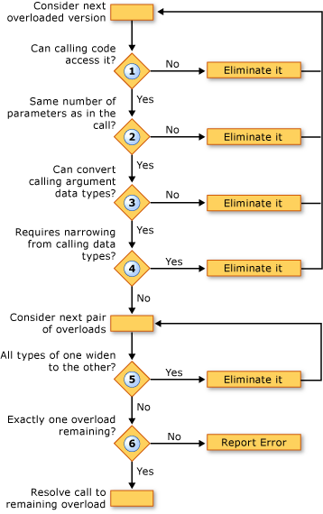

# Overload Resolution (Visual Basic)
When the [!INCLUDE[vbprvb](../VS_visualbasic/includes/vbprvb_md.md)] compiler encounters a call to a procedure that is defined in several overloaded versions, the compiler must decide which of the overloads to call. It does this by performing the following steps:  
  
1.  **Accessibility.** It eliminates any overload with an access level that prevents the calling code from calling it.  
  
2.  **Number of Parameters.** It eliminates any overload that defines a different number of parameters than are supplied in the call.  
  
3.  **Parameter Data Types.** The compiler gives instance methods preference over extension methods. If any instance method is found that requires only widening conversions to match the procedure call, all extension methods are dropped and the compiler continues with only the instance method candidates. If no such instance method is found, it continues with both instance and extension methods.  
  
     In this step, it eliminates any overload for which the data types of the calling arguments cannot be converted to the parameter types defined in the overload.  
  
4.  **Narrowing Conversions.** It eliminates any overload that requires a narrowing conversion from the calling argument types to the defined parameter types. This is true whether the type checking switch ([Option Strict Statement](../VS_visualbasic/option-strict-statement.md)) is `On` or `Off`.  
  
5.  **Least Widening.** The compiler considers the remaining overloads in pairs. For each pair, it compares the data types of the defined parameters. If the types in one of the overloads all widen to the corresponding types in the other, the compiler eliminates the latter. That is, it retains the overload that requires the least amount of widening.  
  
6.  **Single Candidate.** It continues considering overloads in pairs until only one overload remains, and it resolves the call to that overload. If the compiler cannot reduce the overloads to a single candidate, it generates an error.  
  
 The following illustration shows the process that determines which of a set of overloaded versions to call.  
  
   
Resolving among overloaded versions  
  
 The following example illustrates this overload resolution process.  
  
 [!code[VbVbcnProcedures#62](../VS_visualbasic/codesnippet/VisualBasic/overload-resolution--visual-basic-_1.vb)]  
  
 [!code[VbVbcnProcedures#63](../VS_visualbasic/codesnippet/VisualBasic/overload-resolution--visual-basic-_2.vb)]  
  
 In the first call, the compiler eliminates the first overload because the type of the first argument (`Short`) narrows to the type of the corresponding parameter (`Byte`). It then eliminates the third overload because each argument type in the second overload (`Short` and `Single`) widens to the corresponding type in the third overload (`Integer` and `Single`). The second overload requires less widening, so the compiler uses it for the call.  
  
 In the second call, the compiler cannot eliminate any of the overloads on the basis of narrowing. It eliminates the third overload for the same reason as in the first call, because it can call the second overload with less widening of the argument types. However, the compiler cannot resolve between the first and second overloads. Each has one defined parameter type that widens to the corresponding type in the other (`Byte` to `Short`, but `Single` to `Double`). The compiler therefore generates an overload resolution error.  
  
## Overloaded Optional and ParamArray Arguments  
 If two overloads of a procedure have identical signatures except that the last parameter is declared [Optional](../VS_visualbasic/optional--visual-basic-.md) in one and [ParamArray](../VS_visualbasic/paramarray--visual-basic-.md) in the other, the compiler resolves a call to that procedure as follows:  
  
|||  
|-|-|  
|If the call supplies the last argument as|The compiler resolves the call to the overload declaring the last argument as|  
|No value (argument omitted)|`Optional`|  
|A single value|`Optional`|  
|Two or more values in a comma-separated list|`ParamArray`|  
|An array of any length (including an empty array)|`ParamArray`|  
  
## See Also  
 [Optional Parameters](../VS_visualbasic/optional-parameters--visual-basic-.md)   
 [Parameter Arrays](../VS_visualbasic/parameter-arrays--visual-basic-.md)   
 [Procedure Overloading](../VS_visualbasic/procedure-overloading--visual-basic-.md)   
 [Troubleshooting Procedures](../VS_visualbasic/troubleshooting-procedures--visual-basic-.md)   
 [How to: Define Multiple Versions of a Procedure](../VS_visualbasic/how-to--define-multiple-versions-of-a-procedure--visual-basic-.md)   
 [How to: Call an Overloaded Procedure](../VS_visualbasic/how-to--call-an-overloaded-procedure--visual-basic-.md)   
 [How to: Overload a Procedure that Takes Optional Parameters](../VS_visualbasic/how-to--overload-a-procedure-that-takes-optional-parameters--visual-basic-.md)   
 [How to: Overload a Procedure that Takes an Indefinite Number of Parameters](../VS_visualbasic/how-to--overload-a-procedure-that-takes-an-indefinite-number-of-parameters--visual-basic-.md)   
 [Considerations in Overloading Procedures](../VS_visualbasic/considerations-in-overloading-procedures--visual-basic-.md)   
 [Overloads](../VS_visualbasic/overloads--visual-basic-.md)   
 [Extension Methods](../VS_visualbasic/extension-methods--visual-basic-.md)