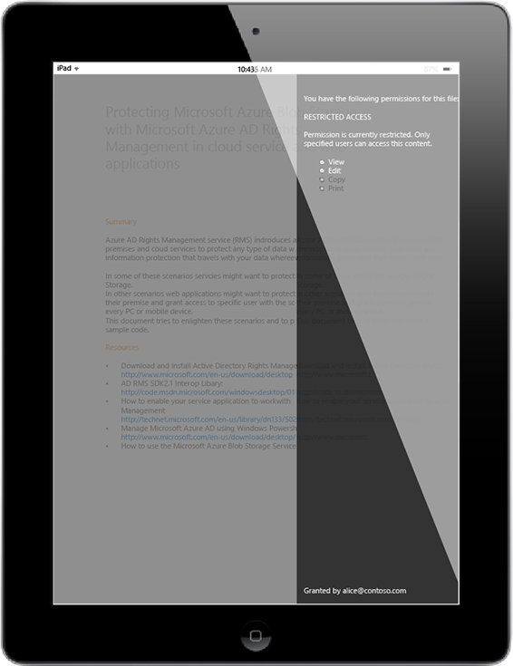

# Full screen picture: Bob opens the attachment on his iPad

Back to [Azure RMS in action: Safely share attachments with mobile users](http://technet.microsoft.com/library/jj585026.aspx#BKMK_Example_SharingApp).

