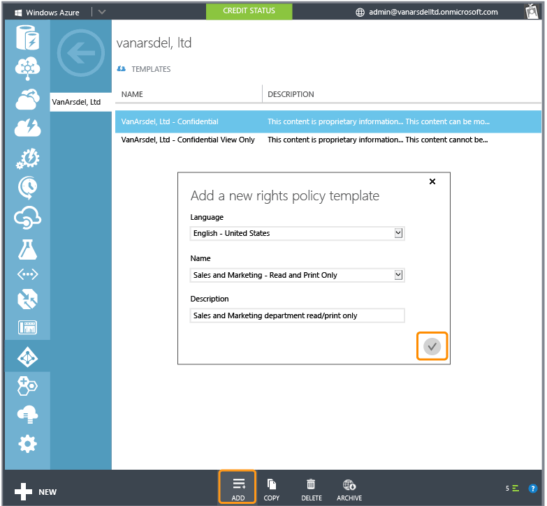

# Full screen picture: RMS templates in the Azure Management Portal

Back to [Azure RMS in action: Activating Rights Management](http://technet.microsoft.com/library/jj585026.aspx#BKMK_Example_ManagementPortal).

