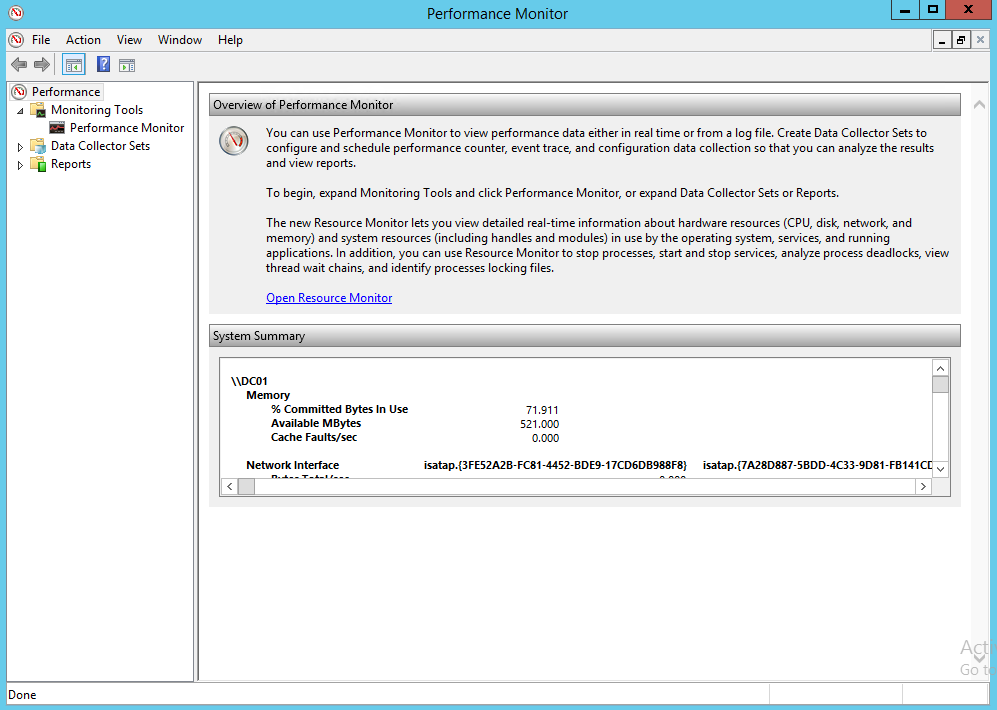
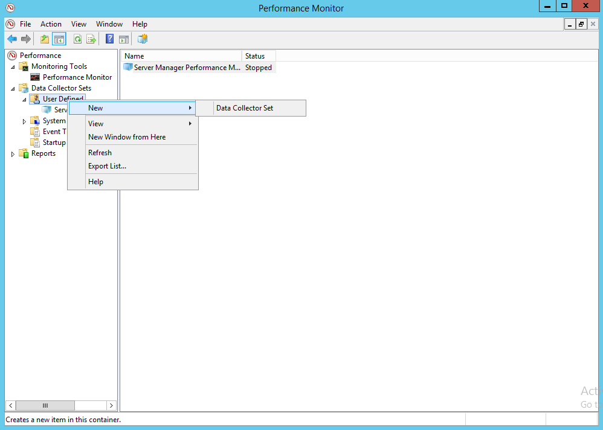
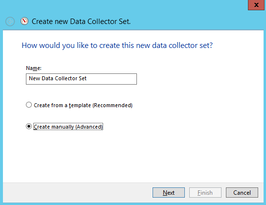
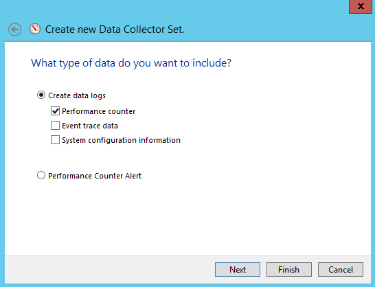
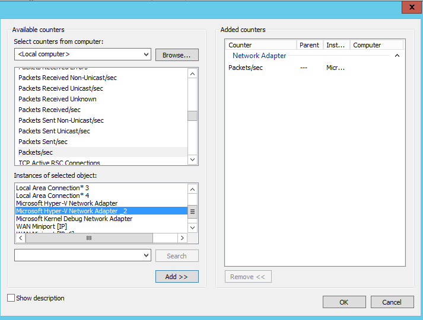
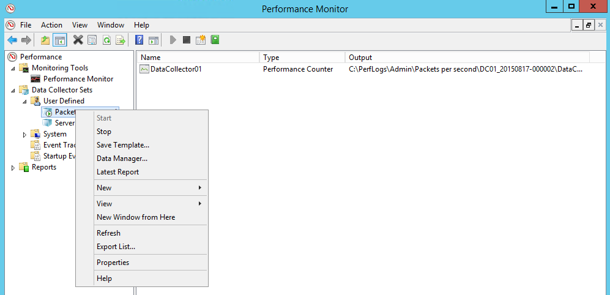
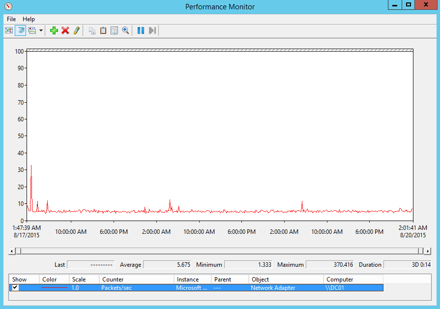

# ATA Capacity Planning
This topic helps you determine how many ATA servers will be needed to support your network.

## ATA Center Sizing
The ATA Center requires a recommended minimum of 30 days of data for user behavioral analytics. The required disk space for the ATA database on a per domain controller basis is defined below. If you have multiple domain controllers, sum up the required disk space per domain controller to calculate the full amount of space required for the ATA database.

|Packets per second&#42;|CPU (cores&#42;&#42;)|Memory (GB)|OS Storage (GB)|Database storage per day (GB)|Database storage per month (GB)|
|---------------------------|-------------------------|---------------|-------------------|---------------------------------|-----------------------------------|
|1,000|4|48|200|1.5|45|
|10,000|4|48|200|15|450|
|40,000|8|64|200|60|1,800|
|100,000|12|96|200|150|4,500|
|200,000|16|128|200|300|9,000|
&#42;Total daily average number of packets-per-second from all domain controllers being monitored by all ATA Gateways.

&#42;&#42;This includes physical cores, not hyper-threaded cores.

> [!NOTE]
> -   The ATA Center can handle an aggregated maximum of 200,000 frames per second (FPS) from all the monitored domain controllers.
> -   For large deployments (starting at around 100,000 packets per second) we require that the journal of the database will be located on a different disk then the database.
> -   The amounts of storage dictated here are net values, you should always account for future growth and to make sure that the disk the database resides on has at least 20% of free space.
> -   If your free space reaches a minimum of either 20% or 100 GB, the oldest 24 hours of data will be deleted. This will continue to occur until either only two days of data or either 5% or 50 GB of free space remains at which point data collection will stop working.

## ATA Gateway Sizing
An ATA Gateway can support monitoring multiple domain controllers, depending on the amount of network traffic of  the domain controllers being monitored.

|Packets per second&#42;|CPU (cores&#42;&#42;)|Memory (GB)|OS storage (GB)|
|---------------------------|-------------------------|---------------|-------------------|
|10,000|4|12|80|
|20,000|8|24|100|
|40,000|16|64|200|
&#42;Total number of packets-per-second from all domain controllers being monitored by the specific ATA Gateway.

&#42;The total amount of domain controller port-mirrored traffic cannot exceed the capacity of the capture NIC on the ATA Gateway.

&#42;&#42;Hyper-threading must be disabled.

## Domain controller traffic estimation
There are various tools that you can use to discover the average packets per second of your domain controllers. If you do not have any tools that track this counter, you can use Performance Monitor to gather the required information.

To determine packets per second, perform the following on each domain controller:

1.  Open Performance Monitor.

    

2.  Expand **Data Collector Sets**.

    

3.  Right click **User Defined** and select **New** &gt; **Data Collector Set**.

    

4.  Enter a name for the collector set and select **Create Manually (Advanced)**.

5.  Under **What type of data do you want to include?**, select  **Create data logs and Performance counter**.

    

6.  Under **Which performance counters would you like to log** click **Add**.

7.  Expand **Network Adapter** and select **Packets/sec** and select the proper instance. If you are not sure, you can select **&lt;All instances&gt;** and click **Add** and **OK**.

    > [!NOTE]
    > To do this, in a command line, run `ipconfig /all` to see the name of the adapter and configuration.

    

8.  Change the **Sample interval** to **1 second**.

9. Set the location where you want the data to be saved.

10. Under **Create the data collector set**  select **Start this data collector set now** and click **Finish**.

    You should now see the data collector set you just created with a green triangle indicating that it is working.

11. After 24 hours, stop the data collector set, by right clicking the data collector set and selecting **Stop**

    

12. In File Explorer, browse to the folder where the .blg file was saved and double click it to open it in Performance Monitor.

13. Select the Packets/sec counter, and record the average and maximum values.

    

## See Also
[ATA Planning and Requirements](../../ems/ATA_Content/ATA-Planning-and-Requirements.md)
 [ATA Architecture](../../ems/ATA_Content/ATA-Architecture.md)
 [For support, check out our forum!](https://social.technet.microsoft.com/Forums/security/en-US/home?forum=mata)

