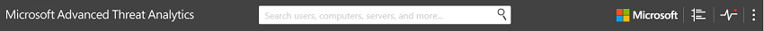
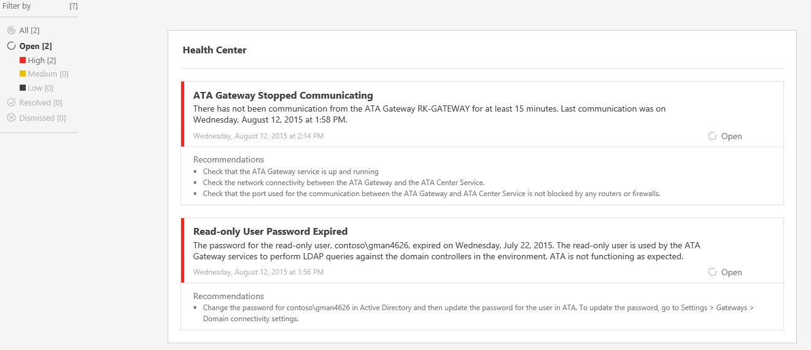

# ATA Health Center
The ATA Health Center lets you know how your ATA service is performing and alerts you to problems.

## Working with the ATA Health Center
The ATA Health Center lets you know that there's a problem by raising an alert (a red dot) above the Health Center icon in the menu bar.

### Managing ATA health
To check up on your system's overall health, click the Health Center icon in the menu bar .

-   All open alerts can be managed by setting them to **Resolved** or **Dismissed**. In the Alert, click **Open** and scroll down to either **Resolved** or **Dismissed**.

-   If you resolve an issue and ATA detects that the issue persists, the issue will automatically be moved back to the **Open** issues list. If ATA detects that an open issue is resolved, it will automatically be moved to the **Resolved** issues list.

-   **Dismissed** issues are issues that you do not want ATA to continue to check - for example, if you are alerted to an issue that you know exists and you do not plan to resolve the issue but do not want to continue to get notifications about it and you no longer want to see it in your **Open** issues list, you can set it to **Dismissed**.

## See Also
[Working with ATA Detection Settings](../../ems/ATA_Content/Working-with-ATA-Detection-Settings.md)
 [Working with Suspicious Activities](../../ems/ATA_Content/Working-with-Suspicious-Activities.md)
 [For support, check out our forum!](https://social.technet.microsoft.com/Forums/security/en-US/home?forum=mata)

